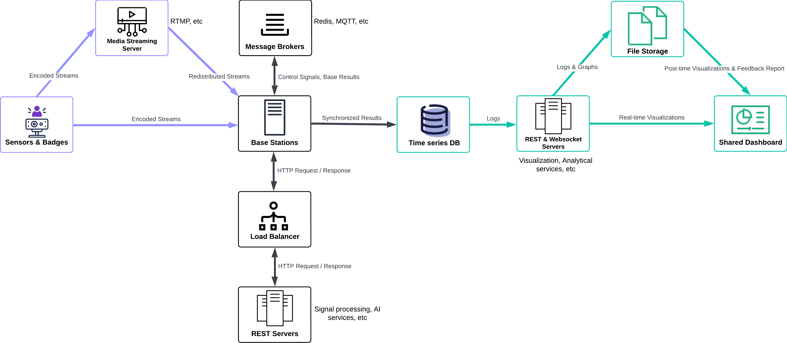

# OpenMMLA

This is a repository for the OpenMMLA project, consisting of a toolkit and read-to-use platform built from the toolkit.

The toolkit is for building up the MMLA pipeline/platform as shown below:

### Pre-implemented Pipelines

+ [ASR with Diarization](base/asr_with_diarization/README.md)
+ [Indoor Positioning](base/indoor_positioning/README.md)
+ [Video Frame Analyzer](base/video_frame_analyzer/README.md)
