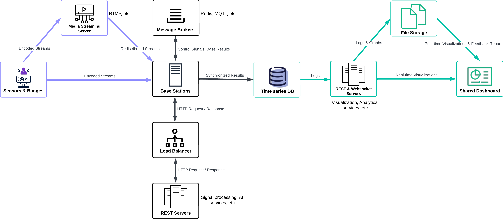
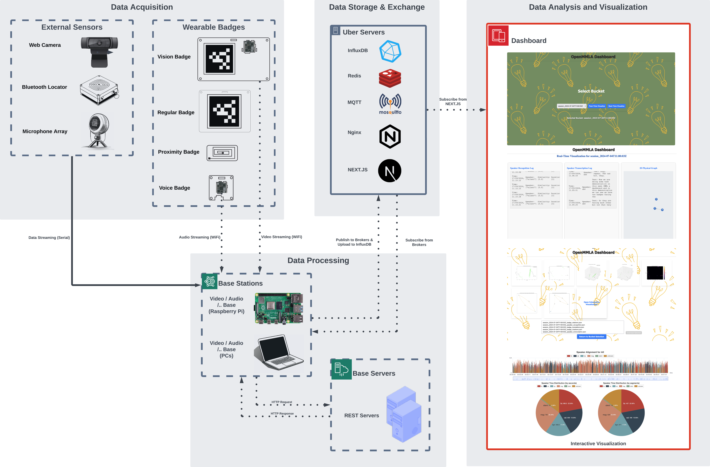

# OpenMMLA

The OpenMMLA repository consists of two main components:

1. The `openmmla` toolkit: An IoT-based multimodal data collection toolkit for learning analytics, providing the core classes, utilities, and pipeline implementations.

2. The runtime platform, represented by the `base_stations`, `servers`, and `wearable_devices` directories. These directories provide the structured environments for deploying and executing pipelines built with the `openmmla` toolkit. They house runtime data, service initiation scripts, logging configurations and outputs, and device-specific adaptation scripts for wearable technology during operation.

## Platform Design

This section provides an overview of the runtime platform, from its high-level system design to its detailed hardware architecture.

### High-level System Design

The MMLA pipeline built with the `openmmla` toolkit follows a three-stage data flow, as depicted below:



<details>
<summary><strong>Data Flow Stages Explained</strong></summary>

+ **Data Input Stage (purple)**: Multimodal raw data from sensors & wearable badges are streamed directly to base stations or a central media server. The raw inputs are transformed into structured, coded streams for efficient transmission and processing.
+ **Data Processing Stage (black)**: These encoded streams are processed individually by the corresponding *(ASR/IPS/VFA)Base*, which handles some signal processing, while more complex tasks are offloaded to the server. For *Bases* within the same group, results are synchronized and uploaded to the time series database, where segment-level measurement features are generated.
+ **Data Output Stage (lime)**: These measurement features are visualized on the dashboard in real time and combined into indicators to analyze group interactions. The platform also generates post-processing visualizations, logs, and reports, which are stored and accessible via the shared dashboard, enabling both real-time awareness and retrospective analysis of group dynamics.
</details>

### System Architecture

The platform's physical architecture consists of several interconnected hardware components:



<details>
<summary><strong>Hardware Components Detailed</strong></summary>

- **Sensors**: Wearable devices and distributed environmental sensors for data acquisition:
   + Supported wearables:
      - *AprilTag*: A fiducial marker for camera-based localization and tracking.
          + *Regular-Badge*: AprilTag only
      - *Nicla Vision*: Arduino board with camera and microphone, and Wi-Fi/BLE connectivity.
          + *Voice-Badge*: [Nicla Vision board](https://docs.arduino.cc/hardware/nicla-vision/) with power supply
          + *Vision-Badge*: Nicla Vision board with [AprilTag](https://april.eecs.umich.edu/software/apriltag) and power supply
   + Supported environmental sensors:
     - *Microphone*: PyAudio USB microphone (Jabra Speak2 75, built-in mic, etc.)
     - *Camera*: USB camera (Logitech HD C920, etc.)
- **Base Stations**: Microprocessors/PCs that process various data streams. Each base station runs one or more instances of *Base* and *Synchronizer*, with specific types (e.g., *AudioSynchronizer*) synchronizing data from corresponding *Base* components (e.g., *AudioBase*).
- **Servers**: Powerful PCs that provide centralized services for other devices within distributed environments. Based on functionality, it can be divided into:
   + *Base Server*: REST servers running AI services (infer, transcribe, vad, vllm... via Flask/FastAPI).
   + *Uber Server*: Central servers running services like database (InfluxDB), Messaging (Redis, MQTT), RTMP streaming & Load balancing (Nginx), dashboard application (Next.js & Flask).
- **Dashboard**: Web-page interfaces accessible via phone and web browsers, featuring session selection, real-time visualizations, post-time visualizations, and measurements downloads.

</details>

## Quick Setup

This section guides you through setting up the OpenMMLA.

### System Prerequisites

The following tools are generally required on machines designated as **Base Stations** or **Servers** (including Base Servers and Uber Servers):

- [Conda](https://docs.conda.io/en/latest/miniconda.html) : for managing Python environments
- [Git](https://git-scm.com/) : for cloning the repository
- [tmux](https://github.com/tmux/tmux/wiki/Installing) : for managing terminal sessions
- [PortAudio](https://www.portaudio.com/) : for audio I/O, if using audio pipelines
- [FFmpeg](https://ffmpeg.org/) : for audio/video processing, if using relevant pipelines

<details>
<summary>Conda Installation</summary>

```bash
curl -L -O "https://github.com/conda-forge/miniforge/releases/latest/download/Miniforge3-$(uname)-$(uname -m).sh"
bash Miniforge3-$(uname)-$(uname -m).sh
```
</details>

<details>
<summary>Other Tools Installation</summary>

```bash
# macOS
brew install ffmpeg portaudio tmux

# Ubuntu/Debian
sudo apt update && sudo apt upgrade
sudo apt install -y build-essential git ffmpeg portaudio19-dev python3-pyaudio libsndfile1 tmux
```
</details>

### Central Services Setup

The following services are typically run on a dedicated **Uber Server** to provide centralized functionalities:

- [InfluxDB](https://docs.influxdata.com/influxdb/v2/install/) (required): Time series database for storing group segment measurement results
- [Redis](https://redis.io/downloads/) (required): Message broker for session bucket Start/Stop control (and cache for Celery workers' tasks)
- [Mosquitto](https://mosquitto.org/download/) (required): MQTT broker for publish/subscribe measurement results among *Base* and *Synchronizer*
- [Nginx](https://github.com/nginx/nginx?tab=readme-ov-file#downloading-and-installing) (optional): Load balancer for AI/Algorithm services and RTMP server for streams
- [Dashboard](https://openmmla-dashboard-ri2dd2eh1-lizaibeims-projects.vercel.app/) (optional): Next.js frontend & Flask backend server for real/post-time visualizations

<details>
<summary>Services Installation</summary>

#### InfluxDB Installation
```bash
# For macOS
brew install influxdb
brew services start influxdb

# For Ubuntu/Debian
wget -q https://repos.influxdata.com/influxdata-archive_compat.key
echo '393e8779c89ac8d958f81f942f9ad7fb82a25e133faddaf92e15b16e6ac9ce4c influxdata-archive_compat.key' | sha256sum -c && cat influxdata-archive_compat.key | gpg --dearmor | sudo tee /etc/apt/trusted.gpg.d/influxdata-archive_compat.gpg > /dev/null
echo 'deb [signed-by=/etc/apt/trusted.gpg.d/influxdata-archive_compat.gpg] https://repos.influxdata.com/debian stable main' | sudo tee /etc/apt/sources.list.d/influxdata.list
sudo apt update && sudo apt install influxdb2
sudo systemctl enable influxdb
sudo systemctl start influxdb

# Go to http://localhost:8086, and follow the instructions to create admin user with operator API token, save your token in a safe place,
# it will be used for setting your [InfluxDB][token] in your config yml file.
```

#### Redis Installation
```bash
# For macOS
brew install redis
# Edit /opt/homebrew/etc/redis.conf (or equivalent path): set "protected-mode no" and "bind 0.0.0.0"
brew services restart redis

# For Ubuntu/Debian
sudo apt install -y redis-server
# Edit /etc/redis/redis.conf: set "protected-mode no" and "bind 0.0.0.0"
sudo systemctl enable redis-server
sudo systemctl restart redis-server
```

#### Mosquitto Installation
```bash
# For macOS
brew install mosquitto
# Edit /opt/homebrew/etc/mosquitto/mosquitto.conf (or equivalent path): add "listener 1883 0.0.0.0" and "allow_anonymous true"
brew services restart mosquitto

# For Ubuntu/Debian
sudo apt install -y mosquitto
# Edit /etc/mosquitto/mosquitto.conf: add "listener 1883 0.0.0.0" and "allow_anonymous true"
sudo systemctl enable mosquitto
sudo systemctl restart mosquitto
```

#### Nginx Installation (Optional)
For detailed Nginx installation and configuration as both a load balancer and RTMP server, please refer to the [Nginx Setup Guide](docs/nginx.md).


#### Dashboard Installation (Optional)
For detailed instructions on setting up the Next.js frontend and Flask backend for the dashboard, please refer to the [Dashboard Setup Guide](docs/dashboard.md).

</details>

### OpenMMLA Codebase Setup

1.  **Clone the Repository:**
    Get the OpenMMLA codebase by cloning the repository:
    ```bash
    git clone https://github.com/ucph-ccs/openmmla.git
    ```
    This will download the `openmmla` toolkit and all associated runtime platform directories and pipeline configurations.

### Pipeline-Specific Setup
After setting up the prerequisites, central services, and cloning the OpenMMLA repository, you can proceed to set up the specific data collection and analysis pipelines you intend to use. Each pipeline has its own dedicated Conda environment, dependencies, and configuration.

Follow the detailed instructions in the respective `README.md` files for each pipeline:

1.  **Automatic Speech Recognition (ASR) with Diarization**
    *   Setup Guide: [ASR Pipeline README](base_stations/asr/README.md)

2.  **Indoor Positioning System (IPS)**
    *   Setup Guide: [IPS Pipeline README](base_stations/ips/README.md)

3.  **Video Frame Analyzer (VFA)**
    *   Setup Guide: [VFA Pipeline README](base_stations/vfa/README.md)

## [FAQ](docs/faq.md)

## Citation

If you use this project in your research, please cite the following paper:

```bibtex
@inproceedings{10.1145/3706468.3706525,
author = {Li, Zaibei and Yamaguchi, Shunpei and Spikol, Daniel},
title = {OpenMMLA: an IoT-based Multimodal Data Collection Toolkit for Learning Analytics},
year = {2025},
doi = {10.1145/3706468.3706525},
booktitle = {Proceedings of the 15th International Learning Analytics and Knowledge Conference},
pages = {872–879},
}
```
