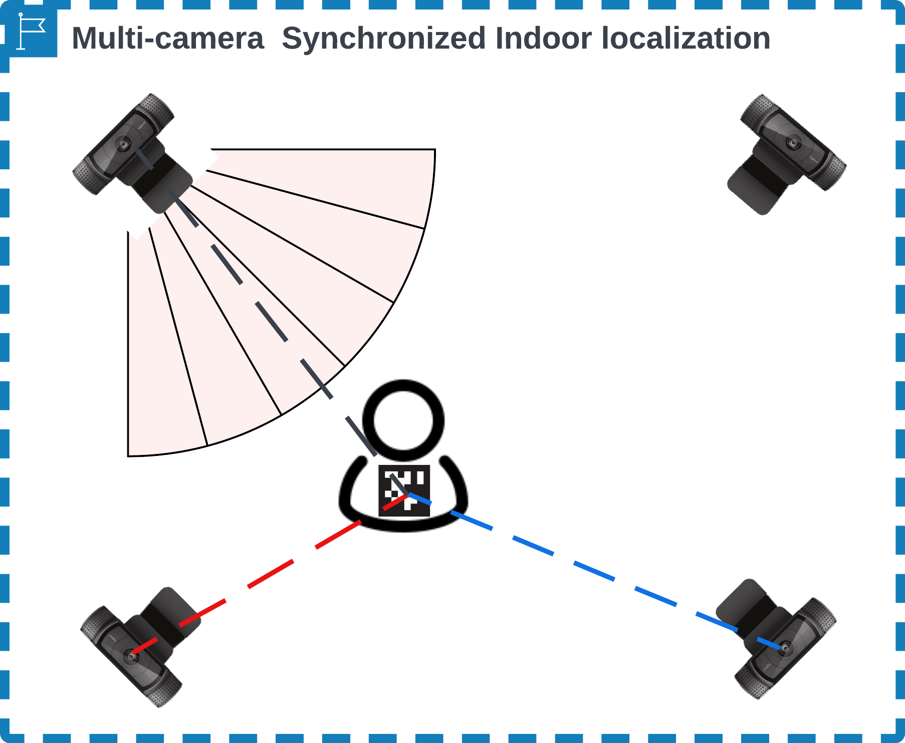
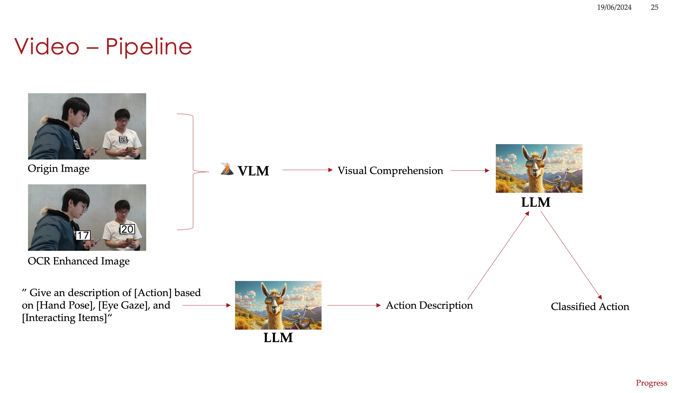
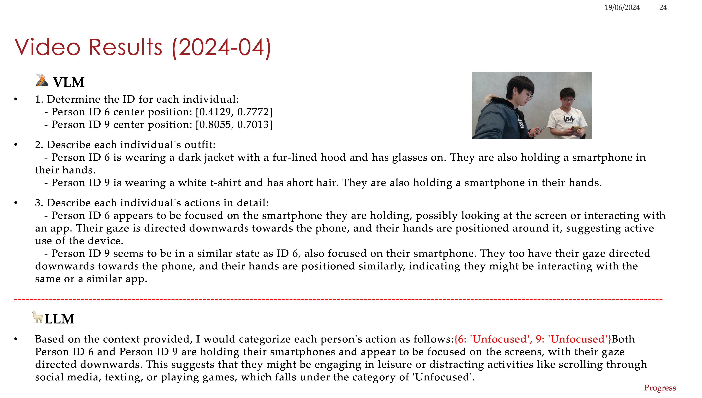

# 🎥 OpenMMLA Vision

[](https://pypi.org/project/openmmla-vision/)

Video module of the mBox - an open multimodal learning analytic platform. For more details, please refer
to [mBox System Design](https://github.com/ucph-ccs/mbox-uber/blob/main/docs/mbox_system.md).

## Table of Contents

- [Related Modules](#related-modules)
- [Installation](#installation)
    - [Uber Server Setup](#uber-server-setup)
    - [Video Base & Server Setup](#video-base--server-setup)
    - [Standalone Setup](#standalone-setup)
- [Pipelines Usage](#pipelines-usage)
    - [Realtime Indoor-Positioning](#realtime-indoor-positioning)
    - [Video Frame Analyzer](#video-frame-analyzer)
- [Visualization](#visualization)
- [FAQ](#faq)
- [Citation](#citation)
- [References](#references)
- [License](#license)

## Related Modules

- [mbox-uber](https://github.com/ucph-ccs/mbox-uber)
- [mbox-audio](https://github.com/ucph-ccs/mbox-audio)

## Installation

### Uber Server Setup

Before setting up the video base, you need to set up a server hosting the InfluxDB, Redis, Mosquitto, and Nginx
services. Please refer to [mbox-uber](https://github.com/ucph-ccs/mbox-uber/blob/main/README.md) module.

### Video Base & Server Setup

1. **Clone the repository**
   ```bash
   git clone https://github.com/ucph-ccs/mbox-video.git
   ```

2. **Install openmmla-vision**
   <details>
   <summary>Set up Conda environment</summary>

   ```bash
   # For Raspberry Pi
   wget "https://github.com/conda-forge/miniforge/releases/latest/download/Miniforge3-$(uname)-$(uname -m).sh"
   bash Miniforge3-$(uname)-$(uname -m).sh

   # For Mac and Linux
   wget "https://repo.anaconda.com/miniconda/Miniconda3-latest-$(uname)-$(uname -m).sh"
   bash Miniconda3-latest-$(uname)-$(uname -m).sh
   ```
   </details>

   <details>
   <summary>Install Video Base</summary>

   ```bash
   conda create -c conda-forge -n video-base python=3.10.12 -y
   conda activate video-base
   pip install openmmla-vision[base]  # for Linux and Raspberry Pi
   pip install 'openmmla-vision[base]'  # for Mac
   ```
   </details>

   <details>
   <summary>Install Video Server</summary>

   The video server provides video frame analyzer services.
   ```bash
   conda create -c conda-forge -n video-server python=3.10.12 -y
   conda activate video-server
   pip install openmmla-vision[server]  # for Linux and Raspberry Pi
   pip install 'openmmla-vision[server]'  # for Mac
   ```
   </details>

3. **Set up folder structure**
   ```bash
   cd mbox-video
   ./reset.sh
   ```

### Standalone Setup

If you want to run the entire mBox Video system on a single machine, follow these steps:

1. Set up the Uber Server on your machine following the instructions in
   the [mbox-uber](https://github.com/ucph-ccs/mbox-uber/blob/main/README.md) module.

2. Install openmmla-vision with all dependencies:
   ```bash
   conda create -c conda-forge -n mbox-video python=3.10.12 -y
   conda activate mbox-video
   pip install openmmla-vision[all]  # for Linux and Raspberry Pi
   pip install 'openmmla-vision[all]'  # for Mac
   ```

3. Set up the folder structure:
   ```bash
   cd mbox-video
   ./reset.sh
   ```

This setup will allow you to run all components of mBox Video on a single machine.

## Pipelines Usage

<details>
<summary> real-time indoor-positioning </summary>

### Realtime Indoor-Positioning




1. **Stream video from camera(s)**
    - Distributed: stream on each camera host machine (e.g. Raspberry Pi, Mac, Linux, etc.)
    - Centralized: stream to a centralized RTMP server (e.g. client/server, see [Raspberry Pi RTMP streaming setup](./docs/raspberrypi_rtmp_streaming_setup.md))

2. **Calibrate camera's intrinsic parameters**
    1. Print chessboard image from `./camera_calib/pattern/` and stick it on a flat surface
    2. Capture chessboard image with your camera and calibrate it by running `./calib_camera.sh`

3. **Synchronize multi-cameras' coordinate systems**

   Calculate transformation matrix between main and alternative cameras:

   ```sh
   ./sync_camera.sh [-d <num_cameras>] [-s <num_sync_managers>]
   ```
   Default parameter settings:
   - `-d`: 2 (number of cameras to sync)
   - `-s`: 1 (number of camera sync manager)

   Modes:
    - Centralized:
      ```sh
      ./sync_camera.sh -d 2 -s 1
      ```
    - Distributed:
      ```sh
      # On camera host (e.g., Raspberry Pi)
      ./sync_camera.sh -d 1 -s 0
      # On synchronizer (e.g., MacBook)
      ./sync_camera.sh -d 0 -s 1
      ```

4. **Run real-time indoor-positioning system**
   ```sh
   ./run.sh [-b <num_bases>] [-s <num_synchronizers>] [-v <num_visualizers>] [-g <display_graphics>] [-r <record_frames>] [-v <store_visualizations>]
   ```
    Default parameter settings:
    - `-b`: 1 (number of video base)
    - `-s`: 1 (number of video base synchronizer)
    - `-v`: 1 (number of visualizer)
    - `-g`: true (display graphic window)
    - `-r`: false (record video frames as images)
    - `-v`: false (store real-time visualizations)

   Modes:
    - Centralized:
      ```sh
      ./run.sh
      ```
    - Distributed:
      ```sh
      # On camera host (e.g., Raspberry Pi)
      ./run.sh -b 1 -s 0 -v 0 -g false
      # On synchronizer (e.g., MacBook)
      ./run.sh -b 0 -s 1 -v 1
      ```

</details>

<details>
<summary> video frame analyzer </summary>

### Video Frame Analyzer



1. **Serve VLM and LLM on video server**
   <details>
   <summary>vllm</summary>

   ```bash
   vllm serve openbmb/MiniCPM-V-2_6 --dtype auto --max-model-len 2048 --port 8000 --api-key token-abc123 --gpu_memory_utilization 1 --trust-remote-code --enforce-eager
   vllm serve microsoft/Phi-3-small-128k-instruct --dtype auto --max-model-len 1028 --port 8001 --api-key token-abc123 --gpu_memory_utilization 0.8 --trust-remote-code --enforce-eager 
   ```
   </details>

   <details>
   <summary>ollama</summary>

   Install [Ollama](https://ollama.com/) from official website.
   ```bash
   ollama pull llava:13b
   ollama pull llama3.1
   ```
   </details>

2. **Configure `conf/video_base.ini`**
   ```ini
   [Server]
   backend = ollama
   top_p = 0.1
   temperature = 0
   vlm_model = llava:13b
   llm_model = llama3.1
   ```

3. **Serve frame analyzer on video server**
   ```bash
   cd examples/
   python video_frame_analyzer_server.py
   ```

4. **Run client script on video base**
   ```bash
   python analyze_video_frame.py
   ```

</details>

## Visualization

After running the analyzers, logs and visualizations are stored in the `/logs/` and `/visualizations/` folders.

The following image shows a simple demo of the video frame analyzer:



## [FAQ](https://github.com/ucph-ccs/mbox-uber/blob/main/docs/FAQ.md)

## Citation

If you use this code in your research, please cite the following paper:

```bibtex
@inproceedings{inproceedings,
  author = {Li, Zaibei and Jensen, Martin and Nolte, Alexander and Spikol, Daniel},
  year = {2024},
  month = {03},
  pages = {785-791},
  title = {Field report for Platform mBox: Designing an Open MMLA Platform},
  doi = {10.1145/3636555.3636872}
}
```

## References

- [apriltags](https://github.com/pupil-labs/apriltags)

## License

This project is licensed under the MIT License - see the [LICENSE](LICENSE) file for details.