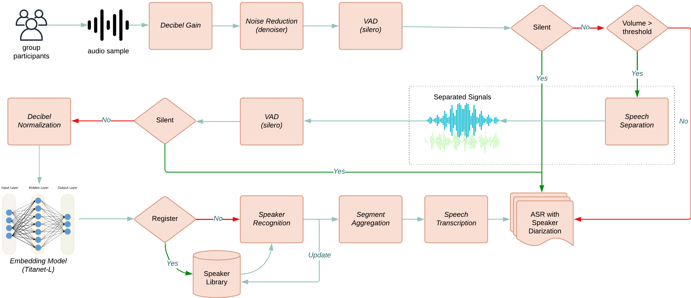

# ASR with Diarization

This pipeline provides automatic speech recognition with speaker diarization capabilities. It processes audio streams in real-time to transcribe speech and identify different speakers.

## Pipeline Overview

The pipeline processes audio through several stages:
- Audio capture/input from microphones
- Voice activity detection (VAD) to identify speech segments
- Speech enhancement to clean audio signals
- Speaker diarization to separate and identify speakers
- Speech recognition to transcribe the audio to text
- Synchronization of results from multiple asr bases

The post-time audio analzyer is similar:

## Usage Instructions

### Install Dependencies
```bash
# Install the required dependencies for the ASR pipeline on specific machines (e.g., base stations -> asr-base,
# asr servers -> asr-server, uber servers -> uber-server)
conda create -n asr-base -c conda-forge python=3.10.12 -y
pip install openmmla[asr-base]
```

### On Servers
```bash
# Run uber services on your machine with uber-server env
# Go to servers/uber/
make all # if start all services 
make all -without=nginx,celery,flask,next # if start without nginx(load balancer, RTMP) and dashboard

# Run asr services on your machine with asr-server env
# Edit your own config.yml file, see servers/asr/config_template.yml for more details
# You can either run it via bash or python

# ==================BASH========================
# Start asr services at once via servers/asr/bash/run.sh, you can edit the weight and port of each server inside the run script file
./run.sh


# =================PYTHON========================
# Activate asr-server environment
conda activate asr-server

# Start asr services one by one
# 1. ASR server with single worker via openmmla command
# e.g.,
# openmmla asr-infer -c config.yml
openmmla <asr-server-commands> -c <config_file_path>
 
# 2. ASR server with multiple workers via gunicorn
# e.g.,
# export CONFIG_FILE=config.yml
# gunicorn -k gevent -w 3 -b 0.0.0.0:5001 openmmla.commands.asr.asr_infer:app
export CONFIG_FILE=config.yml
gunicorn -k gevent -w <number-workers> -b 0.0.0.0:<port> <path-to-asr-servers-app>:app
```

### On Base Stations
```bash
# Run asr pipeline on your machine with asr-base env
# Edit your own config.yml file, see base_stations/asr/config_template.yml for more details
# You can either run it via bash or python

# ===================BASH========================
# Go to /base_stations/asr/bash
# For real-time audio analyzer
usage: ./run.sh [-nb NUM_BASE] [-ns NUM_SYNCHRONIZER] [-s STORE] [-vad VOICE_ACTIVITY_DETECT] [-nr NOISE_REDUCE] [-tr TRANSCRIBE] [-sp SPEECH_SEPARATE] [-d DOMINANT] [-h]

options:
  -nb  NUM_BASE               : Number of ASR bases to run (default: 3)
  -ns  NUM_SYNCHRONIZER       : Number of synchronizers to run (default: 1)
  -s   STORE                  : Whether to store audio data (true/false, default: true)
  -vad VOICE_ACTIVITY_DETECT  : Whether to use Voice Activity Detection (true/false, default: true)
  -nr  NOISE_REDUCE           : Whether to use Noise Reduction (true/false, default: true)
  -tr  TRANSCRIBE             : Whether to transcribe audio (true/false, default: true)
  -sp  SPEECH_SEPARATE        : Whether to use Speech Separation (true/false, default: false)
  -d   DOMINANT               : Whether to apply dominant speaker (true/false, default: false)
  -h                          : Display this help message

# For post-time audio analyzer
usage: ./run_post.sh [-f FILENAMES] [-vad VOICE_ACTIVITY_DETECT] [-nr NOISE_REDUCE] [-sp SPEECH_SEPARATE] [-tr TRANSCRIBE] [-h]

options:
  -f FILENAMES                 : specified filenames in <asr-project>/post-time/origin/ to process, default to all files when not specified.
  -vad VOICE_ACTIVITY_DETECT   : Whether to use Voice Activity Detection (true/false, default: true)
  -nr NOISE_REDUCE             : Whether to use Noise Reduction (true/false, default: true)
  -sp SPEECH_SEPARATE          : Whether to use Speech Separation (true/false, default: true)
  -tr TRANSCRIBE               : Whether to transcribe audio (true/false, default: true)
  -h                           : Display this help message
  
# ==================PYTHON========================
# For real-time audio analyzer
conda activate asr-base
openmmla asr-base -b <base_type> -c <config_file_path> # start asr-base
openmmla asr-sync -c <config_file_path> # start base synchronizer

# For post-time audio analyzer
openmmla asr-post -f <filenames> -c <config_file_path>
```