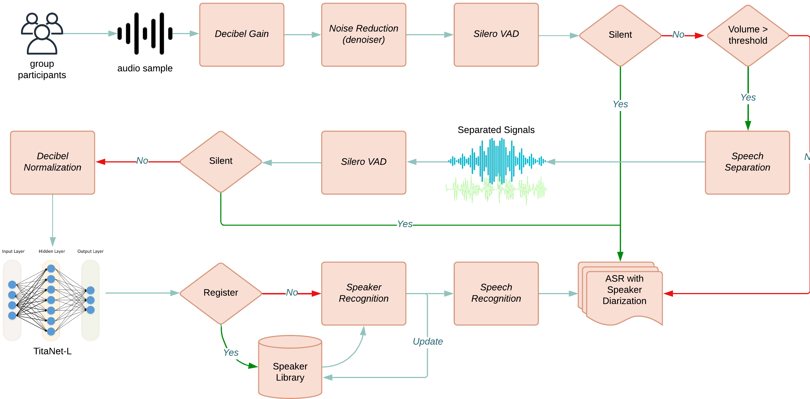
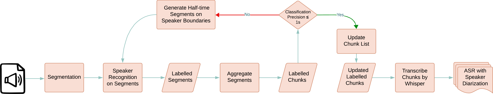

# 🎙️ OpenMMLA Audio

[](https://pypi.org/project/openmmla-audio/)

Audio module of the mBox - an open multimodal learning analytic platform. For more details, please refer
to [mBox System Design](https://github.com/ucph-ccs/mbox-uber/blob/main/docs/mbox_system.md).

## Table of Contents

- [Related Modules](#related-modules)
- [Installation](#installation)
    - [Uber Server Setup](#uber-server-setup)
    - [Audio Base & Server Setup](#audio-base--server-setup)
    - [Standalone Setup](#standalone-setup)
- [Pipelines Usage](#pipelines-usage)
    - [Real-time Audio Analyzer](#real-time-audio-analyzer)
    - [Post-time Audio Analyzer](#post-time-audio-analyzer)
- [Log & Visualization](#logs--visualization)
- [FAQ](#faq)
- [Citation](#citation)
- [References](#references)
- [License](#license)

## Related Modules

- [mbox-uber](https://github.com/ucph-ccs/mbox-uber)
- [mbox-video](https://github.com/ucph-ccs/mbox-video)

## Installation

### Uber Server Setup

Before setting up the audio base, you need to set up a server hosting the InfluxDB, Redis, and Mosquitto services.
Please refer to [mbox-uber](https://github.com/ucph-ccs/mbox-uber/blob/main/README.md) module.

### Audio Base & Server Setup

1. **Clone the repository**
   ```bash
   git clone https://github.com/ucph-ccs/mbox-audio.git
   ```

2. **Install required system dependencies**
   <details>
   <summary>Mac</summary>

   ```bash
   brew install ffmpeg portaudio mecab llvm
   echo 'export PATH="/opt/homebrew/opt/llvm/bin:$PATH"' >> ~/.zshrc
   echo 'export LDFLAGS="-L/opt/homebrew/opt/llvm/lib"' >> ~/.zshrc
   echo 'export CPPFLAGS="-I/opt/homebrew/opt/llvm/include"' >> ~/.zshrc
   source ~/.zshrc
   ```
   </details>

   <details>
   <summary>Ubuntu 24.04</summary>

   ```bash
   sudo apt update && sudo apt upgrade
   sudo apt install build-essential git ffmpeg python3-pyaudio libsndfile1 libasound-dev
   wget https://files.portaudio.com/archives/pa_stable_v190700_20210406.tgz
   tar -zxvf pa_stable_v190700_20210406.tgz
   cd portaudio
   ./configure && make
   sudo make install
   ```
   </details>

   <details>
   <summary>Raspberry Pi Bullseye or later</summary>

   ```bash
   sudo apt-get install portaudio19-dev
   ```
   </details>

3. **Install openmmla-audio**
   <details>
   <summary>Set up Conda environment</summary>

   ```bash
   # For Raspberry Pi
   wget "https://github.com/conda-forge/miniforge/releases/latest/download/Miniforge3-$(uname)-$(uname -m).sh"
   bash Miniforge3-$(uname)-$(uname -m).sh

   # For Mac and Linux
   wget "https://repo.anaconda.com/miniconda/Miniconda3-latest-$(uname)-$(uname -m).sh"
   bash Miniconda3-latest-$(uname)-$(uname -m).sh
   ```
   </details>

   <details>
   <summary>Install Audio Base</summary>

   ```bash
   conda create -c conda-forge -n audio-base python==3.10.12 -y
   conda activate audio-base
   pip install openmmla-audio[base]  # for Linux and Raspberry Pi
   pip install 'openmmla-audio[base]'  # for Mac
   ```
   </details>

   <details>
   <summary>Install Audio Server</summary>

   ```bash
   conda create -c conda-forge -n audio-server python==3.10.12 -y
   conda activate audio-server
   pip install openmmla-audio[server]  # for Linux and Raspberry Pi
   pip install 'openmmla-audio[server]'  # for Mac
   ```
   </details>

4. **Set up folder structure**
   ```bash
   cd mbox-audio
   ./reset.sh
   ```

### Standalone Setup

If you want to run the entire mBox Audio system on a single machine (not in distributed mode), follow these steps:

1. Set up the Uber Server on your machine following the instructions in
   the [mbox-uber](https://github.com/ucph-ccs/mbox-uber/blob/main/README.md) module (**needed for real-time audio analyzer**).

2. Clone the repository, install system dependencies and the conda environment as described in the "Audio Base & Server 
   Setup" section above.

3. Install openmmla-audio with all dependencies:
   ```bash
   conda create -c conda-forge -n mbox-audio python==3.10.12 -y
   conda activate mbox-audio
   pip install openmmla-audio[all]  # for Linux and Raspberry Pi
   pip install 'openmmla-audio[all]'  # for Mac
   ```

4. Set up the folder structure:
   ```bash
   cd mbox-audio
   ./reset.sh
   ```

This setup will allow you to run all components of mBox Audio on a single machine.

## Pipelines Usage

<details>
<summary> Real-time Audio Analyzer </summary>

### Real-time Audio Analyzer



To run the real-time audio analyzer:

1. **Start Audio Server** (optional)
   ```bash
   ./server.sh
   ```

   This script runs distributed audio services on audio servers. To configure your audio server cluster: please refer to
   the [nginx setup](https://github.com/ucph-ccs/mbox-uber/blob/main/docs/nginx.md#configuring-the-load-balancer)
   running on your uber server. Default setup: Three servers (server-01.local, server-02.local, server-03.local) with five
   services (transcribe, separate, infer, enhance, vad).

2. **Start Audio Base**
   ```bash
   ./run.sh [-b <num_bases>] [-s <num_synchronizers>] [-l <standalone>] [-p <speech_separation>]
   ```
   Default parameter settings:
    - `-b`: 3 (number of audio base)
    - `-s`: 1 (number of audio base synchronizer)
    - `-l`: false (not standalone)
    - `-p`: false (no speech separation)

   > 💡 You can switch the operating mode of the audio base during runtime:

   | Mode          | Description                                     |
   |---------------|-------------------------------------------------|
   | **Record**    | Record audio segments without recognition       |
   | **Recognize** | Recognize pre-recorded segments and synchronize |
   | **Full**      | Default: record and recognize simultaneously    |


3. **Start Control Base**
   ```bash
   ./control.sh
   ```
   
</details>

<details>
<summary> Post-time Audio Analyzer </summary>

### Post-time Audio Analyzer



To run the post-time audio analyzer:

1. Create a speaker corpus folder: `/audio_db/post-time/[audio_file_name]/`
2. Add speaker audio files named `[speaker_name].wav` to the corpus folder
3. Run the analyzer:
   ```bash
   cd examples/
   conda activate mbox-audio
   
   # process single audio file (supported formats: wav, m4a, mp3), if not specified, then would process all files in the /audio/post-time/origin/ folder
   python3 run_audio_post_analyzer.py -f [audio_file_name.wav] 
   ```

</details>

## Logs & Visualization

After running the analyzers, logs and visualizations are stored in the `/logs/` and `/visualizations/` folders.

## [FAQ](https://github.com/ucph-ccs/mbox-uber/blob/main/docs/FAQ.md)

## Citation

If you use this code in your research, please cite the following paper:

```bibtex
@inproceedings{inproceedings,
  author = {Li, Zaibei and Jensen, Martin and Nolte, Alexander and Spikol, Daniel},
  year = {2024},
  month = {03},
  pages = {785-791},
  title = {Field report for Platform mBox: Designing an Open MMLA Platform},
  doi = {10.1145/3636555.3636872}
}
```

## References

- [NeMo](https://github.com/NVIDIA/NeMo)
- [Silero VAD](https://github.com/snakers4/silero-vad)
- [Denoiser](https://github.com/facebookresearch/denoiser)
- [MossFormer](https://github.com/alibabasglab/MossFormer)
- [Whisper](https://github.com/openai/whisper)

## License

This project is licensed under the MIT License - see the [LICENSE](LICENSE) file for details.