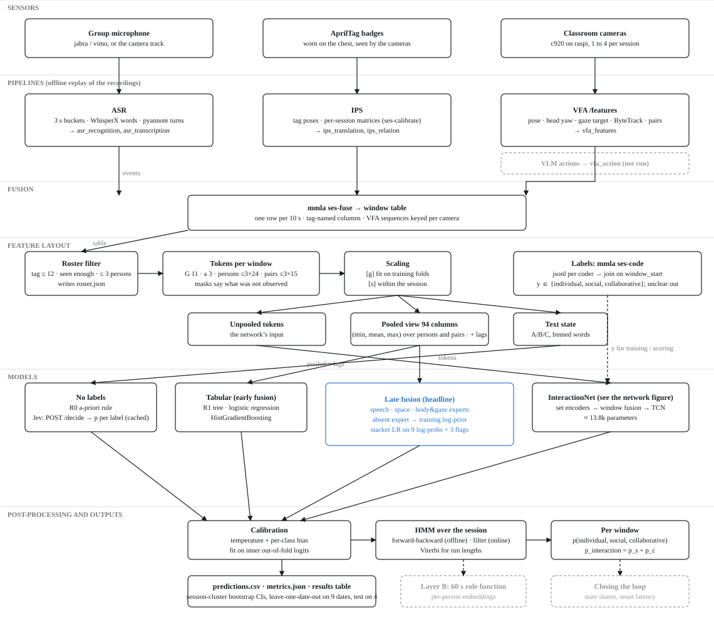
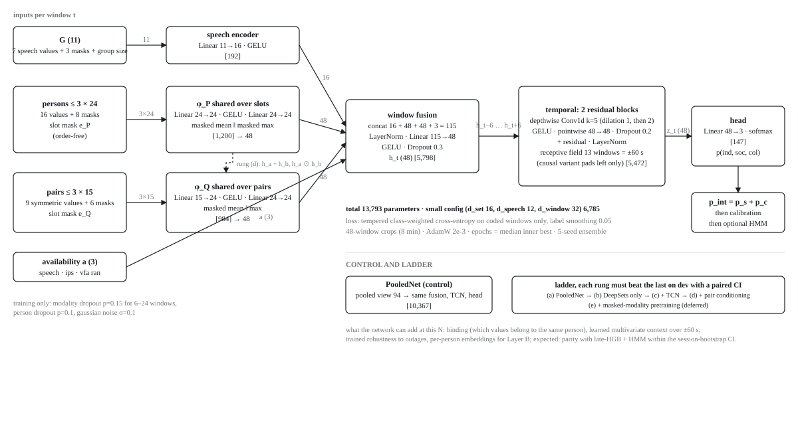

# Interaction classifier

The interaction classifier labels every 10 s window of a session as **individual**, **social** or **collaborative**, with calibrated probabilities. It reads the session's fusion table (`mmla ses-fuse`, see [window features](../pipelines/vfa/index.md#window-features-the-fusion-table)) and learns from windows a person coded in the browser (`mmla ses-code`). This page covers Layer A, the group state of each window. Layer B, the 60 s role of each person, builds on it and is not described here.

Two commands make up the classifier:

- `mmla ses-classify` trains and scores the models, holding out one lesson at a time.
- `mmla ses-jev` asks Jev, a zero-shot model, for the same labels from a plain-text description of each window. It is the no-label baseline the trained models are compared against.



## Targets and codebook

The coder presses one key per window in `mmla ses-code`, from a codebook both the coder and Jev read (`openmmla.commands.ses.code.CODEBOOK`):

| Key | Class | Meaning |
|---|---|---|
| 1 | individual | nobody interacts with another member for most of the window: working alone, waiting, watching the teacher |
| 2 | social | members interact (talk, gesture, look at each other), but not about the task |
| 3 | collaborative | members interact about the task: talk about it, joint attention on the shared artifact, pointing, handing over, working on one thing together |
| 0 | unclear | cannot tell: out of view, no audio, or a transition with no dominant state |

The rule is to label the group as a whole with the state that fills most of the ten seconds. Two members collaborating while a third works alone is still collaborative.

- **Binary target.** Interaction (social or collaborative) against individual. It is always derived, as p_interaction = p_social + p_collaborative, and never trained on its own. The exception is the `--target binary` fallback described below.
- **Unclear windows** are left out of the loss and the scores. They stay in the sequence as context and are counted per session.
- **Labels.** Each coder has an append-only file, `artifacts/<session>/labels/<coder>.jsonl`. A later line for a window replaces an earlier one, and a line with label `null` undoes it.
- **Truth.** The truth is the primary coder: `--coder`, or by default the coder with the most windows over the dev sessions. TEST labels never decide it, and a `--split test` run must name the coder with `--coder`. Where `adjudicated.jsonl` exists, it overrules that coder for the windows it holds. `config.json` records the coder and how it was chosen.
- **Second coder.** A second coder's overlapping windows give Cohen's κ, three-class and binary. It is reported as the ceiling. Labels are never averaged across coders.
- **Join.** Labels join the table on the window start, to the millisecond, then on the nearest window within 0.5 s. A run aborts when more than 1 % of labels find no window. That happens when the coding grid moved because a recording was missing on the coding machine. `--join overlap` then maps each label to the window it overlaps by at least 5 s and reports the offsets.

## From the fusion table to the model inputs

`openmmla/analytics/interaction/layout.py` turns a fusion table into the inputs every model reads.

!!! note "Two-camera sessions need a re-fuse"
    Tables fused before the camera fix put the frames of two cameras with the same angle into one sequence. Their wrist speed, gaze switches and yaw spread measure camera flips, not movement. Re-fuse every session (`mmla ses-fuse -md artifacts/<session>/measurements`) before training or asking Jev. A re-fused table has `p<tag>_frame_sets` and `p<tag>_cameras`, and `data_checks.json` then compares one-camera with two-camera windows.

**Roster.** Tag ids group columns and nothing else. No feature name, value or slot carries a tag id, a session id or a column position. The rules below run in order, and each drop is written to `roster.json` with its reason:

| Rule | Drops |
|---|---|
| R1 | a tag above 12, the IPS trust bound (a mis-decoded badge) |
| R2 | a tag only the cameras saw, in under 25 % of windows, never positioned, in a session where IPS positioned someone |
| R3 | a person observed in under 5 % of windows. They get no slot but count in the group size, and the session is flagged `degraded` |
| R4 | anyone beyond three, keeping the best-covered |

Slots follow descending coverage. A duplicate-skeleton gate masks a person's camera values in a window where two kept persons are seen together with their hands under 0.01 frame widths apart on average: that is one body tagged twice.

**Zero is not missing.** A value no sensor could observe is NaN before scaling and 0 after it, and a mask column says which of the two it is. An observed 0 stays 0. So IPS being off never reads as "far apart", and a window with no transcription chunk never reads as "no words".

**Tokens** (per window, the network's input and the source of every other view):

| Token | Size | Contents |
|---|---|---|
| group G | 11 | speech_ratio, silence_ratio, log words, dia_speakers, log dia_switches, dia_overlap_ratio, dia_share_entropy; masks m_asr, m_transcription, m_dia; group size / 3 |
| availability a | 3 | speech ran, IPS ran, VFA ran |
| person slots | 3 × 19 | present_ratio, log path, seen share, head-turn mean and spread / 90, log wrist speed, gaze switch rate, gaze on a partner's face, a partner's hands, own hands, elsewhere, out of frame (each over the readable share), readable share; masks m_ips, m_path, m_vfa, m_yaw, m_wrist, m_gaze |
| pair slots | 3 × 13 | distance mean and min, face_any = max(ab, ba), co-seen share, hand distance min and mean, gaze distance, joint attention; masks m_dist, m_face, m_covis, m_hand, m_gazepair |

Every pair value is symmetric in a and b. A value is scaled either as [g], a robust z-score over the training sessions' non-empty windows, or as [s], one within its own session. Per-camera units such as frame widths, words and path use [s]. The result is clipped to ±5.

**Pooled view.** Each person value becomes its (min, mean, max) over the slots that observed it, and each pair value the same over pairs. Masks, shares of slots observed and the group size are added, for 82 columns in four blocks: speech 10, space 18, body and gaze 53, roster 1. For at most three persons, (min, mean, max) gives back the sorted values exactly. The pooled view therefore loses only which values belong to one person, and that binding is what the network's set encoders can add. The rule, LR, HGB, late fusion and PooledNet all read this view.

**Temporal context** for the tabular models, over each session's whole grid (coded or not):

| Mode | Adds | Columns |
|---|---|---|
| T0 | nothing | 82 |
| T1c (causal) | 12 key columns at t−1 and t−2, and their mean over t−4..t | 118 |
| T2 (centred) | the same at t−1 and t+1, and their mean over t−2..t+2 | 118 |

The dropped columns, with a reason each (`layout.DROPPED`), include:

- `spk_*_ratio`, `n_speakers_named` and the spurt counters;
- `yaw_mean`, whose sign depends on the seat;
- `face_ab`/`face_ba`, replaced by face_any, and the near-dead mutual gaze and mutual facing;
- every coverage counter (`n_*`, `*_frames`, `*_frame_sets`, `*_cameras`). Camera count is a session fingerprint, so these are only masks and normalisers;
- the action columns, reserved for a semantic block once the VLM runs.

## Models

| Model | What it is |
|---|---|
| `r0` | The a-priori rule, from thresholds fixed by the codebook's wording before any label. Talk is speech ≥ 30 % with a change of speaker, or ≥ 5 words when not diarized. Look is ≥ 20 % of readable gaze on a partner's face. Shared focus is joint attention ≥ 30 %, or hands ≤ 0.05 frame widths apart. Any of the three makes an interaction. Shared focus, or ≥ 40 % of gaze on hands, makes it collaborative. It gives hard labels only. |
| `majority`, `stratified` | The label floors: the training prior, and labels drawn from it (averaged over five seeds). |
| `r1` | A fitted two-level tree (at most four leaves, ≥ 100 windows each) on the T0 pooled view, then calibrated. |
| `lr`, `hgb` | Early fusion: logistic regression (median imputation, standardising, balanced multinomial, C ∈ {0.01, 0.03, 0.1, 0.3, 1}) and gradient boosting (12-point grid, native NaN, no early stopping) on the whole view. |
| `late-lr`, `late-hgb` | Late fusion, the headline candidates. There is one expert per modality: speech, space, and body and gaze. Each reads only its block, the group size and its lags. Where its modality is absent, an expert answers the training log-prior. A multinomial stacker (C = 1, unweighted) over the nine expert log-probabilities and three presence flags is trained on the experts' inner out-of-fold answers. |
| `pooled-net`, `net-notcn`, `net`, `net-pair` | The network ladder (below). |
| `jev` | Zero-shot Jev J0, read from `mmla ses-jev`'s cached answers. It uses argmax, since it has no prior. |
| `jev-cal` | Jev with the calibration and HMM fitted on the training folds' labels. |

**Calibration.** Every single model except late fusion (whose stacker is its own calibrator) maps its logits as z / T + b, with b fixed at 0 for individual. The map is fitted by unweighted NLL on the inner out-of-fold logits. The bias gives back the prior that balanced class weights take away.

**Hard labels.** The pre-declared balanced decision, never tuned: argmax p(k) / π_k, with π the outer-training class frequencies. The binary label is interaction when p_int / π_int ≥ (1 − p_int) / (1 − π_int).

**HMM** (`--hmm`). The states are the classes. The transitions are counts of adjacent coded pairs in the training sessions, plus 1 on every cell and 10 more on the diagonal. The emission is (p / π)^γ, with γ ∈ {0.5, 0.75, 1} chosen on the inner out-of-fold NLL. A window where no modality ran gets a flat emission. The modes are:

- `fb`: forward-backward, offline. It also gives the Viterbi path, which is used for run lengths only.
- `filter`: the causal forward filter, the online answer. It is run only for inputs that never read a later window (T0, T1c, the network without its temporal blocks, Jev). For these rows the held-out session's [s] values are scaled by a running median and spread over the windows so far, with the training statistics until 30 values are seen. Nothing in an online row reads a later window of the held-out session.
- `none`: no smoothing.

A 2-state HMM on the derived binary posteriors is reported next to each `fb` variant as a check.

**What is fit where:**

| Fit | Data |
|---|---|
| [g] scaling statistics | the outer-training sessions, label-free |
| [s] scaling statistics | each session itself, label-free |
| C, the HGB grid point, the network's epoch count | inner folds over the outer-training lessons (4, grouped by lesson), class-weighted NLL of the out-of-fold answers |
| calibrator, stacker, HMM γ | the same inner out-of-fold answers |
| HMM transitions, π | the outer-training labels |
| the model that is scored | refit on every outer-training session, applied once to the held-out lesson |

## The network



InteractionNet reads the tokens of a whole session as one sequence.

- **Per-window encoders.** A speech encoder reads G. A shared encoder runs over each person slot and another over each pair slot. Each set is pooled by masked mean and max, so neither slot order nor group size can matter.
- **Fusion and time.** A window fusion layer is followed by two residual depthwise-separable convolution blocks (kernel 5, dilations 1 and 2). They see ±60 s, centred.
- **Head.** Three logits per window.

| Variant | Parameters |
|---|---|
| `net` (default) | 13,625 |
| small configuration (used when a fold has fewer than 3,000 coded training windows; `--small`) | 6,673 |
| `net-pair` (pair encoder conditioned on both persons' states) | 14,777 |
| `net-notcn` (no temporal blocks) | 8,153 |
| `pooled-net` (the 82-column pooled view through the same fusion, temporal blocks and head) | 9,767 |

The recipe was fixed before any result, and only the epoch count is tuned.

- **Loss.** Cross-entropy with label smoothing 0.05 on coded windows only, with tempered class weights (N / 3N_c)^0.5.
- **Crops.** 48-window crops placed around coded windows, 16 per batch.
- **Augmentation.** Modality dropout zeroes one modality's values, masks and availability bit over a run of 6 to 24 windows (p = 0.15). Person dropout has p = 0.1, and Gaussian noise of 0.1 is added to observed values.
- **Optimiser.** AdamW with learning rate 2e-3 and weight decay 1e-2, gradients clipped at 1, one thread.
- **Epoch count.** Seed 0 trains on each inner fold for up to 300 epochs, with patience 25 on the held-out class-weighted NLL. E* is the median of the best epochs.
- **Refit.** Five seeds for E* epochs on every outer-training session. The prediction is the mean of their softmaxes, and no seed is ever picked over another.

The rungs form a ladder: `pooled-net`, then `net-notcn`, then `net`, then `net-pair`. Each rung must beat the one before it with a paired interval that excludes 0. Because the pooled view is lossless per feature, PooledNet is the control for any claim about set structure. At this sample size the network is a controlled probe of binding and temporal context, not a contender. Torch is needed only for these variants: `pip install torch`.

## Splits and metrics

**TEST** is four sessions, scored once, after every choice is frozen:

- `exp_20260520_microbit_group_01_260520T0834Z`
- `exp_20260520_wegrow_group_01_260520T1054Z`
- `exp_20260603_microbit_group_01_260603T0826Z`
- `exp_20260603_wegrow_group_01_260603T1037Z`

These sessions never reach a scaler, the Jev word bins or a pilot, and a LOSO run does not open them at all.

**DEV** is the other sessions.

**Inclusion rule S1** (fixed before any label is read, in `layout.session_inclusion`): a session enters a run only when its roster keeps at least two persons and two of them are observed together (positioned by IPS or seen by a camera) in at least 30 % of its windows. A session that fails is left out whole, DEV or TEST: it trains nothing and is scored nowhere. The run names it and the reason in `roster.json` (`included: false`), and refuses when nothing is left.

- **Lessons.** The unit is the lesson: the session id without its start suffix, so the two 2025-05-13 takes are one lesson.
- **Outer folds.** `--split loso` holds out one lesson with coded windows at a time.
- **Inner folds.** Grouped by lesson, the same way.
- **Refusal.** A run refuses to train any learned model when a class has fewer than 30 coded windows in an outer-training fold. It prints the class × session counts first. `--target binary` then trains individual against interaction, labelled as a fallback.

**Metrics.** Every variant is scored pooled over the held-out windows, per session and per task, with and without empty windows. An empty window has no speech, nobody positioned and nobody seen.

- **Three-class:** macro-F1 (primary), per-class F1 with support, balanced accuracy, κ and the confusion matrix. Per-session macro-F1 averages only classes with at least 5 true windows.
- **Binary:** F1, balanced accuracy, AUROC and AUPRC.
- **Calibration:** NLL, Brier, and top-label and classwise ECE over 15 equal-mass bins, with reliability tables.
- **Temporal fidelity:** predicted against true switches per hour and mean run length, within coded stretches.
- **State shares:** the absolute error of each state's time share per session.
- **Onset latency and miss rate:** for the causal `filter` variants.

The R0 rule has no posterior, so its NLL, ECE and AUROC are n/a.

**Uncertainty.** Intervals come from a session-cluster bootstrap over lessons (2,000 resamples), recomputing the pooled metric each time. Differences are paired on the same resamples. Window-level intervals are never used, because neighbouring windows are near copies.

**Coverage.** A variant is scored only on the coded windows it answered. Every model except Jev answers every window. Jev answers only the windows `ses-jev` asked about and got an answer for. `results.csv` and `metrics.json` give each variant's coverage, and the command prints any variant below 100 %. `jev` and `jev-cal` are left out of a run, with the reason, in three cases:

- a session they would score, or that `jev-cal` would train on, has no `jev_<variant>.jsonl`;
- the map was made from an earlier version of the fusion table;
- the maps were written with different templates.

**Headline selection** (pre-registered). The headline is the best of `late-lr` and `late-hgb` over {T0, T1c, T2} × {HMM, none}, by dev LOSO macro-F1. It is tested by three Holm-corrected contrasts:

| Contrast | Compares |
|---|---|
| C1 | the headline against `r1` |
| C2 | the headline's model with the HMM against without it |
| C3 | the headline against Jev J0 |

A contrast is computed only when both of its variants answered every coded held-out window, so C3 never compares the headline with a partial Jev. A contrast the run cannot compute is listed with the reason and left out of the Holm correction.

**Absent-class policy.** With fewer than 200 coded social windows on dev, or social at least 5 times in fewer than 6 lessons, the confirmatory target becomes binary macro-F1, and the three-class results are exploratory.

**The run folder**, `artifacts/_analysis/interaction/<split>-<time>/` (or `-o`):

| File | Holds |
|---|---|
| `predictions.csv` | one row per held-out window and variant. Columns: session, lesson, task, window_index, window_start, fold, model, variant, coded, empty_window, y_true, the three probabilities, p_interaction, y_pred, y_pred_binary, temporal mode, HMM mode and the Viterbi state |
| `metrics.json` | every metric of every variant with its interval and coverage, the headline and contrasts (with the reason for any left out), the models left out, the notes on each session's Jev map, the absent-class policy, inter-coder κ, label join reports, and per fold the chosen parameters, calibrators, γ and epochs |
| `results.csv` | the results table: one row per variant with its coverage, grouped as no labels, label floors, few-label, tabular, neural, online and ceiling |
| `per_session.csv`, `confusion.csv` | per-session scores and pooled confusion cells of every variant |
| `label_counts.csv` | coded windows per class and session, written before any training |
| `roster.json`, `data_checks.json` | each session's roster with reasons and whether the inclusion rule S1 kept it (`included`, `reason`), and the data checks: low-speech sessions with windows to listen to, the support of every column, the one- against two-camera check |
| `config.json` | the truth coder and how it was chosen, feature lists, the layout version, grids, seeds, the sha256 of every fusion table and label file, software and git commit (secrets masked) |
| `coefficients.csv` | the LR weights per modality block and fold |

The `_analysis` prefix keeps `ses-code` from taking the folder for a session.

## The Jev baseline

`mmla ses-jev` writes a deterministic plain-text state for each window and asks Jev to choose among the three classes. Persons are A, B and C in slot order. Every number is rounded and given a word:

- physical bins for badge distances: close under 0.6 m, normal 0.6–1.0 m, far above;
- tertiles fitted once on the dev sessions' windows, label-free, for speech, words, head turn, head-turn spread, hand movement, gaze switches and hand distance.

The tertile edges are part of the template. The first run fits them and freezes them in `artifacts/_analysis/interaction/jev/bins.json`. A pilot uses `bins_pilot.json` instead, since its tables predate the camera fix. Every later run reads the frozen file, or the one `--bins` names. Only `--fit-bins` fits them again, and the command then says that every state is new.

A missing modality is said in words ("not measured", "C not in view"), never as 0. No tag id, session id, date, task name or transcript text is in the state, so nothing said leaves the machine. The question is the coder's codebook, plus a note on what the sensors can and cannot tell. `unclear` is offered only in J2.

| Variant | What Jev sees |
|---|---|
| `j0` | the window alone (the zero-shot row, and C3) |
| `j1` | the window and the two before it |
| `j2` | J0 with `unclear` offered, coded windows only (agreement with the coder's unclear) |

**Mechanics.**

- **Request.** Requests go to the provider's endpoint: by default OpenRouter's `https://openrouter.ai/api/v1/systemone`, which serves TypeSafe's model (`jev-1.13`) at TypeSafe's list price; `--provider url --endpoint <URL> --key-env <VAR>` names any other host that speaks TypeSafe's decide API (jevtypesafeai.com is an unrelated reseller at ten times the price, kept only as such an explicit choice). The key comes from the provider's environment variable only (`OPENROUTER_API_KEY` by default) and travels in the Authorization header. It is never printed, logged, cached or put in a URL.
- **Cache.** Answers are cached under `artifacts/_analysis/interaction/jev/cache/<sha256 of the request>.json`. A rerun is free, a re-fused table misses the cache by itself, and identical states such as empty windows are paid once.
- **Session map.** Each session gets `artifacts/<session>/analysis/interaction/jev_<variant>.jsonl`. It maps each window to its request and records two digests: the fusion table's and the template's. A later run from the same table and template adds to the map, so a `--limit` run never cuts a full map down. A map from another table or template is replaced. `ses-classify -m jev,jev-cal` reads a map only when its table digest matches the current table.
- **Run folder.** Each run writes `predictions.csv`, `bins.json` and `sanity.json` under `artifacts/_analysis/interaction/jev/<variant>/`. `sanity.json` holds the Spearman correlation of p_interaction with speech and with partner-directed gaze. Both should be positive.

**Cost** is $0.042 per million input tokens (TypeSafe's list price, passed on by OpenRouter); output is free, and the real figure is summed from the answers' `usage`. On the 14 local tables (4,429 windows, 3,714 distinct J0 states) a call is about 470–520 input tokens:

| Run | Estimate |
|---|---|
| J0, all windows | about 2.1M input tokens, about $0.9 |
| J1 | about $1.0 |
| `--pilot --limit 200` | about 85k tokens, about $0.04 |

## Running it

Install the analysis dependencies. Add torch only for the network variants:

```bash
pip install "openmmla[analysis]"
pip install torch
```

Then, in order:

```bash
# 1. re-fuse every session after the camera fix
mmla ses-fuse -md artifacts/<session>/measurements

# 2. the Jev pilot: plumbing, wording and cost, on dev sessions, never scored
mmla ses-jev --pilot --dry-run                  # three sample states, one masked request, the estimate
OPENROUTER_API_KEY=... mmla ses-jev --pilot --limit 200

# 3. freeze the state template before any label is read (--fit-bins, once), then J0 and J1 on every window
OPENROUTER_API_KEY=... mmla ses-jev --variant j0 --fit-bins
OPENROUTER_API_KEY=... mmla ses-jev --variant j1

# 4. code windows: 30 % of 5-minute blocks per dev session, the same blocks for a second coder
mmla ses-code --sample 0.3 --block 300 --seed 1

# 5. dev: leave one lesson out
mmla ses-classify -m r0,jev,majority,stratified,r1,jev-cal,lr,hgb,late-lr,late-hgb --split loso --jobs 4
mmla ses-classify -m pooled-net,net-notcn,net,net-pair --split loso --jobs 4

# 6. once every choice is frozen: the TEST sessions, exactly once
mmla ses-classify -m <headline model>,<compared models> --split test --confirm-frozen --coder <LOSO coder> --epochs <median LOSO E*>
```

| `ses-classify` flag | Does |
|---|---|
| `-a`, `-s`, `-o` | artifacts root, a session-id filter, the run folder |
| `-m` | comma list of models (default `r0,r1,lr,hgb,late-lr,late-hgb`) |
| `--split loso` / `test` | leave one dev lesson out, or score TEST once (needs `--confirm-frozen` and `--coder`; each start and finish is appended to `artifacts/_analysis/interaction/test_runs.jsonl`) |
| `--temporal`, `--hmm` | comma lists, or `all` (the default for both); a model the two give no variant, such as `lr` with `--temporal T2 --hmm filter`, is refused before anything is read |
| `--target binary` | the two-class fallback |
| `--coder`, `--join overlap` | the truth coder (default: the most windows over the dev sessions); the overlap join |
| `--seeds`, `--small`, `--epochs` | the network's ensemble size, configuration, and fixed epoch count |
| `--jev-variant` | which cached Jev answers `jev` and `jev-cal` read |
| `--jobs` | outer folds in parallel |
| `--quick` | two-point grids, 30 epochs, 200 resamples: a plumbing check, never a result |

The full grids are costly: `late-hgb` takes about 70 s per outer fold and temporal mode, so give `--jobs`.

| `ses-jev` flag | Does |
|---|---|
| `--variant j0` / `j1` / `j2` | which question (J2 asks about the `--coder`'s coded windows only) |
| `--pilot` | dev sessions, and a state without the quantities the old camera interleave corrupted; writes `jev_<variant>_pilot.jsonl` |
| `--limit N` | at most N windows, drawn with a fixed seed; the answers are added to the session maps |
| `--bins PATH`, `--fit-bins` | read the frozen tertile words from another file; fit them again and freeze them in place of the old ones |
| `--workers` | requests in flight (default 4) |
| `--dry-run` | print and estimate, send nothing |

## Not built yet

These were deferred by decision, and each has its place in the code:

- the ablation grids (`--ablate`: modality, temporal, fusion, ladder, weights);
- the causal network row (a TCN padded on the left only; `network.TemporalBlock` takes `causal`);
- leave-one-date-out and task transfer (`--split date` and `task`; the fold helpers exist in `splits.py`);
- the `+lexicon` content feature;
- masked-modality pretraining (ladder rung e);
- Jev's criteria-order and rerun checks (`--order-check`, `--rerun-check`);
- the VLM action block (`--with-actions`).
