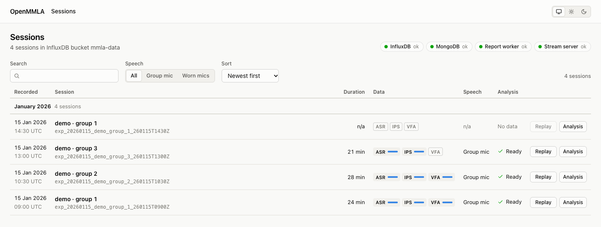
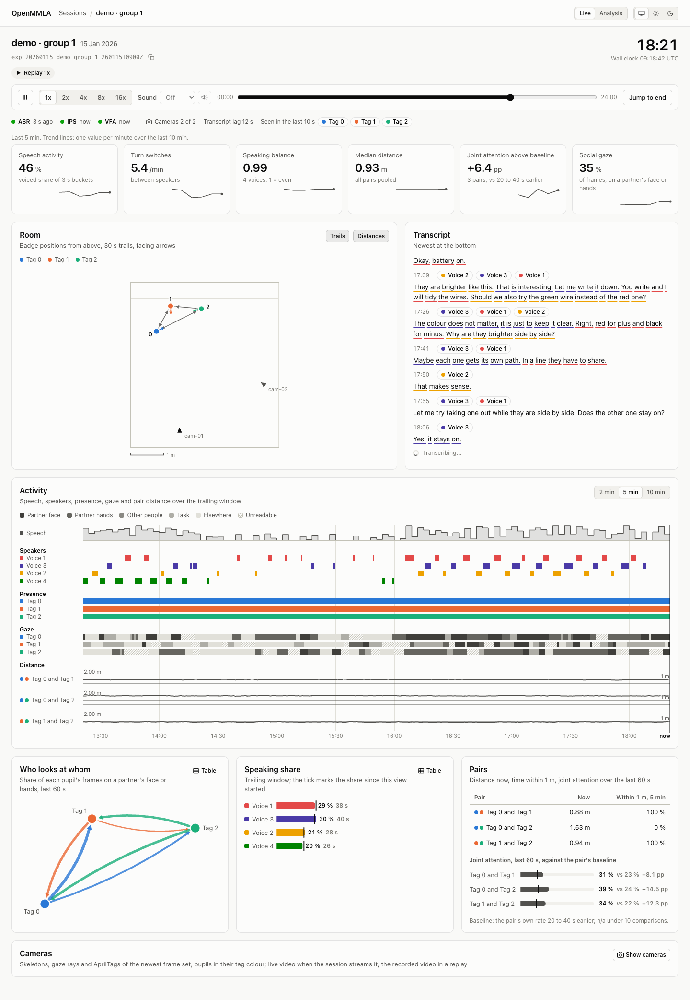
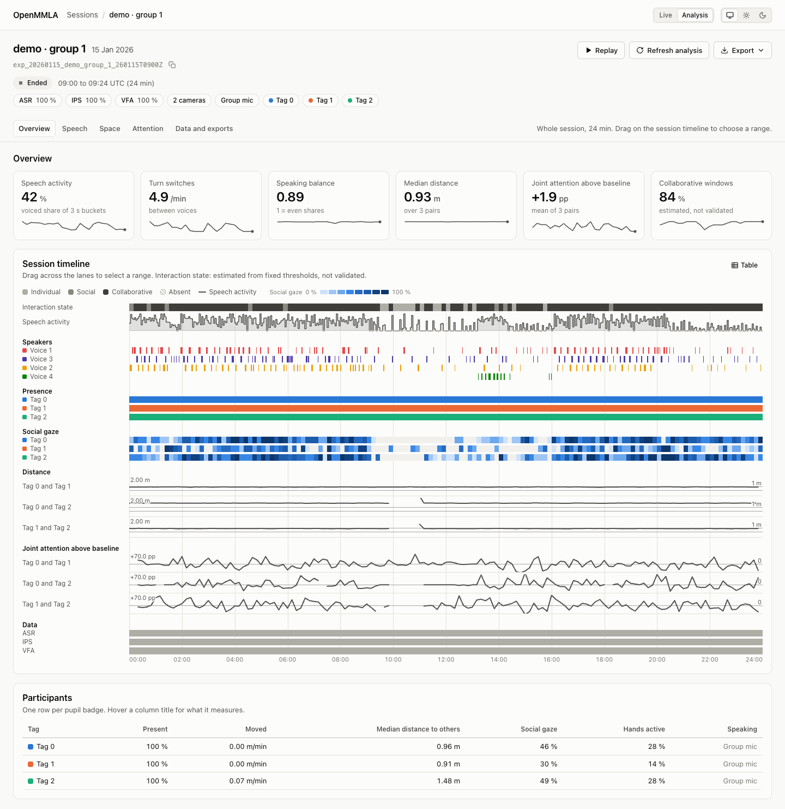

# Dashboard

The dashboard shows what a session records: live while it runs, as a replay once it has ended, and as an analysis report of its speech, space and attention. Open it in a browser on the lab network to watch a session, to review one afterwards, or to download its data.

!!! warning "No login"
    The dashboard has no login, and it serves transcripts, camera video and the participants' voices to anyone who reaches its ports. Keep it on a trusted network, and turn the raw recordings off where they should not be served: see [Keep the dashboard private](deploy.md#keep-the-dashboard-private).

## What the dashboard shows

| Page | URL | What it shows |
|---|---|---|
| [Sessions](#sessions) | `/` | every session, with its modalities, coverage and analysis state, and the sessions running now |
| [Live](#live) | `/live?session=<id>` | a running session as it is written, or a replay of an ended one: indicators, room plan, transcript, timeline and camera tiles |
| [Analysis](#analysis) | `/analysis?session=<id>` | the report of one session, with a selectable time range, exports and the session's recordings |

The Live and Analysis pages also answer at `/realtime?session=<id>` and `/posttime?session=<id>`.

On every page, participants are shown by their AprilTag badge id (`Tag 0`), never by name. Each tag keeps one colour on a page, assigned in tag order to the participants actually seen, and a tag seen in under 2 % of the windows is greyed as rare. A group microphone's speakers are anonymous voices from diarization (`Voice 2`), which are not linked to badges; a worn microphone's speech is attributed to its wearer's tag. Every chart card has a **Table** toggle with the numbers behind it, and missing values read `n/a`.

## How it works

The dashboard reads the measurements the pipelines write to InfluxDB, adds the session's MongoDB document when MongoDB answers, and plays camera video and microphone sound from the Stream Server (MediaMTX). It never talks to the bases, the session control bus or MQTT.

```text
browser ──HTTP + Server-Sent Events──> Flask (gunicorn -k gevent -w 1, port 5050)
                                          ├── InfluxDB      measurements (required)
                                          ├── MongoDB       session documents (optional, read only)
                                          ├── Redis db 1    queue of the report worker
                                          └── MediaMTX API  which streams are live (optional)
report jobs: on the Celery worker when one listens, else in processes the web process starts
browser ──WebRTC (WHEP)──> MediaMTX :8889                 live camera video and live microphone sound
browser ──HTTP──> the same Flask app on ports 5051, 5052  recorded video and sound of a replay
```

- **Backend**: a Flask app run by gunicorn, in `pipelines/uber-server/dashboard/flask-backend/`. It also serves the frontend.
- **Frontend**: plain HTML, CSS and JavaScript modules in `pipelines/uber-server/dashboard/frontend/`, with no build step and nothing loaded from the internet.
- **Report**: all computation is in `openmmla/analytics/report/`. The analysis report is computed once per session by a report job and cached ([Report jobs and the worker](deploy.md#report-jobs-and-the-worker)).

## What you need

- **The `uber-server` environment** on the dashboard's machine ([Deploy the dashboard](deploy.md)).
- **InfluxDB**, which holds the measurements, and **Redis**, the queue of the report worker ([System Services](../system_services.md)).
- **MongoDB**, optional: with it the dashboard knows each session's cameras, microphones, streams, IPS camera placement and software versions, and lists sessions that have no measurements yet.
- **MediaMTX**, optional: only for live video and sound ([Live video and sound](live-video-and-sound.md)).

Each part of the pages needs one pipeline. A part whose pipeline did not run stays empty and says so; the rest of the page works.

| Part | Needs | Written by |
|---|---|---|
| Speech, transcript, speaking share | `asr_recognition`, `asr_transcription` | ASR synchronizer and bases; anonymous voices need diarization (`-dia`, see [Voices across chunks](../pipelines/asr/speakers-and-diarization.md#voices-across-chunks)) |
| Room, distances, facing, presence | `ips_translation`, `ips_rotation`, `ips_relation` | IPS synchronizer |
| Skeletons, tags and gaze on the camera tiles, gaze categories, who looks at whom, joint attention | `vfa_features` | VFA synchronizer with **Pose** (`-pose`) and **Gaze** (`-gaze`) on, one frame set per `Base.keyframe_interval` (1 s by default; [Features endpoint](../pipelines/vfa/pose-and-gaze.md#features-endpoint)) |
| Live video under the overlay | a stream on MediaMTX that the session's bases pulled | MediaMTX ([Live video](live-video-and-sound.md#live-video)) |

The bases need no screen: an IPS or VFA base whose source is a stream opens no window by default (**Graphics** `off for streams`, see [IPS](../pipelines/ips/run.md#every-session) and [VFA](../pipelines/vfa/run.md#every-session)), which suits a base started over SSH on another host from its card's **Host**. The dashboard is where the session is watched.

## Sessions page { #sessions }



The Sessions page lists every session found in InfluxDB, plus those MongoDB knows that have no measurements yet, newest first and grouped by month. A row shows when the session was recorded (from its id, not from when its MongoDB document was made), its duration, its modalities with their coverage (`IPS <n> windows, <p> % coverage`), whether speech came from a group microphone or worn ones, and whether its analysis is ready. **Replay** (**Live** for a running session) opens its Live page, and **Analysis** its report.

A **Live now** band at the top lists the sessions that wrote data in the last 20 seconds, each with a running clock and the age of its newest data. The band is re-read every 5 seconds through the light [state route](reference.md#session-state) and the list every 30 seconds; a hidden tab asks for nothing.

The chips in the header say whether the services answer:

| Chip | What it says |
|---|---|
| **InfluxDB** | whether InfluxDB answers; when it does not, the page shows its error instead of an empty list |
| **MongoDB** | whether MongoDB answers |
| **Report worker** | `ok` when a Celery worker takes the report jobs, `local` when they run in processes of the web server, `unreachable` when `DASHBOARD_JOBS=celery` and no worker listens |
| **Stream server** | whether the MediaMTX API answers; its tooltip says when WebRTC is off |

The **Search** field, the **Task** and **Speech** filters and the **Sort** order narrow the list, and the URL keeps them, so a filtered list can be bookmarked or sent: `/?q=group+01&task=<task>&speech=worn&sort=oldest`. Press `/` to jump to the search field and Escape to clear it.

| Parameter | Values | What it does |
|---|---|---|
| `q` | text | every word has to start a word of the session's id, title, date, month or speech setup, or the whole search has to be part of the id |
| `task` | a task name | shows the sessions of one task; the filter appears when the sessions carry at least two tasks |
| `speech` | `group`, `worn` | shows the sessions with a group microphone or with worn ones |
| `sort` | `newest`, `oldest`, `longest` | the order of the list |

## Live page { #live }



The Live page follows a running session as it is written, or replays an ended one at the speed you choose:

| Mode | When | What it does |
|---|---|---|
| Follow | a running session | shows the last five minutes, then each record as the pipelines write it |
| Replay | an ended session | opens paused at the session's start (`00:00`), before most of its data: press **Play** (1x to 16x), scrub, or use **Jump to end** |
| Replay | a running session scrubbed back | switches to replay at the moment you scrubbed to, until **Back to live** |

The playback bar holds **Play** and **Pause**, the speeds **1x** to **16x**, the [**Sound**](live-video-and-sound.md#sound) control, the scrubber, **Jump to end** (the last moment, with the five minutes before it), **Replay from start** once a replay reaches the end, and **Back to live** on a running session in replay. The status pill reads `Live` with the lag behind the newest data, `Replay 4x`, `Paused`, `Ended` or `Reconnecting`.

??? info "Details: what a replay loads"
    - A replay loads nothing before the moment it stands at. A paused replay keeps no stream open, and **Play** reconnects at the paused moment.
    - A jump loads the five minutes before the new moment, or back to the session's start when that is nearer.
    - `?mode=follow` in the URL opens any session in follow mode. On an ended session it shows the last five minutes, with a note that the session has ended and a **Replay this session** button that opens the replay paused at the start.

The cards of the page, top to bottom:

- **Health strip**: the age of the newest ASR, IPS and VFA record, how many cameras sent frames, the transcript's lag, and the tags seen in the last 10 seconds.
- **Indicators** over a trailing window (5 minutes by default), each with a per-minute sparkline.
- **Room**: a top-down plan of the badges in metres, with 30-second trails, heading arrows, who faces whom, the cameras, and the distance of a pair on hover. The floor is estimated from the badges' own orientation (gravity), so the plan is level even with a tilted main camera.
- **Transcript**: the newest chunks at the bottom, each with its speaker. Diarized words are underlined in their voice's colour, and a worn microphone's crosstalk is dimmed.
- **Activity**: a timeline of the last 2, 5 or 10 minutes: speech activity, who speaks, presence and gaze category per tag, and the distance of each pair.
- **Who looks at whom**, **Speaking share** and **Pairs**: the gaze graph, each voice's share of speech, and per pair the distance now, the time within 1 m and the joint attention against its baseline.
- **Cameras**, closed until opened: one tile per camera, with the skeletons, tags and gaze of the newest frame set over the live or recorded video ([Camera tiles](live-video-and-sound.md#camera-tiles)).

??? info "Details: what the indicators measure"
    | Indicator | What it measures |
    |---|---|
    | Speech activity | the voiced share of 3-second buckets |
    | Turn switches | changes of speaker per minute |
    | Speaking balance | how evenly the voices share the speech; 1 is even |
    | Median distance | the median distance between badges, all pairs pooled |
    | Joint attention above baseline | how much more often a pair's gazes fall on the same spot (within 5 % of the frame's width) than one pupil's gaze falls where the other looked 20 to 40 s earlier, over the pairs seen together in at least 12 frames a minute, weighted by their frames |
    | Social gaze | the share of every camera frame a pupil is seen in, unreadable gaze included, that rests on a partner's face or hands |

## Analysis page { #analysis }



The Analysis page is the report of one session. It is built from four report parts, `speech`, `space`, `attention` and `timeline`, as each becomes ready; a part still computing shows its job's progress (`Reading video features: 20 min of 1 h 01 min`).

| Section | What it shows |
|---|---|
| **Overview** | the indicators (as on the Live page, with the share of windows the interaction state calls collaborative in place of social gaze), the session timeline (interaction state, speech activity, speakers, presence and social gaze per tag, pair distances, joint attention, and which modalities have data), and a participants table |
| **Speech** | speaking time per voice or wearer, who speaks after whom, turn and pause lengths, speech over time, and the searchable transcript |
| **Space** | an occupancy heatmap or trails on the room plan, distances between pairs, facing, distance over time per pair, and movement per tag |
| **Attention** | who looks at whom (faces or hands), where each pupil looks (partner's face, partner's hands, other people, task, elsewhere, unreadable), joint attention against each pair's own rate 20 to 40 s earlier, hand activity, which camera saw which tag, and the quality of the video data |
| **Data and exports** | coverage per modality, devices and software versions from MongoDB, and the downloads, the session's raw recordings among them ([Raw recordings](live-video-and-sound.md#raw-recordings)) |

The interaction state labels each 10-second window individual, social, collaborative or absent with fixed thresholds on the speech, gaze, hand and distance features of that window. It is a rough estimate, and the page marks it as one.

**Time range.** Drag across the session timeline, or across a distance chart, to select a time range. The bar under the section links then reads `Range 00:11:57 to 00:24:30 (12 min 33 s)` with **Clear**, and the URL keeps the range as `#range=a-b` (seconds from the session start), so a link opens the same range. Every section recomputes its numbers for the range in the browser; without a range the page shows the totals the server computed.

??? info "Details: what a time range changes"
    - The sections recompute from the per-window, per-minute, turn and track data of the report parts. The heatmap and trails are redrawn from the tracks in the range, and the transcript lists the chunks in it.
    - A few panels exist only for the whole session and say so when a range is set: facing, camera coverage, video data quality, and the follow, both-active and one-active columns of the pair hands table.
    - Clicking a transcript time sets the timeline's cursor, not the range.

**Refresh analysis** computes the report again. The **Export** menu offers:

| Export | File |
|---|---|
| raw events | JSON lines per event type: ASR recognition and transcription, IPS translation, rotation and relation, and VFA features |
| transcript | `transcript.txt` or `transcript.srt` |
| window table | `window_features.csv`, the fused 10-second window table, once the video job has run ([Window features](../analytics/window_features.md)) |
| report | `report.json`, the whole report |

## Pages in this guide

- [Live video and sound](live-video-and-sound.md): the camera tiles, live and recorded video, live and recorded sound, and the raw recordings.
- [Deploy the dashboard](deploy.md): set it up, start and update it, its configuration, and the report jobs.
- [Reference](reference.md): the live data stream, what a viewer costs, and the API.
