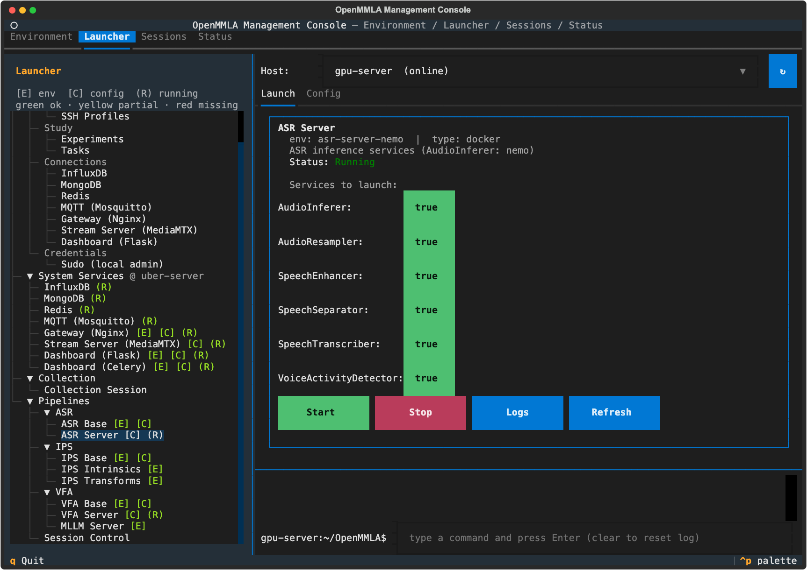
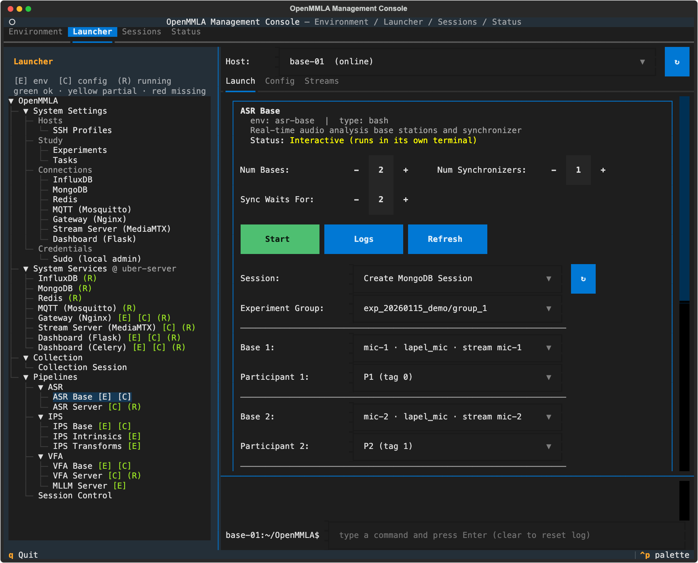

# Run ASR

This page runs ASR from the management console: what you set up once per deployment, and what you do for every session. It also covers running the components from the command line and replaying recorded audio.

!!! note "Before you start"
    This page assumes the [one-time setup](../../quickstart.md#one-time-setup) of the Quickstart is done: the machines added and prepared, the system services running, every machine pointed at them, and the study described.

## Once per deployment

These steps are done once, and again only when something they set changes: a microphone, a model or a machine.

1. **ASR Server config.** Open `Launcher → Pipelines → ASR → ASR Server` with **Host** on the GPU server. On the **Config** tab, set the speaker embedding backend and its model (`AudioInferer`), the transcription backend and its model (`SpeechTranscriber`), and `cuda` for each service that has it. **Save** writes `pipelines/asr-server/config.yml` on that host ([Server config](configuration.md#server-config)).
2. **Diarization token**, only when bases diarize, which group microphones do by default: accept the pyannote pipeline's terms on huggingface.co and give the account's token to the server ([Set up diarization](speakers-and-diarization.md#set-up-diarization)).
3. **ASR Server.** On the **Launch** tab, **Services to launch** lists the services of the config, each with a `true`/`false` toggle, all `true` at first. Leave on the services the bases call, and press **Start**. The card runs `docker compose -f docker/docker-compose.asr.yml up -d --build` for them on its host ([Docker](../../docker.md)).

    

    ??? info "Details: the first Start and config changes"
        - The first Start builds the images, several GB, and downloads the models; the log below the card shows the build.
        - When the Gateway runs, Start also renders and reloads it, so it routes the services ([Nginx](../../nginx.md#running)).
        - The services read their config when their containers start. After a change, **Stop** the card and **Start** it again.

4. **ASR Base config.** Open `Launcher → Pipelines → ASR → ASR Base` with **Host** on the base station, which needs the `asr-base` environment (the leaf's `[E]` reads `Ready`). On the **Config** tab ([Base config](configuration.md#base-config)):
    - `Base`: one block per kind of microphone (**+ Add Base**), with its `asr_scope` and the audio format the base works in.
    - `Bases`: one entry per microphone (**+ Add Entry**): `id`, `base_type`, `source` and the fields that source needs, with the devices the host reports ([Input sources](configuration.md#input-sources)).
    - `Streams`: one entry per stream the bases pull or receive (**+ Add Stream**). `target` takes the path alone, such as `asr/mic1`, and **Save** completes it with the Stream Server of System Settings. A `udp://` or `tcp://` target names the base station and the `port` of the `Bases` entry it feeds ([Streams](configuration.md#streams)).
    - `Server.asr`: the six service endpoints, through the Gateway or straight to the GPU server ([Service endpoints](configuration.md#service-endpoints)).

    **Save** writes the config on the card's host. A `source: stream` entry offers the `Streams` entries once the config is saved. The sections `InfluxDB`, `MongoDB`, `MQTT`, `Redis` and `Gateway` come from System Settings and are read-only here.

5. **Streams tab** of the same card. For each stream the console captures, pick its **SSH Profile** (the machine that runs its FFmpeg, such as `pi-01`), its **Device** and **Record**. These picks are written into the config of the card's host. **Start** a stream and **Probe** it: FFmpeg decodes two seconds of what the bases pull.
6. **Other base stations.** Each host runs its bases from its own `config.yml`. **Sync to Host** on the **Config** tab copies this one, whole, to another base station, replacing its `Bases` and `Streams` too. Then press **Refresh** on each card under **System Services** to check that the services are running and reachable.
7. **Speaker profiles**, only for bases that verify speakers: register each speaker on the base station ([Register a speaker](speakers-and-diarization.md#register-a-speaker)).

## Every session

1. **Start the streams.** On the ASR Base card's **Streams** tab, with **Host** on the base station whose config names them, **Start** each stream, or **Start All**, which starts every stream of the card that the console runs, in name order. A stream reads `Running` once its FFmpeg runs, and its **Stream Server** column `● live` once the Stream Server receives it (`-` for a `udp://` or `tcp://` stream, which goes straight to its base).
2. **Fill in the ASR Base card** on the **Launch** tab.

    

    | Field | Default | What it does |
    |---|---|---|
    | **Num Bases** | 1 | bases started on this host, one per microphone |
    | **Num Synchronizers** | 1 | a session has one synchronizer; set 0 on the cards of the session's other hosts |
    | **Sync Waits For** (`--num_bases`) | follows **Num Bases** | how many bases the synchronizer merges each bucket from, counted over every host of the session; set it by hand when bases run on other hosts |
    | **Session**, **Experiment Group** | | `Create MongoDB Session`, with the take's experiment group, starts a new take; or pick an existing session |
    | **Base 1**, **Base 2**, ... | | which `Bases` entry each base is, one dropdown per base |
    | **Participant**, under each base (`-pt`) | from the pick kept, else the base type | whom that base's speech is attributed to: a participant who wears that microphone, **Group**, or **Speakers (speaker verification)** ([Attribution per base](speakers-and-diarization.md#attribution-per-base)) |
    | **Speakers**, under a Speakers base (`-spk`) | the group's participants with a profile | the speaker profiles that base recognizes; **Manage** changes them ([Speakers](speakers-and-diarization.md#speakers)) |
    | **Mode** (`-m`) | `live` | `live` recognizes and transcribes as the session runs; `capture` only records the audio to `records/`; `analyze` processes the `.wav` files in `records/` |
    | **Language** (`-lang`) | `the server's own language` | the language the speech is transcribed in ([Language](speakers-and-diarization.md#language)) |
    | **Diarize** (`-dia`) | `on for group microphones` | which bases send their chunks for anonymous speaker turns ([Diarization](speakers-and-diarization.md#diarize)) |
    | **Store Audio** (`-s`) | off | keep the speech segments in `segments/` (and `separations/` with speech separation) and the chunks in `chunks/`; off, a segment is deleted once recognized and no chunk is written; `capture` records to `records/` either way |
    | **VAD** (`-vad`) | on | keep only the speech of each segment (Voice Activity Detector) |
    | **Noise Reduce** (`-nr`) | on | reduce the noise of each segment (Speech Enhancer) |
    | **Transcribe** (`-tr`) | on | transcribe the chunks (Speech Transcriber) |
    | **Speech Separate** (`-sp`) | off | split overlapping voices before recognition (Speech Separator); the segments are then `recognize_sp_duration` long |
    | **Dominant Speaker** (`-d`, synchronizer) | off | keep only the most confident recognition of each bucket, instead of every speaker the bases heard |
    | **Half-Scaled Recognition** (`-hsr`) | on | at a change of speaker, recognize the two half segments around it again, between the two speakers, so the change falls to half a segment; only with speaker verification |

    ??? info "Details: the card's fields"
        - **Sync Waits For** too high: a bucket waits for bases that never report until a later result is `Synchronizer.result_expiry_time` (10 s in the template) past it, and is then written with what it has. Too low: a bucket is written before the other bases report, and their late results are dropped or written as buckets of their own.
        - **Session**: the first Start with `Create MongoDB Session` mints the session id. Every base card (ASR, IPS and VFA, on any host) then opens on it, so the cards of the other base stations join it with their own Start.

3. **Press Start.** It opens one terminal window per base and synchronizer, and nothing in them asks anything. Each base starts with the speakers of its **Speakers** line, the synchronizer starts synchronizing, and all of them wait for START.

    ??? info "Details: what Start checks"
        - On a remote host whose config lacks the current System Settings, the first Start only brings them there and says `Relaunch ASR Base once the sync above completes.` Press **Start** again.
        - Start asks the Stream Server whether the streams the bases pull are live, and holds back once when it receives nothing on one ([Stream check](../../tui/pipelines.md#stream-check)). Start the stream, or press **Start** again to start the bases anyway.
        - Start refuses, and the log says why, when two bases are on one `Bases` entry, the card starts more bases than the synchronizer waits for, one tag is picked on two bases, or a Speakers base in `live` or `analyze` mode would have no speakers: no profile registered on the host, none ticked for it, or none of those ticked registered there.
        - Start warns, and starts anyway, when the **Streams** tab runs a stream these bases pull, or a microphone that pushes to a `udp` or `tcp` base, on another machine or records it otherwise than the config of the card's host says. The bases read that config, and the session notes what it says: a microphone that records on its Pi while the config says `record: false` is noted as not recorded, and one captured on another Pi than its `ssh_profile` sends **Sessions → Export** to the wrong Pi.
        - Start passes each base its own speakers as `-spk Alice,Bob`, and none to the synchronizer. A base already running keeps the profiles it started with.
        - A base whose source is a stream opens it at START and waits up to 30 s for one that is not up yet (`stream_kwargs.connect_wait`). One that drops during the session is opened again on its own (`stream_kwargs.reconnect_wait`); see [How the bases pull a stream](../../streaming/index.md#bases-pulling-a-stream).

4. **Send START.** Open `Launcher → Pipelines → Session Control`, pick the session the cards were started into, keep **ASR** ticked with the other pipelines of the take, and press **Send START** once every window reports that it waits.
5. **Send STOP** at the end. Every base and the synchronizer finish their run and exit, also when STOP comes before START. STOP also marks the session as ended in MongoDB, and the base cards go back to `Create MongoDB Session` for the next take.

    ??? info "Details: what happens at STOP"
        - A base notes in the session that it leaves first thing on its way out, then finishes its last audio chunks.
        - The synchronizer merges and writes every bucket still open, since a bucket some base never reported to would otherwise be lost.

6. **Stop the streams** once no other session needs them: **Stop** or **Stop All** on the card's **Streams** tab, or **Stop All** on the **Streams** tab of `Launcher → System Services → Stream Server (MediaMTX)`, which stops the streams of every card and takes a second press. A stream with `record: true` finishes its file on the capture host as it stops.
7. **Export and archive** on the **Sessions** tab ([Export and archive](../../quickstart.md#export-and-archive)). What the bases and the synchronizer wrote for the session (logs, the config they ran with, what they stored) stays under `artifacts/<session>/pipelines/` on the machine they ran on; **Export** brings a copy to the console.

## Run from the command line

The card runs these commands; you can run them by hand on a base station:

```bash
conda activate asr-base
# one base per microphone
mmla asr-base -p pipelines/asr-base -c pipelines/asr-base/config.yml -m live -sid <session-id> -b <base-id> -pt speakers -spk Alice,Bob
# a worn microphone, attributed to the participant with tag 5
mmla asr-base -p pipelines/asr-base -c pipelines/asr-base/config.yml -m live -sid <session-id> -b <worn-base-id> -pt 5
# one synchronizer per session
mmla asr-sync -p pipelines/asr-base -c pipelines/asr-base/config.yml -sid <session-id> -nb 2
```

| Flag | Command | Default | What it does |
|---|---|---|---|
| `-p` | both | the working directory | the project directory |
| `-c` | both | required | the config file |
| `-sid` | both | asked | the session; given, the component starts at once and exits when the run ends with STOP |
| `-b` | `asr-base` | with `-sid`, the only `Bases` entry; else asked | the `Bases` entry this base is |
| `-m` | `asr-base` | `capture` | `live`, `capture` or `analyze` |
| `-pt` | `asr-base` | the config decides | whom the speech is attributed to: a tag id, `group` or `speakers` |
| `-spk` | `asr-base` | every registered profile | the speaker profiles to recognize, comma-separated |
| `-lang` | `asr-base` | the transcriber's own language | the language to transcribe in, such as `en`, `da` or `zh-CN` |
| `-dia` | `asr-base` | group microphones diarize | send every chunk for its speaker turns |
| `-s`, `-vad`, `-nr`, `-tr`, `-sp`, `-hsr` | `asr-base` | `False`, `True`, `True`, `True`, `False`, `True` | the card's toggles |
| `-nb` | `asr-sync` | with `-sid`, the number of `Bases` entries; else asked | how many bases to merge |
| `-d` | `asr-sync` | `False` | keep only the dominant speaker of each bucket |
| `-sp` | `asr-sync` | `False` | the bases separate speech, so the buckets default to `recognize_sp_duration` |
| `-bt` | `asr-sync` | the length the base types share | a `Base` block whose segment length the buckets take when the `Synchronizer` section sets none ([Synchronizer](configuration.md#synchronizer)) |

Without `-sid` each process shows its menu and asks for the session and whatever its flags leave out. With `-sid` and a flag left out that has no single value to take, the window says so and asks. The synchronizer asks for no base type: it merges every base of the session, whatever its type. `mmla ses-ctl -c pipelines/asr-base/config.yml` sends START and STOP instead of Session Control.

??? info "Details: runs that end on an error"
    - A run that ends on an error rather than STOP, such as a stream that did not come up or did not come back, says so and shows the base's menu, where **Start** runs it again; send START for the session again.
    - A recording error does not end a live run: the base records on in the same session five seconds later, without waiting for another START, at most three times within a minute, after which the run ends as an error. A STOP sent meanwhile ends it.
    - A base that reads a file, or recorded segments in `analyze` mode, ends its run on a recording error instead, since starting over would publish its results a second time.

### Speaker profiles from the command line

`mmla asr-speakers` lists, registers and deletes the speaker profiles of a host without a base's menu, and asks nothing:

```bash
mmla asr-speakers -p pipelines/asr-base --list
# record from the source of a Bases entry
mmla asr-speakers -p pipelines/asr-base -c pipelines/asr-base/config.yml --register Alice -b <base-id>
# register from audio files on this host
mmla asr-speakers -p pipelines/asr-base -c pipelines/asr-base/config.yml --register Alice -b <base-id> --files a.wav b.m4a
mmla asr-speakers -p pipelines/asr-base --delete Alice
```

A registration takes the settings of the base type of `-b`. `-t` sets the seconds to record (default: the base type's `register_duration`), `-vad` and `-nr` the preprocessing (both on), and `-s` whether its audio is kept in the profile (on).

### Run the server without Docker

Install one backend extra and start one gunicorn process per service from `openmmla/services/asr/apps/`. The WeSpeaker backend is not on PyPI, so it is installed separately at the commit the Docker image uses:

```bash
pip install -e '.[asr-server-wespeaker]'   # or '.[asr-server-nemo]'
pip install "wespeaker @ git+https://github.com/wenet-e2e/wespeaker.git@9ce7995648a281ba6ce6f4e7a33941672ef22779"

export PROJECT_DIR=pipelines/asr-server CONFIG_PATH=pipelines/asr-server/config.yml
gunicorn -k gevent -w 1 -b 0.0.0.0:5005 openmmla.services.asr.apps.serve_speech_transcriber:app
```

The modules are `serve_audio_inferer` (5001), `serve_audio_resampler` (5002), `serve_speech_enhancer` (5003), `serve_speech_separator` (5004), `serve_speech_transcriber` (5005) and `serve_voice_activity_detector` (5006).

## Replay recordings { #post-time-processing }

A recorded session is analyzed by replaying its audio files through the bases (post-time processing).

1. Record with **Collection → Collection Session** ([Record a session](../../tui/collection.md#record-a-session)).
2. On the ASR Base card's **Config** tab, set each base's `source` to `file` and its `source_index` to its file in the `audio/` directory of the collection manifest, by its full path (**Browse…** picks it).
3. Run the session in `live` mode as in [Every session](#every-session), without the streams. The Quickstart's [Analyze the recordings later](../../quickstart.md#analyze-the-recordings-later) gives the steps for all pipelines at once.

The replay's timing comes from the file names (`<prefix>_<timestamp>.wav`). A `udp` or `tcp` stream with `record: true` writes such a file on its capture host ([Streams](configuration.md#streams)). To process again the audio a base recorded in `capture` mode, start it in `analyze` mode in that session.

??? info "Details: the batch replay script"
    `scripts/replay_sessions.py` replays collected sessions through ASR, VFA and IPS one after another and fuses the results. It gives each personal recording of a session with several microphones its own `Vimo` base, bound to its participant (the device name when none is bound), beside the group base, and writes that `participant` into the `Bases` entries of the configs it generates. The personal bases run without `-dia`, and the synchronizer runs with `-bt Vimo -nb <count>`.

## Troubleshooting

**A base window shows the base's menu.** A base that cannot start on its own says why and what to do, and shows its menu; when the menu would clear the screen, the window waits for Enter first.

- A host the card could not ask for speakers, or a profile deleted after it was picked: choose **Edit Speaker Profiles** (register from the source or from files, select the speakers), then **Start**.
- A `Bases` entry that is not there, or one that names no stream or file, or one that is not there: pick it from the menu in the same way.
- A run started again from the menu exits on STOP like the first.

**Manage says the checkout on a host has no `mmla asr-speakers` yet.** On another host, Manage and the speaker checks of Start run `mmla asr-speakers` there, in its `asr-base` environment and its own checkout. Pull the latest OpenMMLA there.

**A base says the transcriber did not take its language, or answered turns without voices.** The speech transcriber's image is out of date. Pull the latest OpenMMLA on the GPU server, then **Stop** and **Start** the ASR Server card, which rebuilds the image.
