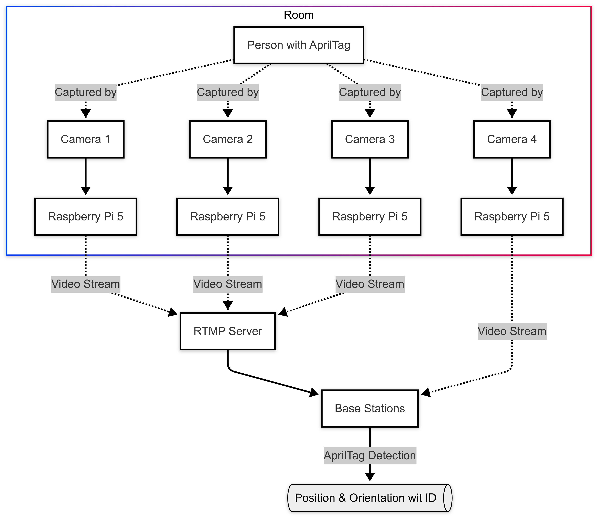

# Indoor Positioning System (IPS)

Camera-based indoor positioning with AprilTags. Several cameras watch the room, each IPS base detects the tags worn by the participants in its camera's view, the coordinates are transformed into one shared frame, and the synchronizer writes positions, orientations and the proximity graph of the group to InfluxDB.

## Pipeline overview



1. Video capture from one camera per base: a USB camera, an RTMP stream, LSL, or a recorded file
2. AprilTag detection and pose estimation with the calibrated camera intrinsics
3. Transformation of every camera's coordinates into the main camera's frame, using the matrices produced by camera sync
4. Synchronization of all bases into time buckets, written as `ips_translation`, `ips_rotation` and `ips_relation` events
5. Optional real-time visualization of the positions

| Component | Runs on | Command | Environment |
|---|---|---|---|
| IPS Base, one per camera | base station | `mmla ips-base` | conda env `ips-base` |
| IPS Synchronizer, one per session | base station | `mmla ips-sync` | conda env `ips-base` |
| IPS Visualizer, optional | base station | `mmla ips-vis` | conda env `ips-base` |
| Camera calibrator, once per camera model | any machine with the camera | `mmla ips-ccal` | conda env `ips-base` |
| Camera tag detector and sync manager, once per camera arrangement | base stations | `mmla ips-ctag`, `mmla ips-csync` | conda env `ips-base` |

IPS needs no AI server. Create the `ips-base` environment from the TUI's Environment tab or by hand (`conda create -n ips-base python=3.10 -y && pip install -e '.[ips-base]'`). For an `lsl` source add `pip install pylsl==1.17.6` and `conda install -c conda-forge liblsl=1.16.2`.

An alternative input path skips the cameras entirely: a Nicla Vision badge running `pipelines/wearables/nicla-vision/ips/onboard_apriltag_detect.py` detects tags on the device and publishes its results over MQTT to the `<session>/ips` topic.

## Configuration

`pipelines/ips-base/config.yml` is the base station config; `config_template.yml` documents every key. Open the **Config** tab of the IPS Base card and press **Save** to create it from the template, or copy the template by hand.

| Section | What it holds |
|---|---|
| `Base` | settings shared by every base: `tag_size` and `families` of the AprilTags, `resolution`, `rotate`, `fps`, the file-replay pacing (`keyframe_interval`, `processing_rate`, `enable_timing_sync`), `file_dir` for replay, and `stream_kwargs` |
| `Bases` | one entry per camera position: `id`, `camera` (a calibrated profile from `Cameras`), `source`, `source_index`, and `main` (exactly one `true`). Camera sync, the bases and the transform matrices all key on these ids. |
| `Cameras` | the intrinsic parameters per camera model, written by the calibration tool (or filled in by hand); the template ships profiles for a Logitech C920, a MacBook Air camera and an iPhone |
| `Synchronizer` | `bucket_duration` |
| `Streams` | managed and external streams, see below |
| `InfluxDB`, `MongoDB`, `MQTT`, `Redis`, `Gateway` | mirrored from System Settings, see [System Services](../system_services.md) |

```yaml
Bases:
  - id: cam-front            # base id; appears in MQTT and as the transform matrix key
    camera: logitechC920     # a calibrated profile from Cameras
    source: opencv           # opencv | rtmp | lsl | file
    source_index: 0          # opencv/rtmp: 0-based index; file: file name in Base.file_dir; lsl: stream name
    main: true               # exactly one base is the main reference frame
  - id: cam-side
    camera: logitechC920
    source: rtmp
    source_index: 0
    main: false
```

IPS has no capture/analyze/live mode switch: a live source (`opencv`, `rtmp`, `lsl`) runs in real time and a `file` source replays the recording at the configured pace.

### Input sources

| Source | Description | Setup |
|---|---|---|
| `opencv` | USB camera on the base station or a Raspberry Pi | `source_index` is the device index (0 to 3); the base lists the devices it finds |
| `rtmp` | video pulled from the Nginx RTMP server | a `Streams` entry with `target: rtmp://...`; `source_index` is the position among the RTMP entries |
| `lsl` | Lab Streaming Layer | `source_index` is the stream name; needs `pylsl` |
| `file` | replay of a recorded video | `source_index` is the file name inside `Base.file_dir`; the start time comes from the file name |

### Streams

```yaml
Streams:
  # external RTMP stream (already running, the base only pulls from the URL)
  cam-external:
    target: rtmp://uber-server.local/ips/3

  # managed stream: the TUI starts/stops ffmpeg on a remote Raspberry Pi over SSH
  cam-1:
    ssh_profile: rpi-living-room    # must match a TUI SSH profile name
    device: /dev/video0             # camera device on the remote machine
    target: rtmp://uber-server.local/ips/1
    codec: libx264
    resolution: 1920x1080
    fps: 30
```

Managed streams are started and stopped from the **Streams** tab; see [RTMP Streaming](../rtmp_streaming.md) for the FFmpeg commands.

## Camera calibration and synchronization

One-time setup for a camera arrangement, done in this order from the leaves under `Launcher → Pipelines → IPS`. Redo the synchronization whenever a camera moves.

### Calibrate each camera model

**IPS Camera Calibration** runs `mmla ips-ccal`, which films a checkerboard, computes the intrinsic parameters and writes them into the `Cameras` section of `config.yml` under the name you give the camera. The captured images land in `pipelines/ips-base/camera_calib/cameras/<camera>/`; the panel below the card lists them and can delete images or a whole camera (local host only). Cameras of the same model can share one profile.

### Synchronize the cameras

Define the `Bases` entries first (one per camera position, exactly one `main: true`); the sync manager refuses to start without a main base. **IPS Camera Sync** starts `Num Tag Detectors` instances of `mmla ips-ctag` (one per camera, each asks which `Bases` entry it is) and one `mmla ips-csync` sync manager. The manager pairs the main base with one alternative base at a time (switch to the next alternative from its menu): show one AprilTag to both cameras and start the synchronization, and it computes the transform from that camera into the main camera's frame and accumulates the pairs in `pipelines/ips-base/camera_sync/transformation_matrices.json`. Choose **export transformations** in the manager's menu when every camera is done: it writes `transformation_matrices_<main-id>.json`, which is the file the bases load.

### Distribute the matrices

The **Transform Matrix** tab of the IPS Base card shows the exported files as editable JSON. With Host set to `Local`, **Sync to Remote** copies them into `pipelines/ips-base/camera_sync/` on the chosen base station; with a remote host selected, the tab edits that host's copy directly. Every base station that runs an IPS base needs the exported file.

## Run from the TUI

1. **System services** running and reachable, and the setup above done: calibrated `Cameras`, `Bases` with one `main: true`, and the exported transform matrices on every base station.
2. **IPS Base**: `Launcher → Pipelines → IPS → IPS Base`, Host set to the base station. Choose the number of bases, synchronizers and visualizers, the **Session** (or `Create MongoDB Session` from an experiment group), and the toggles (`Graphics` shows the annotated frames, `Store` saves frames, `Verbose` prints debug output). **Start** opens one terminal window per instance; each base asks which `Bases` entry it is.
3. **Session Control**: once every window reports that it is waiting, send **START** for the session; send **STOP** at the end.

## Manual CLI

```bash
conda activate ips-base
P=pipelines/ips-base; C=$P/config.yml

mmla ips-ccal  -p $P -c $C                 # camera intrinsic calibration
mmla ips-ctag  -p $P -c $C -b <base-id>    # one tag detector per camera (-hl true for headless)
mmla ips-csync -p $P -c $C                 # sync manager; pairs each alternative base with the main one

mmla ips-base  -p $P -c $C -sid <session-id> -b <base-id>
mmla ips-sync  -p $P -c $C -sid <session-id>
mmla ips-vis   -p $P -c $C -sid <session-id>
```

`-b` and `-sid` are asked interactively when omitted. `pipelines/ips-base/apriltag/` contains printable tag36h11 tags and a resize script; `pipelines/ips-base/docs/clock.html` is a browser clock you can film to check the timing of recordings.

## Post-time processing

Record with **Collection → Collection Session**, then set each base's `source` to `file`, `Base.file_dir` to the `video/` directory from the collection manifest and `source_index` to the file name. `keyframe_interval` and `processing_rate` control how fast the recording is replayed.
