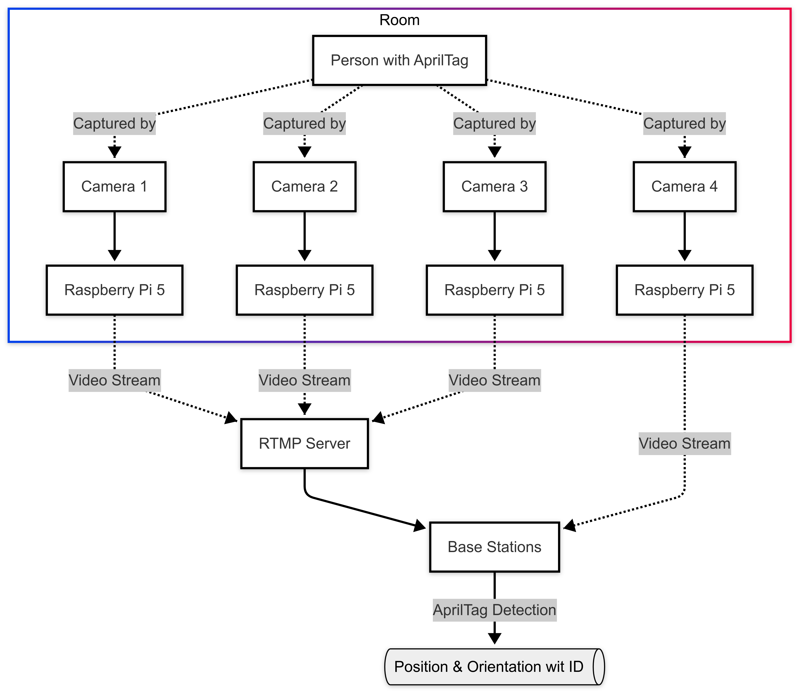

# Indoor Positioning System (IPS)

Camera-based indoor positioning with AprilTags. Several cameras watch the room, each IPS base detects the tags worn by the participants in its camera's view, the coordinates are transformed into one shared frame, and the synchronizer writes positions, orientations and the proximity graph of the group to InfluxDB.

## Pipeline overview



1. Video capture from one camera per base: a USB camera, an RTMP stream, LSL, or a recorded file
2. AprilTag detection and pose estimation with the calibrated camera intrinsics (scaled to the frame size), the raw pose of every detection published as it is
3. Transformation of every camera's coordinates into the main camera's frame, using the matrices produced by camera sync
4. Synchronization of all bases into time buckets, the cameras of each bucket fused per tag, written as `ips_translation`, `ips_rotation` and `ips_relation` events (see [What is stored](#what-is-stored))
5. The positions, headings and who faces whom are shown live on the [dashboard](../dashboard.md)'s Live page (its Room card), and summarized on its Analysis page

| Component | Runs on | Command | Environment |
|---|---|---|---|
| IPS Base, one per camera | base station | `mmla ips-base` | conda env `ips-base` |
| IPS Synchronizer, one per session | base station | `mmla ips-sync` | conda env `ips-base` |
| Camera calibrator, once per camera model | any machine with the camera | `mmla ips-ccal` | conda env `ips-base` |
| Camera tag detector and sync manager, once per camera arrangement | base stations | `mmla ips-ctag`, `mmla ips-csync` | conda env `ips-base` |

IPS needs no AI server. Create the `ips-base` environment from the TUI's Environment tab or by hand (`conda create -n ips-base python=3.10 -y && pip install -e '.[ips-base]'`). For an `lsl` source add `pip install pylsl==1.17.6` and `conda install -c conda-forge liblsl=1.16.2`.

An alternative input path skips the cameras entirely: a Nicla Vision badge running `pipelines/wearables/nicla-vision/ips/onboard_apriltag_detect.py` detects tags on the device and publishes its results over MQTT to the `<session>/ips` topic.

## Configuration

`pipelines/ips-base/config.yml` is the base station config; `config_template.yml` documents every key. Open the **Config** tab of the IPS Base card and press **Save** to create it from the template, or copy the template by hand.

| Section | What it holds |
|---|---|
| `Base` | settings shared by every base: `tag_size` and `families` of the AprilTags, `resolution`, `rotate`, `fps`, the file-replay pacing (`keyframe_interval`, `processing_rate`, `enable_timing_sync`), the window's smoothing (`display_smoothing`, `display_reset_seconds`), and `stream_kwargs` |
| `Bases` | one entry per camera position: `id`, `camera` (a calibrated profile from `Cameras`), `source`, `source_index`, `capture_rotate` (optional: the turn a `file` source was recorded with, see **Turning the picture** under [Streams](#streams)), `room` (optional, see [Several rooms](#several-rooms)) and `main` (exactly one `true`, one per room). Camera sync, the bases and the transform matrices all key on these ids. |
| `Cameras` | the intrinsic parameters per camera model, written by the calibration tool (or filled in by hand), with `calibration_resolution`, the frame size they were calibrated at (**Intrinsics and frame size** under [What is stored](#what-is-stored) says what an entry without it gets); the template ships profiles for a Logitech C920, a MacBook Air camera and an iPhone |
| `Synchronizer` | `bucket_duration`, `max_lateness`, `fusion_gate` (see [What is stored](#what-is-stored)) |
| `Streams` | managed and external streams, see below |
| `InfluxDB`, `MongoDB`, `MQTT`, `Redis`, `Gateway` | mirrored from System Settings, see [System Services](../system_services.md) |

```yaml
Bases:
  - id: cam-front            # base id; appears in MQTT and as the transform matrix key
    camera: logitechC920     # a calibrated profile from Cameras
    source: opencv           # opencv | stream | lsl | file (rtmp is the old name of stream)
    source_index: 0          # opencv: camera index; stream: index among the pullable Streams entries; file: the file's full path; lsl: stream name
    main: true               # exactly one base is the main reference frame
  - id: cam-side
    camera: logitechC920
    source: stream
    source_index: 0
    main: false
```

IPS has no capture/analyze/live mode switch: a live source (`opencv`, `stream`, `lsl`) runs in real time and a `file` source replays the recording at the configured pace.

### Input sources

| Source | Description | Setup |
|---|---|---|
| `opencv` | USB camera on the base station or a Raspberry Pi | `source_index` is the device index: the Config tab lists the cameras found on the card's host (`/dev/video<N>` is index N on Linux, a Mac's in AVFoundation's order) to pick from, and the base lists the devices it finds when it starts |
| `stream` | video pulled from the MediaMTX server (`rtmp` is the old name) | a `Streams` entry whose `read_target` (else `target`) is an `rtmp://`, `rtsp://` or `srt://` URL; `source_index` is its position among those entries |
| `lsl` | Lab Streaming Layer | `source_index` is the stream name; needs `pylsl` |
| `file` | replay of a recorded video | `source_index` is the file to replay, by its full path: **Browse…** on the Config tab writes it, and the dropdown lists the other files of its folder (when the card's host is this machine; on another one the path is typed). Files replayed together sit in one folder: the replay starts at the latest start among them, read from the names. A config from before keeps a `file_dir` in `Base`, where a bare file name was looked up: the bases still read it, and the Config tab turns those names into full paths, which the next **Save** writes (the log says what moved). |

### Streams

```yaml
Streams:
  # external stream (already running; the base pulls read_target, else target)
  cam-external:
    target: rtmp://uber-server.local:1935/ips/3
    read_target: rtsp://uber-server.local:8554/ips/3

  # managed stream: the TUI starts/stops ffmpeg on a remote Raspberry Pi over SSH
  cam-1:
    ssh_profile: rpi-living-room    # must match a TUI SSH profile name
    device: /dev/video0             # camera device on the remote machine
    target: rtmp://uber-server.local:1935/ips/1       # published to MediaMTX
    read_target: rtsp://uber-server.local:8554/ips/1  # pulled by the base
    codec: libx264
    resolution: 1920x1080
    fps: 30
    bitrate: 1M
    record: true                    # also keep an mkv on the Pi for later replay
```

Managed streams are started and stopped from the **Streams** tab; see the [Streaming guide](../rtmp_streaming.md) for the FFmpeg commands and the recording layout.

**Turning the picture.** A camera mounted upside down (or on its side) is turned upright once, where it is captured: its Streams entry's `rotate` (0, 90, 180 or 270, clockwise; the **Rotate** cell of the Streams tab) makes the capture host's FFmpeg turn the picture, so the base, the Stream Server's recordings and the dashboard all get it upright, and the session notes the turn as the stream's `sources[].capture.rotate`. `Base.rotate` stays 0; it turns the frames in the base, for a source the console does not capture. The base finds the Streams entry its source pulls and turns the camera's intrinsics with the picture, from the `Cameras` entry as it was calibrated: nothing in `Cameras` changes when a camera is turned. A file turned before it reached the base, such as a recording `mmla ses-tidy` flipped or a replay of a turned session's recording, says so with its `Bases` entry's `capture_rotate`, and the base turns the intrinsics for that turn as well (a base whose capture turn and `Base.rotate` are both set warns at start that the picture is turned twice). A stream whose `rotate` changed is restarted before the bases start: until then it still sends the picture as it was started. The poses stay in the camera's frame as the sensor gives it, whatever turned the picture (see [What is stored](#what-is-stored)), so the Camera Sync matrices hold whether the picture is turned or not. The base's session parameters note `capture_turn` beside `rotate`. Until 2026-10-02 a base turning its frames reported the poses on the turned frame, so matrices fitted by `mmla ips-ctag` under a `Base.rotate` other than 0 before then are in the turned frame and are to be fitted again; the base warns of this at start whenever `Base.rotate` is set.

## What is stored

**Raw poses.** A base publishes, for every frame, the pose of every tag it detects as the detector gave it: the rotation and position in its camera's frame, the decoder's decision margin and the pose error, and the frame's time. Nothing is carried over from earlier frames, so a position is where the tag was on that frame, not an average lagging behind it, and a tag seen again after a while is placed where it is. The one change made to a pose: a tag the camera sees faces the camera, so a rotation whose z axis points at the camera (a misread of a small tag) is turned half a turn about the tag's y axis, which keeps the badge's y axis (gravity) and makes -column 2 the outward normal, as every reader takes it.

**Poses in the sensor's frame.** A base reports every pose in its camera's frame as the sensor gives the picture, before any turn: a pose found on a picture turned by `Base.rotate` (and, for a file, its `capture_rotate`) is turned back about the optical axis (a half turn negates x and y; a quarter turn clockwise maps the turned frame's (x, y) back to the sensor's (y, -x)). `mmla ips-ctag` and `mmla ses-calibrate` report their poses the same way, so the transformation matrices, the synchronizer and the stored data keep one frame per camera whether the picture was turned or not. Who faces whom on one camera's frame is judged on the turned (upright) picture's poses, whose x-z plane is the floor's.

**Display smoothing.** Only the base's window (Graphics on) draws a smoothed pose: `display_smoothing` (0.7) is the weight of a tag's history in the drawn pose (0 draws the raw pose), rotations are smoothed along the shorter arc between their quaternions, and a tag not seen for more than `display_reset_seconds` (2), or turned by more than 45 degrees, is drawn from its raw pose again. The dashboard draws the stored poses.

**Buckets.** The synchronizer files each frame into the bucket of its time: buckets of `bucket_duration` seconds from the first frame it gets, so a file replay, whose frames lie on whole seconds from the shared start, puts one frame per camera in each bucket. A bucket is written once every base still sending has moved past it. A base more than `max_lateness` seconds (of frame time, 5 by default) behind the newest frame no longer holds the buckets up; a frame of a bucket already written is left out. The synchronizer's log names a base's first such frame with how far it was behind the newest frame and why it came late (the base joined after the bucket was written, it was more than `max_lateness` behind when the bucket was written, or the frame is older than one it sent before), and counts such frames per base at the end of the run, when the buckets still open are written too. For the first `max_lateness` seconds a base the matrices place that has sent nothing yet holds them up as well, so a base that starts a little later keeps its first frames.

**Fusing the cameras.** Each camera's detection is taken into the main camera's frame with its matrix. A live camera that sent several frames in a bucket stands for the one nearest the median of their positions. Per tag, the cameras whose positions lie within `fusion_gate` metres (0.25) of the cameras' median position are averaged, each weighted by 1 / distance^4 from the camera that saw the tag (a tag's depth error, the larger part of its error, grows with the square of its distance, so its variance grows with the fourth power and the weight is its inverse); a camera further off is left out, and when none lies within the gate (two cameras that disagree) the best camera is taken alone. The best camera is the one nearest the tag, the decision margin breaking a tie, and the stored rotation is its rotation: averaging two readings of a small tag's rotation can give one neither camera saw.

**Who faces whom.** A tag faces another (`is_tag_looking_at_another_2d`: its outward normal within about 20 degrees of the direction to the other on the x-z plane, the two within 1 m) when a camera that saw both saw it on at least half of its frames of the bucket that held both, on their raw poses in that camera's frame, or on the fused poses in the main camera's frame (within 1.2 m). There is no history from one bucket to the next: the fusion table counts the facing over its 10 s windows.

The three events of a bucket share `window_start_time` and `window_end_time`:

| Event | Field | Holds |
|---|---|---|
| `ips_translation` | `translations` | `{tag: [[x], [y], [z]]}`: the fused position in metres, in the main camera's frame |
| | `detections` | `{tag: {camera: {t, f, d, m, dt, n, out}}}`: every camera's own detection of the tag in the bucket, for analyses that use or fuse the cameras themselves. `t` is its position in the main camera's frame, `f` its outward normal there, `d` its distance from that camera (metres), `m` the decision margin (null from a base that sent none), `dt` the frame's time after the bucket's start, `n` how many frames it stands for (a live camera; absent for one), `out` true when the fused position left it out |
| `ips_rotation` | `rotations` | `{tag: 3x3}`: the rotation of the tag's best detection, in the main camera's frame |
| `ips_relation` | `graph` | `{tag: [tags it faces]}`, every tag of the bucket a key |

Sessions written before 2026-10-02 hold smoothed poses (an exponential average of factor 0.7 over each tag's whole history, never reset), and the last camera's value per bucket; they are made raw by replaying IPS again.

**The floor plan.** The dashboard lays the positions on the floor (`openmmla/analytics/report/space.py`): the badges hang, so the mean of their y axes is the room's gravity `g` in the main camera's frame, and the plan's axes are `u` to the right of the main camera, `v` away from it and `h` up, right-handed, so the plan is the room seen from above. The positions are in the main camera's frame as the sensor gives it, so a main camera hung upside down has its x axis pointing to the room's left and one on its side has it up or down: `u` is therefore the right of the picture as it stands upright, the right axis of the quarter turn whose down axis lies nearest `g`, laid flat on the floor (the camera's x for a camera hung upright, rolled less than 45 degrees, which is what `u` always was; -x for one hung upside down), and `v` is the optical axis laid flat. A session with too few badge rotations (under 30) falls back on the main camera's x-z plane, which the gravity cannot turn; the analysis report's plan turns it by the main camera's turn instead, read from the session document (its base's `capture_turn` and `rotate`, else its stream's `sources[].capture.rotate`), and its floor says `method: camera-xz` with that `turn`. The Room card of the live view and of a replay does not take that fallback: until the badges' rotations it reads give it the floor, it lays the positions on the camera's own x-z plane, which is a mirror image for a main camera hung upside down. Plans computed before 2026-10-02 of a session whose main camera hung upside down and whose poses are in the sensor's frame are mirror images; recompute the report.

**Intrinsics and frame size.** A camera's intrinsics hold for the frame size they were calibrated at, `calibration_resolution` in its `Cameras` entry (IPS Intrinsics writes it from the checkerboard images). An entry without it, written before the key or saved from a form that does not carry it, goes by its principal point, which lies near the centre of the calibration images: frames within 10% of (2cx, 2cy) are read with the intrinsics as they are, and frames of another size are scaled from the common frame size nearest (2cx, 2cy), 1920x1080 for the Logitech C920, MacBook Air and iPhone profiles. The base's log says which size it took. A frame of another size, such as a 960x540 recording, gets fx and cx scaled by the width ratio and fy and cy by the height ratio, measured on the picture as the sensor gives it, before a file's `capture_rotate` or `Base.rotate` turned it; the base's log says so once. On a turned picture the scaled intrinsics are turned with it (a half turn takes (cx, cy) to (W - 1 - cx, H - 1 - cy); a quarter turn swaps fx and fy as well). Without it every tag of such a recording comes out twice as far away and off to one side. A frame of another aspect than the calibration's is scaled all the same, with a warning that the result is only approximate, and a principal point that lands more than 10% off the frame's centre is warned of too: the intrinsics were then calibrated at another size than the entry says. A fisheye camera's frames are remapped with its own K and are not scaled. The distortion coefficients `D` of a pinhole camera are not used.

## Camera calibration and synchronization

One-time setup for a camera arrangement, done in this order from the leaves under `Launcher → Pipelines → IPS`. Redo the synchronization whenever a camera moves.

### Calibrate each camera model

**IPS Intrinsics** runs `mmla ips-ccal`, which films a checkerboard, computes the intrinsic parameters and writes them into the `Cameras` section of `config.yml` under the name you give the camera. A `Cameras` entry holds the intrinsics of the picture as the sensor gives it, which every base turns with the picture: calibrating from a stream whose Streams entry has a `rotate`, the calibrator lists the stream with its turn and turns each captured image back before it saves it, so the intrinsics and `calibration_resolution` are the sensor's whatever turned the stream (the live view shows the stream as it comes, turned). Images of another size than most of a camera's (one saved turned a quarter by an older calibrator, or taken at another resolution) are left out of the calibration with a warning; images an older calibrator saved from a stream turned by half are upside down, and give a principal point mirrored about the centre: capture them again. The captured images land in `pipelines/ips-base/camera_calib/cameras/<camera>/`; the panel below the card lists them and can delete images or a whole camera (local host only). Cameras of the same model can share one profile. The panel's **Sync to Host** gives the machine that runs the IPS base a camera's parameters, and **Sync from Host** brings every calibrated camera of another machine into this one's `config.yml`, asking for a second press before it replaces parameters this machine has; the images never travel.

### Synchronize the cameras

Define the `Bases` entries first (one per camera position, exactly one `main: true`, or one per room, see [Several rooms](#several-rooms)); the sync manager refuses to start without a main base. **IPS Transforms** starts `Num Tag Detectors` instances of `mmla ips-ctag` (one per camera, each asks which `Bases` entry it is) and one `mmla ips-csync` sync manager. The manager pairs the main base with one alternative base at a time (switch to the next alternative from its menu): show one AprilTag to both cameras and start the synchronization, and it computes the transform from that camera into the main camera's frame from each pair of detections of the tag that reached it within 0.2 s of each other (`mmla ips-csync -t <seconds>` changes it). It goes by when the detections arrive, not by the capture stamps they carry, which lag its clock by the whole way from the camera through the stream, the detector and the MQTT broker: a slow network or a relayed broker makes the sync wait longer for a detection, but no longer keeps every pair out. It accumulates the pairs in `pipelines/ips-base/camera_sync/transformation_matrices.json`. Choose **export transformations** in the manager's menu when every camera is done: it writes `transformation_matrices_<main-id>.json`, which is the file the bases load.

### Distribute the matrices

The **Transform Matrix** tab of the IPS Base card shows the exported files as editable JSON. The tab edits the files of the host it is set to. **Sync to Host** copies them into `pipelines/ips-base/camera_sync/` on the machine picked beside it, and **Sync from Host** copies that machine's into the host the tab is set to, so either button takes them from here to a base station or from a base station back here; files are added or overwritten, never deleted. **Delete** removes the file on screen from the host the tab edits, after a second press (the other hosts keep theirs). Every base station that runs an IPS base needs the exported file.

### Calibrate from a recorded session

A recorded session calibrates itself: whenever two cameras saw the same tag at the same moment, the tag's position in both camera frames is one sample of the transform between them. `mmla ses-calibrate` reads the session's videos (from `artifacts/<session>/manifest.json`), detects the tags on a frame every `-st` seconds with the same detector, intrinsics (`Cameras`, scaled to the videos' frame size as the base scales them) and tag size as the IPS base, on the raw poses in the sensor's frame (a video turned before it was read is read with the intrinsics turned with it and its poses turned back: a recording the Collection card turned notes its turn as `rotate` in its own manifest entry, the session's `sources[].capture.rotate` gives the turn of a stream's recording, and `-cr`, which wins over both, that of one the session does not note, such as one `mmla ses-tidy` flipped; the log says where each turn came from), pairs the sightings of the main camera with each other camera's, fits one rigid transform per camera to the paired positions (with the pairs that disagree thrown out) and writes `artifacts/<session>/analysis/calibration/transformation_matrices_<main>.json`, ready for `camera_sync/`, next to a `calibration_report.json` with the residuals. Given matrices are scored on the same pairs with `-v`, which is how a calibration made on another day is checked against a session:

```bash
mmla ses-calibrate -c pipelines/ips-base/config.yml -sid <session-id> -v pipelines/ips-base/camera_sync/calibrations/<calibration>/transformation_matrices_<main>.json
```

The report says, per camera, how many paired sightings there were, the residual of the fit (median and p90, in metres), how far the pose-to-pose average that Camera Sync would compute lies from it, and for the given matrices their residuals, the share of pairs within 0.15 m and their difference to the fit. A camera that never saw a tag together with the main one cannot be placed.

A camera with fewer than `-nb` (10) paired sightings is searched for near-simultaneous ones as well: around every sampled moment where one camera saw a tag that the other saw one step before or after, a few more frames of both are read, and the sightings of the same tag at most `-nw` (0.2) seconds apart are paired. So are the camera's sightings at the same moment as a third camera whose own fit rests on at least `-nb` pairs with a p90 within 0.15 m: that camera's sighting, taken into the main camera's frame by its fit, stands in for the main camera's. Both kinds are too few or too indirect to fit a transform on, but they can check one; they go to `near_pairs.json` beside the report, whose `near` entry counts them (`pairs` with the main camera, `via` per third camera) and scores the `-v` matrices on them.

The batch replay (`scripts/replay_sessions.py`) runs `ses-calibrate` for every multi-camera session and then picks each camera's transform: its own fit when it rests on at least 10 pairs with a p90 residual within 0.15 m (or within 0.3 m when the given calibration is no better on the same pairs); else the given calibration's entry when the session's pairs put its median residual within 0.3 m; else, for a camera with fewer than 10 pairs, the own fit of the same camera pair from another session on the same rig (the same given calibration and main camera), the one nearest in date, because the cameras of a rig are rarely moved. A borrowed fit is checked on the pairs `ses-calibrate` kept for the camera (near-simultaneous, or through a third camera) when there are any, and refused when their median residual is over 0.3 m. With nothing to borrow, the given entry that no direct pair judged is checked the same way and taken when those pairs put it within 0.3 m; when there are no such pairs either, it is taken unchecked (`given calibration (unchecked: no shared sightings, nothing to borrow)`), since a rig no other session shares has only its calibration file to go on. A camera stays out of the IPS run only when the session's pairs put the given entry more than 0.3 m off, or the given calibration has no entry for it. The choice per camera is logged, and `matrices_used.json` (and the `borrowed` entry of `calibration_report.json`) names the session a borrowed fit came from. A camera whose recording was turned where it was captured (the `rotate` its Collection recording notes in the manifest, 0 included, which a raw-only session without sources has too; else its stream's turn, the session's `sources[].capture.rotate`, read from `artifacts/<session>/measurements/<session>_parameters.json`, else from the MongoDB document) recorded the turned picture, so its `Bases` entry in the replay's IPS and VFA configs carries that turn as `capture_rotate`, and the base reads the file as the live base read the stream: intrinsics turned with the picture, poses in the sensor's frame. The default template configs (the pilot configs) have `Base.rotate: 0`, as such a session needs: a template with a `Base.rotate` would turn its pictures a second time, which the base warns of at start.

## Run from the TUI

1. **System services** running and reachable, and the setup above done: calibrated `Cameras`, `Bases` with one `main: true` (one per room), and the exported transform matrices on every base station.
2. **IPS Base**: `Launcher → Pipelines → IPS → IPS Base`, Host set to the base station. Choose the number of bases and synchronizers, the **Session** (or `Create MongoDB Session` from an experiment group), **Graphics** (`-g`: `off for streams`, the default, opens a window on the annotated frames unless the base's source is a stream, which a base pulls where nobody watches it, often over SSH with no display; `on` and `off` decide for every source), and the toggles (`Store` saves frames, `Verbose` prints debug output). Everything the windows used to ask is chosen on the card:
    - with rooms in `Bases`, the **Room** of the session: picking one puts that room's bases on the card, sets **Num Bases** to their number and the main camera to the room's main (see [Several rooms](#several-rooms));
    - which `Bases` entry each base is, one dropdown per base (their number follows **Num Bases**);
    - the synchronizer's **main camera**, the base whose `camera_sync/transformation_matrices_<id>.json` it loads. The dropdown lists the files exported on the card's host and starts on the `Bases` entry with `main: true` when its file is there, else on the first file, and follows Base 1 to the main of its room; **Start** refuses to launch a synchronizer until one is picked (press Refresh on the card once the files are there).

    **Start** opens one terminal window per instance. Each process starts at once with those choices and waits for START; nothing is asked in the windows.
3. **Session Control**: once every window reports that it is waiting, send **START** for the session; send **STOP** at the end. On STOP every base and synchronizer ends its run and exits, also when STOP comes before START; start the card again for the next session. A synchronizer whose run ends on an error instead of STOP (the connection to Redis lost, say) says so and shows its menu, where `1` starts it again.

When a choice from the card cannot be used (the synchronizer finds no `camera_sync/transformation_matrices_<id>.json` for its main camera, or a base gets an id that is not in `Bases`), that window says why and what to do, then shows the process's own menu or base prompt, so it can be fixed there, or on the card before the next Start.

Each base notes in the session's MongoDB document which `Bases` entry it is, the stream it pulls (for a `stream` source) and when it joined and left; it notes the leaving first on its way out, before it stops its threads and stream. **Sessions → Export** reads this note, so it takes the session's own streams, from the Stream Server and from the capture hosts, without being told which. A session without this note (one from before the bases wrote it, or one no base joined) has nothing to export, and the console says so.

### Several rooms

One config can serve several rooms, each with its own cameras and its own coordinates: give every `Bases` entry the `room` its camera is in (`A`, `B`, ...) and mark one base per room `main: true`. A config whose bases name no room is one room, as before.

```yaml
Bases:
  - {id: 1, camera: logitechC920, source: stream, source_index: c920-01, room: A, main: true}
  - {id: 2, camera: logitechC920, source: stream, source_index: c920-02, room: A, main: false}
  - {id: 7, camera: logitechC920, source: stream, source_index: c920-07, room: B, main: true}
  - {id: 8, camera: logitechC920, source: stream, source_index: c920-08, room: B, main: false}
```

- **Camera sync** pairs a room's cameras with its main. With a main per room, `mmla ips-csync` first asks for the main (or takes `-m <id>`, or the room of `-b <id>`) and then offers only that room's other bases. Export writes `transformation_matrices_<main>.json` per main, with that room's cameras only. **clear transformations** in the manager's menu clears that room alone (the menu names it): its pairs leave `transformation_matrices.json` and its bases' `transformation_matrices_<id>.json` are removed, while the other rooms' pairs and files stay; bases left without a room beside named rooms are a room of their own here. Without rooms it removes every `transformation_matrices*.json`, as before.
- **Each base** loads the matrix file of its room's main, and none when that file is missing: another room's file holds other coordinates.
- **A session is one room's.** Two rooms at the same time are two sessions: start the IPS Base card with **Room** A and a new session, then again with **Room** B and another new session, and send START and STOP to each from Session Control. Each synchronizer takes its room's main as **Main Camera** (`-mc`); without one, a synchronizer facing a main per room says so instead of picking one. **Start** refuses a card whose bases are in different rooms, or whose main camera belongs to another room than its bases, and a synchronizer leaves out, with one warning, the detections of a base its main camera's matrices do not place.

## Manual CLI

```bash
conda activate ips-base
P=pipelines/ips-base; C=$P/config.yml

mmla ips-ccal  -p $P -c $C                 # camera intrinsic calibration
mmla ips-ctag  -p $P -c $C -b <base-id>    # one tag detector per camera (-hl true for headless)
mmla ips-csync -p $P -c $C                 # sync manager; pairs each alternative base with the main one

mmla ips-base  -p $P -c $C -sid <session-id> -b <base-id>
mmla ips-sync  -p $P -c $C -sid <session-id> -mc <main-base-id>   # -mc/--main_camera
```

With `-sid`, as the console runs them, each command asks nothing: it starts at once, waits for START and exits when the run ends on STOP. `ips-sync` without `-mc` takes the `Bases` entry marked `main: true` when its transformation file is there, else, when the `Bases` name no room, the only `transformation_matrices_<id>.json` in `camera_sync/` (with a main per room it asks for `-mc`); `ips-base` without `-b` takes the only `Bases` entry there is. Without `-sid` the commands ask for the session, and `ips-base` for its base when `-b` is omitted; `ips-sync` shows its menu as before (start, set main camera, exit) and goes back to it after each run. To watch the positions while a session runs, open it on the [dashboard](../dashboard.md)'s Live page. `pipelines/ips-base/apriltag/` contains printable tag36h11 tags and a resize script; `pipelines/ips-base/docs/clock.html` is a browser clock you can film to check the timing of recordings.

## Post-time processing

Record with **Collection → Collection Session**, then set each base's `source` to `file` and its `source_index` to its file in the `video/` directory from the collection manifest, by its full path (**Browse…** picks it). `keyframe_interval` and `processing_rate` control how fast the recording is replayed.
