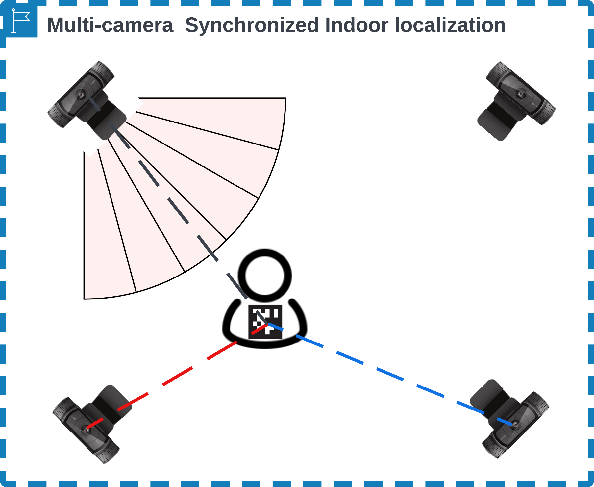

# Calibrate the cameras

IPS needs two calibrations: each camera model's intrinsics, which turn a tag on the picture into a pose in metres, and the transform matrices that take each camera into its room's main camera frame. Calibrate each camera model, synchronize the cameras of each room, and copy the matrices to every base station, in that order. Synchronize again whenever a camera moves.

!!! note "Before you start"
    Every machine that runs a camera tool needs the `ips-base` environment ([What you need](index.md#what-you-need)) and an IPS Base config: **Save** on the **Config** tab of `Launcher → Pipelines → IPS → IPS Base`, with **Host** on that machine, writes one from the template.

A session of one camera needs only the intrinsics ([One camera](#one-camera)). A recorded session can be calibrated from its own videos ([Calibrate from a recorded session](#calibrate-from-a-recorded-session)).

## Calibrate each camera model

1. **Print the checkerboard.** `pipelines/ips-base/camera_calib/pattern/pattern.png` has 10 × 7 squares, and the calibrator looks for its 9 × 6 inner corners. Keep the print flat, on a board.
2. **Start IPS Intrinsics.** Open `Launcher → Pipelines → IPS → IPS Intrinsics` with **Host** on the machine the camera is plugged into. A camera that only its stream reaches is calibrated from any machine, once the stream runs (**Start** on the IPS Base card's **Streams** tab). **Start** opens the calibrator, `mmla ips-ccal`, in a terminal.
3. **Capture** (`1` in its menu). Type the camera's name, which becomes its `Cameras` entry (`logitechC920`), and pick the camera: the machine's own cameras are listed first, then the config's streams. Hold the board in front of the camera, press `c` to capture and `y` to keep the image. Capture it at different places, distances and tilts across the whole picture, then press `q`.
4. **Calibrate** (`2`). Pick the camera's folder and say whether its lens is a fisheye. A window shows the corners found on each image; press a key for the next. The calibrator then writes the camera's entry into `Cameras` of the IPS Base config on its machine ([Cameras](configuration.md#cameras)).
5. **Give the intrinsics to the base stations.** On the **Calibration Cameras** panel below the card, with the card's **Host** on `Local`, pick the camera and the base station, and press **Sync to Host**. The base station needs its IPS Base config first.

Cameras of the same model can share one entry. The **Calibration Cameras** panel copies the entries between machines, never the images; its controls are listed under [IPS calibration](../../tui/launcher/pipelines/index.md#ips-calibration).

??? info "Details: turned streams, image sizes and shipped images"
    - A `Cameras` entry holds the intrinsics of the picture as the sensor gives it. Calibrating from a stream whose `Streams` entry has a `rotate`, the calibrator lists the stream with its turn and turns each image back before it saves it. The live view shows the stream as it comes, turned.
    - One calibration holds for one frame size, which the calibrator writes as `calibration_resolution`. Images of another size than most of the camera's images are left out with a warning.
    - An image saved upside down gives a principal point mirrored about the centre: capture it again.
    - A second capture adds to the camera's images, numbered after the highest one there.
    - The repository ships checkerboard images of five models under `camera_calib/cameras/`: `acr010webcam`, `iphone`, `logitechC920`, `macbook-air` and `smraza-cam`. **Calibrate** offers them like your own, so a camera of one of these models needs no capture.

## Synchronize the cameras

Each camera reports a tag's pose in its own frame. Camera sync shows one tag to the main camera and one other camera at the same time, and works out the transform between the two frames. You do this for each camera of the room in turn.



1. **Define the bases.** Camera sync works on the `Bases` entries of the IPS Base config: one per camera position, and exactly one `main: true`, or one per room ([Bases](configuration.md#bases)).
2. **Start the cameras' streams**, for cameras that stream: **Start All** on the IPS Base card's **Streams** tab.
3. **Start IPS Transforms.** Open `Launcher → Pipelines → IPS → IPS Transforms`, set **Num Tag Detectors** to the number of cameras (2 by default), leave **Num Sync Managers** at 1, and press **Start**. Each tag detector, `mmla ips-ctag`, asks which `Bases` entry it is. The sync manager, `mmla ips-csync`, pairs the main base with another base of its room, and asks which when there are several.
4. **Show a tag to both cameras**, and choose `1: start` in the sync manager. A 3D plot shows, per tag, the main camera's position (o) and the other camera's position taken through the transform (x), which meet as the transform settles. Move the tag through the space both cameras see, then close the plot.
5. **Next camera.** Choose `2: set camera id`, pick the next base, and repeat step 4 for every camera of the room.
6. **Export.** Choose `4: export transformations`. It writes `pipelines/ips-base/camera_sync/transformation_matrices_<main-id>.json`, the file the bases and the synchronizer load.

| Sync manager option | What it does |
|---|---|
| `1: start` | pairs the two cameras' detections of each tag, updates the transform and shows the plot |
| `2: set camera id` | picks the main and the other base again |
| `3: switch mode` | with `sync: False`, checks the stored transform instead: the plot shows the other camera's positions taken through it, and nothing is written |
| `4: export transformations` | writes `transformation_matrices_<main-id>.json` from the stored transforms |
| `5: clear transformations` | removes the matrices: every `transformation_matrices*.json`, or with rooms only this room's ([Several rooms](#several-rooms)) |
| `0: exit` | ends the sync manager |

??? info "Details: how camera sync pairs the detections"
    - Two detections of one tag, one from each camera, form a pair when they reached the sync manager within 0.2 s of each other (`mmla ips-csync -t <seconds>` changes it). The manager goes by when they arrive, not by the capture stamps they carry, which lag its clock by the whole way through the stream, the detector and the MQTT broker. A slow network makes the sync wait longer for a pair, but does not keep the pairs out.
    - Each pair gives a pose-to-pose transform, and the manager averages the last 5000. A pair whose position, taken through the average, lies more than 0.1 m or 3 degrees from the main camera's reading is dropped as an outlier.
    - The manager keeps the transform of each camera pair in `camera_sync/transformation_matrices.json`, under `<other-id>-<main-id>`, and exports the main's file from it.

## Distribute the matrices

Every base station that runs an IPS base or the synchronizer needs the exported file of its room's main camera.

1. Open the **Transform Matrix** tab of the IPS Base card. It shows the matrix files of the host the tab is set to, as editable JSON.
2. Pick a base station beside **Sync to Host** and press it. The files are copied into `pipelines/ips-base/camera_sync/` there.
3. Repeat for every base station.

**Sync from Host** copies the files the other way, and **Delete** removes the file on screen ([Transform Matrix tab](../../tui/launcher/pipelines/index.md#transform-matrix-tab)).

## One camera

A session of one camera needs no camera sync: its poses are the session's coordinates as they are.

- A base that no exported file holds starts without matrices, as the main camera of itself. Such a base has no `transformation_matrices_<id>.json` of its own and no matrix in another main's file: a test camera of no room, a base camera sync has not paired yet, or a main whose room has no file.
- On the IPS Base card, pick it as **Main Camera**, where it is listed as `<id> · <camera> · alone, no matrices`. From the command line, give it to the synchronizer as `-mc`.
- The session notes the main camera with `file: null` and no matrices.

!!! warning
    A main camera alone runs on its own detections only. **Start** refuses such a card beside other bases, and a synchronizer started by hand leaves any other base out with a warning.

A base that a main's file holds is in that main's coordinates, and its session takes that main; the synchronizer says which when it is given the base.

## Several rooms

One config can serve several rooms, each with its own cameras and coordinates. Give every `Bases` entry the `room` its camera is in, and mark one base per room `main: true`. A config whose bases name no room is one room.

```yaml
Bases:
  - {id: 1, camera: logitechC920, source: stream, source_index: cam-1, room: A, main: true}
  - {id: 2, camera: logitechC920, source: stream, source_index: cam-2, room: A, main: false}
  - {id: 7, camera: logitechC920, source: stream, source_index: cam-7, room: B, main: true}
  - {id: 8, camera: logitechC920, source: stream, source_index: cam-8, room: B, main: false}
```

- **Camera sync** pairs a room's cameras with its main. `mmla ips-csync` first asks for the main, or takes `-m <id>` or the room of `-b <id>`, then offers only that room's other bases. Export writes one `transformation_matrices_<main>.json` per main, with that room's cameras only.
- **Clear** (`5: clear transformations`) clears the room of the current main alone, and the menu names it. That room's pairs leave `transformation_matrices.json` and its bases' `transformation_matrices_<id>.json` are removed; the other rooms keep theirs. Bases without a room beside named rooms count as a room of their own.
- **Each base** loads the matrix file of its room's main, and none when that file is missing: another room's file holds other coordinates.
- **A session is one room's.** Two rooms at the same time are two sessions: start the IPS Base card with **Room** A and a new session, then with **Room** B and another new session, and send START and STOP to each from Session Control. Each synchronizer takes its room's main as **Main Camera** (`-mc`).

??? info "Details: what Start and the synchronizer refuse with rooms"
    - **Start** refuses a card whose bases are in different rooms, or whose main camera belongs to another room than its bases.
    - A synchronizer started without `-mc` facing a main per room says so instead of picking one.
    - A synchronizer leaves out the detections of a base its main camera's matrices do not place, with one warning.

## Calibrate from a recorded session

A recorded session calibrates itself: whenever two cameras saw the same tag at the same moment, the tag's position in both camera frames is one sample of the transform between them. `mmla ses-calibrate` fits the transforms from these samples, and scores matrices made on another day on them.

1. **Run it** on the machine that holds the session under `artifacts/`:

    ```bash
    mmla ses-calibrate -c pipelines/ips-base/config.yml -sid <session-id>
    ```

    It reads the videos named in `artifacts/<session>/manifest.json`, detects the tags on a frame every 2 s as the IPS base does, pairs each camera's sightings with the main camera's, and fits one rigid transform per camera to the paired positions, leaving out the pairs that disagree.

2. **Read the report.** It writes `transformation_matrices_<main>.json` and `calibration_report.json` to `artifacts/<session>/analysis/calibration/`, and prints the report per camera.
3. **Use the matrices.** Copy `transformation_matrices_<main>.json` into `pipelines/ips-base/camera_sync/` to replay the session with them ([Replay recordings](run.md#post-time-processing)).

To check a calibration from another day against the session, score it on the same pairs with `-v`:

```bash
mmla ses-calibrate -c pipelines/ips-base/config.yml -sid <session-id> \
  -v pipelines/ips-base/camera_sync/calibrations/<calibration>/transformation_matrices_<main>.json
```

| Report entry, per camera | What it says |
|---|---|
| pairs | how many paired sightings with the main camera the fit rests on |
| residual | the fit's residual, median and p90, in metres |
| pose-to-pose | how far the average transform that camera sync would compute lies from the fit |
| given | for the `-v` matrices: their residuals, the share of pairs within 0.15 m, and their difference to the fit |
| near | for a camera with few pairs: the near-simultaneous and relayed pairs found, and the `-v` matrices' residual on them |

A camera that never saw a tag together with the main camera cannot be placed. `ses-calibrate` needs at least two cameras, and refuses a fisheye camera, whose frames it reads unremapped.

| Flag | Default | What it does |
|---|---|---|
| `-c` | required | an IPS base config: its `Cameras` give the intrinsics, its `Base` the tag family, the tag size and `rotate` |
| `-sid` | required | the session; `artifacts/<session>/manifest.json` names its videos |
| `-p` | the working directory | the project directory, which holds `artifacts/` |
| `-mc` | `c920-01`, else `c920-05`, else the first device | the main camera, a device of the manifest |
| `-cams` | every video of the manifest | the devices to take, comma-separated |
| `-cam` | the entry the devices' `Bases` entries name, else the config's only camera | the `Cameras` entry the videos were recorded with |
| `-cr` | what the session notes, else 0 | the turn the capture applied to the videos: one turn for all (`180`), or `device=turn` pairs (`cam-1=180,cam-2=0`) |
| `-st` | `2.0` | seconds between the sampled frames |
| `-ts` | the manifest's `tag_size`, else the config's, else `0.08` | the tag size in metres |
| `-v` | not set | a `transformation_matrices_<main>.json` to score on the same pairs |
| `-nb` | `10` | the paired sightings under which a camera is searched for near-simultaneous and relayed pairs |
| `-nw` | `0.2` | the most seconds apart two sightings of a tag may lie to count as near-simultaneous; `0` turns the search off |
| `-o` | `artifacts/<session>/analysis/calibration/` | where to write the matrices and the reports |

??? info "Details: near-simultaneous and relayed pairs"
    A camera with fewer than `-nb` paired sightings is searched for more:

    - **Near-simultaneous pairs.** Around every sampled moment where one camera saw a tag that the other saw one step before or after, a few more frames of both are read, and the sightings of the same tag at most `-nw` seconds apart are paired.
    - **Relayed pairs.** The camera's sightings at the same moment as a third camera whose own fit rests on at least `-nb` pairs with a p90 within 0.15 m: the third camera's sighting, taken into the main camera's frame by its fit, stands in for the main camera's.

    Both kinds are too few or too indirect to fit a transform on, but they can check one. They go to `near_pairs.json` beside the report, whose `near` entry counts them (`pairs` with the main camera, `via` per third camera) and scores the `-v` matrices on them.

??? info "Details: which intrinsics and turns ses-calibrate uses"
    - **Intrinsics.** The `Cameras` entry that `-cam` names; else the one that the `Bases` entries of the devices it takes name; else the config's only camera. An entry is a device's when its `id` is the device's name, or, for a `stream` or `file` entry, its `source_index` is the device's name or its recording's path. When those devices name different cameras, name one `Cameras` does not hold, or one of them has no entry while `Cameras` holds more than one, it stops and asks for `-cam`. The log and the report's `camera_from` say where the entry came from. The intrinsics are scaled to the videos' frame size, as the base scales them ([Frame size](configuration.md#frame-size)).
    - **Turns.** A video turned before it was read is read with the intrinsics turned with it, and its poses turned back into the sensor's frame. The turn comes from `-cr`, which wins; else from the `rotate` that a Collection recording notes in its own manifest entry, where a noted `0` counts too; else from the session's `sources[].capture.rotate` for a stream's recording, read from `artifacts/<session>/measurements/<session>_parameters.json`, else from the MongoDB document. The log says where each turn came from. The config's `Base.rotate` turns every frame on top of that.

??? info "Details: the batch replay's choice of matrices"
    `scripts/replay_sessions.py` replays recorded sessions through the pipelines. For every multi-camera session it runs `ses-calibrate` first and then picks each camera's transform:

    1. The camera's own fit, when it rests on at least 10 pairs with a p90 residual within 0.15 m, or within 0.3 m when the given calibration is no better on the same pairs.
    2. Else the given calibration's entry, when the session's pairs put its median residual within 0.3 m.
    3. Else, for a camera with fewer than 10 pairs, the own fit of the same camera pair from the session on the same rig (the same given calibration and main camera) nearest in date. It is checked on the near-simultaneous or relayed pairs when there are any, and refused when their median residual is over 0.3 m.
    4. With nothing to borrow, the given entry, checked the same way when there are such pairs, and taken unchecked when there are none (`given calibration (unchecked: no shared sightings, nothing to borrow)`).

    A camera stays out of the IPS replay only when the session's pairs put the given entry more than 0.3 m off, or the given calibration has no entry for it. The choice per camera is logged, and `matrices_used.json` (and the `borrowed` entry of `calibration_report.json`) names the session a borrowed fit came from.

    A camera whose recording was turned where it was captured gets that turn as `capture_rotate` in the replay's IPS and VFA `Bases` entries: the `rotate` its Collection recording notes in the manifest (a noted `0` included), else its stream's `sources[].capture.rotate` from `artifacts/<session>/measurements/<session>_parameters.json` or the MongoDB document. The template configs the replay starts from (`--ips-template`, `--vfa-template`) must keep `Base.rotate: 0`, or the pictures are turned twice.

## Troubleshooting

**IPS Intrinsics refuses to start.** The machine has no IPS Base config. **Save** on the IPS Base card's **Config** tab with **Host** on that machine, then **Start** again.

**Camera sync cannot start.** The message names the problem with the `Bases`: none or only one, no `main: true`, more than one main in a room (or without rooms), or a room whose main is alone. Fix the entries on the IPS Base card's **Config** tab.

**A base logs `No camera parameters found, please calibrate camera first.`** Its host's config has no `Cameras` entry at all. Copy the camera's entry there with **Sync to Host** on the Calibration Cameras panel.

**A base reads the tags with the wrong intrinsics.** A base whose `camera` is not in its host's `Cameras` takes the first entry by name, and its log says which (`Using camera '<name>'`). Copy the right entry to that host, or fix the base's `camera`.

**A base logs `No transformation matrices found, please do the camera sync first.`** Its host has no matrix file of its room's main camera. Copy it with the **Transform Matrix** tab ([Distribute the matrices](#distribute-the-matrices)).

**A base warns about `Base.rotate` at start.** It warns whenever `Base.rotate` is set: the base reports its poses in the sensor's frame, not on the frame `Base.rotate` turned, and so do IPS Transforms and `mmla ses-calibrate`. Matrices fitted on the turned frame do not hold for these poses: fit them again with IPS Transforms or `mmla ses-calibrate`.
