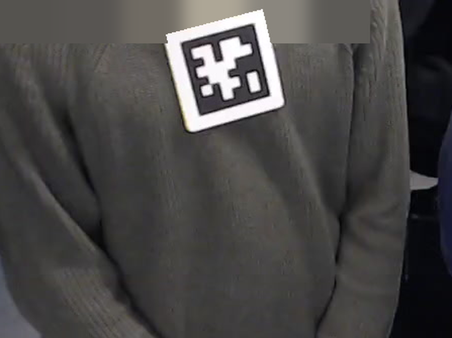
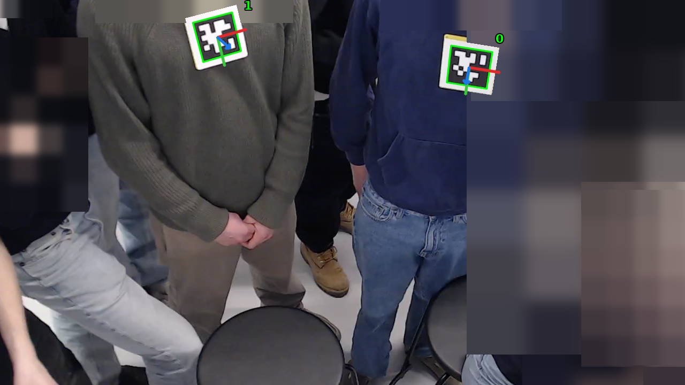

# Indoor positioning system (IPS)

The indoor positioning system follows where each participant is in the room and which way they face. Cameras read the AprilTag badge each participant wears on the chest. Use it when a study needs positions, distances and who faces whom, next to speech ([ASR](../asr/index.md)) and video analysis ([VFA](../vfa/index.md)).

## What IPS produces

| Output | What it gives | Event |
|---|---|---|
| Positions | per badge, its position in metres in the main camera's frame, fused from every camera that saw it, and each camera's own reading | `ips_translation` |
| Orientations | per badge, its rotation in the main camera's frame | `ips_rotation` |
| Who faces whom | per badge, the badges it faces | `ips_relation` |

The synchronizer writes the three events once per time bucket, one second by default. On the dashboard, the **Room** card of the [Live](../../dashboard/index.md#live) page draws them as a plan of the room seen from above, and the [Analysis](../../dashboard/index.md#analysis) page summarizes them. [What is stored](configuration.md#what-is-stored) describes every field.

## How it works


1. **Capture**: each IPS base reads one camera: a USB camera, a stream from the Stream Server, a Lab Streaming Layer stream or a recorded file.
2. **Detection**: the base finds the badges on each frame and estimates each one's pose, its rotation and position in the camera's frame, from the camera's intrinsics and the printed tag size. It publishes the pose of every detection over MQTT.
3. **Synchronization**: the synchronizer files the detections of all bases into time buckets, and takes each camera's poses into the main camera's frame with the transform matrices that camera sync produced.
4. **Fusion and storage**: per bucket, the synchronizer fuses the cameras' readings of each badge, works out who faces whom, and writes the three events to InfluxDB ([Databases](../../database.md#influxdb)).

IPS needs no AI server: the tags are detected on the base stations.

## Components

| Component | Runs on | Started with | Environment |
|---|---|---|---|
| IPS Base, one per camera | base station | `mmla ips-base` | conda env `ips-base` |
| IPS Synchronizer, one per session | base station | `mmla ips-sync` | conda env `ips-base` |
| Camera calibrator, once per camera model | any machine that reaches the camera | `mmla ips-ccal` | conda env `ips-base` |
| Tag detectors and sync manager, once per camera arrangement | base stations | `mmla ips-ctag`, `mmla ips-csync` | conda env `ips-base` |

The management console starts them from the **IPS Base**, **IPS Intrinsics** and **IPS Transforms** cards under `Launcher → Pipelines → IPS`; see [Run IPS](run.md) and [Calibrate the cameras](calibration.md).

## What you need

- **Cameras**: one per viewing position, as a USB camera, a stream through the Stream Server, a Lab Streaming Layer stream or a recorded file ([Input sources](configuration.md#input-sources)). Each camera model is calibrated once, and the cameras of a room are put into one frame by camera sync ([Calibrate the cameras](calibration.md)).
- **AprilTag badges**: one per participant, worn on the chest ([AprilTag badges](#apriltag-badges)).
- **The system services**: MQTT, Redis, MongoDB and InfluxDB, and the Stream Server for streamed cameras ([Quickstart](../../quickstart.md#one-time-setup)).
- **The `ips-base` environment** on every machine that runs an IPS base or a camera tool. Create it from the console's **Environment** tab, or by hand:

    ```bash
    conda create -n ips-base python=3.10 -y
    conda activate ips-base
    pip install -e '.[ips-base]'
    ```

    For an `lsl` source, add `pip install pylsl==1.17.6` and `conda install -c conda-forge liblsl=1.16.2`.

### AprilTag badges

Each participant wears one AprilTag of the `tag36h11` family. Its id is how IPS, and [VFA](../vfa/index.md), tell the participants apart.



1. **Pick the ids.** Give each participant one tag id, and enter it as their **Tag ID** under `Launcher → System Settings → Study → Experiments` ([Describe the study](../../quickstart.md#describe-the-study)). The synchronizer keeps only the tags of the session's participants.
2. **Print the tags.** `pipelines/ips-base/apriltag/tag36h11/` holds the tags with ids 0 to 11: one PNG per id, and a PDF of all twelve in each of `60.0mm/`, `80.0mm/`, `100.0mm/` and `120.0mm/`, named after the side of the tag's black square. Print the PDF at actual size, not fitted to the page.
3. **Set the tag size.** Measure the printed black square and set `Base.tag_size` in the IPS Base config to its side in metres, such as `0.08` for the `80.0mm` sheet. The white margin around the square does not count ([Base](configuration.md#base)).
4. **Wear it upright.** Pin or hang the badge on the chest, facing forward, upright as it was printed. The way the tag faces is taken as the way its wearer faces, and the floor plan takes the badges' vertical axis as the room's up ([The floor plan](configuration.md#the-floor-plan)).

!!! warning "The tag size sets the distances"
    The detector computes a tag's distance from its printed size. A `tag_size` that is off by some percent puts every position off by the same percent.

A larger tag is read from farther away. To check the badges, start a base with **Graphics** on and hold them in front of its camera: the window outlines each badge it reads in green, with its id and an arrow for the way it faces.



??? info "Details: which detections count"
    - A base reads tag ids 0 to 12 and leaves higher ids out. A detection whose decision margin is under 10 is not taken as a badge.
    - The synchronizer takes the Tag IDs of the participants in the session's MongoDB document, which come from the experiment group the session was created in. A tag the cameras see but no participant carries is left out, and its log says so once. A session whose participants carry no Tag ID keeps every tag.
    - `pipelines/ips-base/apriltag/resize_tags.sh` makes the sheets of another size. Set `width`, the side of the black square in mm, at the top of the script, and run it from `pipelines/ips-base/apriltag/` with ImageMagick (`convert`, `montage`) installed. It empties `tag36h11/<width>mm/` first, then writes `all_tags.pdf` there, at `dpi` (500) with `grid_h` × `grid_w` (1 × 2) tags per page.

## Pages in this guide

- [Run IPS](run.md): set up once, run every session, run from the command line, replay recordings.
- [Calibrate the cameras](calibration.md): camera intrinsics, camera sync, one camera, several rooms, and calibrating from a recorded session.
- [Configuration](configuration.md): every key of the config, the input sources and streams, what is stored and the floor plan.
