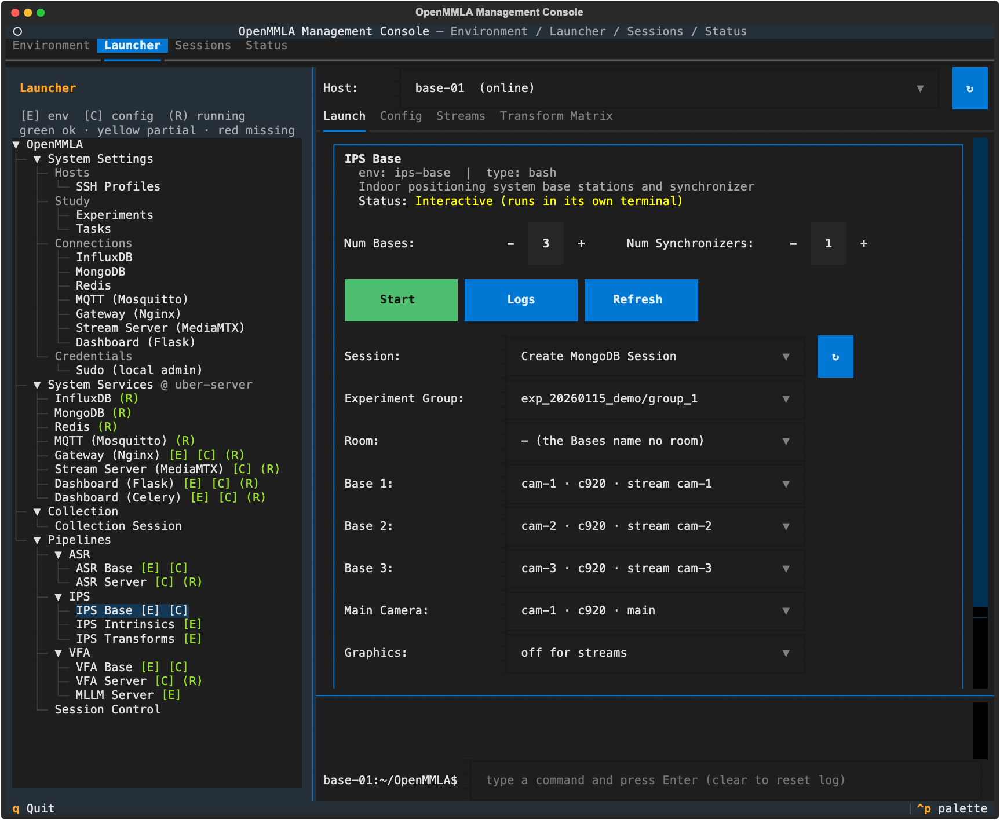

# Run IPS

This page runs IPS from the management console: what you set up once per deployment, and what you do for every session. It also covers running the components from the command line and replaying recorded video.

!!! note "Before you start"
    This page assumes the [one-time setup](../../quickstart.md#one-time-setup) of the Quickstart is done: the machines added and prepared, the system services running, every machine pointed at them, and the study described, with a **Tag ID** for every participant.

## Once per deployment

These steps are done once, and again only when something they set changes: a new camera model, a camera moved or added, another room. IPS needs no AI server, so there is no server card to start.

1. **Environment.** Give every machine that runs an IPS base or a camera tool the `ips-base` environment: **Create Env** and **Install Deps** on the **Environment** tab, with that machine as **Host** ([Prepare every machine](../../quickstart.md#prepare-every-machine)).
2. **Badges.** Print one tag per participant and set `Base.tag_size` to the side of its black square ([AprilTag badges](index.md#apriltag-badges)).
3. **Streams.** Open `Launcher → Pipelines → IPS → IPS Base` with **Host** on the base station. For each camera the bases pull over the network, add a `Streams` entry on the **Config** tab (**+ Add Stream**); write its `target` as the path alone (`ips/cam-1`), which **Save** completes with the Stream Server of System Settings ([Streams](configuration.md#streams)). A camera plugged into the base station (`source: opencv`) needs no stream.
4. **Streams tab.** For each stream, set the row's **SSH Profile** (the machine that captures it, such as `pi-01`), **Device**, **Record** and **Rotate** (`180°` for a camera mounted upside down; see [Turning the picture](configuration.md#turning-the-picture)).
5. **Cameras.** Calibrate each camera model with **IPS Intrinsics**, and give the intrinsics to each base station ([Calibrate each camera model](calibration.md#calibrate-each-camera-model)).
6. **Bases.** On the **Config** tab, add one `Bases` entry per camera position: `id`, `camera` from `Cameras`, `source` and `source_index`, and exactly one `main: true`, or one per room ([Bases](configuration.md#bases)). **Save** writes the config of the card's host.
7. **Other base stations.** The bases read the config of the machine they run on. **Sync to Host** on the **Config** tab copies this config, its `Bases` and `Streams` included, to the others.
8. **Camera sync.** With the streams running, put every camera of a room into its main camera's frame with **IPS Transforms** ([Synchronize the cameras](calibration.md#synchronize-the-cameras)).
9. **Matrices.** Copy the exported matrix files to every base station with the **Transform Matrix** tab ([Distribute the matrices](calibration.md#distribute-the-matrices)).

A session of one camera needs neither camera sync nor matrices ([One camera](calibration.md#one-camera)).

## Every session

1. **Start the streams.** Open `Launcher → Pipelines → IPS → IPS Base` with **Host** on the base station. On its **Streams** tab, press **Start All**, or **Start** for one row, and wait until each row's **Stream Server** column reads `● live`; start the streams before the bases.

    

2. **Fill in the IPS Base card** on the **Launch** tab. The card opens on the host it was last pointed at.

    

    | Field | Default | What it does |
    |---|---|---|
    | **Num Bases** | 1 | bases started on this host, one per camera |
    | **Num Synchronizers** | 1 | a session has one synchronizer; set 0 on the cards of the session's other hosts |
    | **Session**, **Experiment Group** | | `Create MongoDB Session`, with the take's experiment group, starts a new take; the group's participants give the tags the synchronizer keeps |
    | **Room** | `- (the Bases below)` | with rooms in `Bases`, puts that room's bases on the card, sets **Num Bases** to their number and the **Main Camera** to the room's main ([Several rooms](calibration.md#several-rooms)) |
    | **Base 1**, **Base 2**, ... | | which `Bases` entry each base is, one dropdown per base |
    | **Main Camera** (`-mc`) | the `Bases` entry with `main: true` | the base whose `transformation_matrices_<id>.json` the synchronizer loads |
    | **Graphics** (`-g`) | `off for streams` | a window on the annotated frames, unless the base's source is a stream; `on` and `off` decide for every source |
    | **Store Frames** (`-s`) | off | keep the frames |
    | **Verbose** (`-v`) | on | print debug output |

    ??? info "Details: the card's fields"
        - **Session**: the first Start mints the session id. Every base card (ASR, IPS and VFA, on any host) then opens on it, so the other cards of the take join it with their own Start ([TUI → One session per take](../../tui/launcher/pipelines/index.md#one-session-per-take)).
        - **Room** `- (the Bases below)` sets nothing.
        - **Base** *n*: Start refuses two bases on one entry.
        - **Main Camera** lists the matrix files exported on the card's host, then each base no file there holds (`· alone, no matrices`, see [One camera](calibration.md#one-camera)). It starts on the `Bases` entry with `main: true` when that is offered, else on the first option, and follows Base 1 to the main of its room. Start refuses a synchronizer until a Main Camera is picked: make the file, copy it to the host, and press **Refresh** on the card.
        - **Graphics**: a stream is pulled where nobody watches, often over SSH with no display, so `off for streams` opens no window for it. The dashboard's Room card shows the positions either way.

3. **Press Start.** It opens one terminal window per base and synchronizer, and nothing in them asks anything. Each process starts on the session and waits for START.

    ??? info "Details: what Start checks"
        - Start asks the Stream Server whether the streams the bases pull are live, and holds back once, naming those that are not ([Stream check](../../tui/launcher/pipelines/index.md#stream-check)). Start them on the **Streams** tab, or press **Start** again to start the bases anyway.
        - Start warns, and starts anyway, when a stream the **Streams** tab runs is captured on another machine, recorded or turned otherwise than the config of the card's host says. The bases read that config, and the session notes what it says.
        - Start warns of a stream whose **Rotate** changed since it started; its cell shows both turns in yellow (`180° (runs 0°)`). A running stream keeps the turn it was started with: **Stop** it and **Start** it again.
        - A base whose stream is not up yet says so and waits for it, up to 30 s ([How the bases pull a stream](../../streaming/index.md#bases-pulling-a-stream)), before it says that it waits for START. A START or STOP sent meanwhile is heard once the stream is up.
        - When a choice from the card cannot be used (no `transformation_matrices_<id>.json` for the main camera, or a base id that is not in `Bases`), that window says why and what to do, then shows the process's own menu or base prompt. Fix it there, or on the card before the next Start.

4. **Send START.** Open `Launcher → Pipelines → Session Control` and pick the session; the list opens on the one the base cards were last started into. Keep **IPS** ticked and press **Send START** once every window reports that it waits. The Stream Server records the session's streams from START to STOP ([On the server](../../streaming/recording.md#on-the-server)), and the positions show on the dashboard's [Live](../../dashboard/index.md#live) page, in its **Room** card.
5. **Send STOP** at the end. Every base and synchronizer ends its run and exits, also when STOP comes before START or while a base still waits for its stream. STOP marks the session as ended, and the base cards go back to `Create MongoDB Session`, so the next session's bases are started from the card again.
6. **Stop the streams** once no other session pulls them: **Stop** or **Stop All** on the card's **Streams** tab, or **Stop All** on the Streams tab of `Launcher → System Services → Stream Server (MediaMTX)`, which lists every pipeline's streams. An IPS and a VFA base can pull the same camera's stream.
7. **Export and archive** on the **Sessions** tab ([Export and archive](../../quickstart.md#export-and-archive)). **Export** takes the session's own streams, from the Stream Server and the capture hosts, by what the bases noted in the session ([What a session records](configuration.md#what-a-session-records)).

## Run from the command line

The card runs these commands; you can run them by hand on a base station:

```bash
conda activate ips-base
P=pipelines/ips-base; C=$P/config.yml

mmla ips-base  -p $P -c $C -sid <session-id> -b <base-id>
mmla ips-sync  -p $P -c $C -sid <session-id> -mc <main-base-id>

mmla ips-ccal  -p $P -c $C                 # camera intrinsics
mmla ips-ctag  -p $P -c $C -b <base-id>    # one tag detector per camera
mmla ips-csync -p $P -c $C                 # sync manager
```

| Flag | Command | Default | What it does |
|---|---|---|---|
| `-p` | all | the working directory | the project directory, `pipelines/ips-base` |
| `-c` | all | required | the config file |
| `-sid` | `ips-base`, `ips-sync` | asked | the session; given, the component asks nothing, starts at once, waits for START and exits when the run ends |
| `-b` | `ips-base` | with `-sid`, the only `Bases` entry; else asked | the `Bases` entry this base is |
| `-g` | `ips-base` | no window for a stream source | show the annotated frames |
| `-s` | `ips-base` | `False` | store the frames |
| `-v` | `ips-base`, `ips-sync` | `False` | print debug output |
| `-mc` | `ips-sync` | the `main: true` entry | the main camera: the base whose `camera_sync/transformation_matrices_<id>.json` the synchronizer loads |
| `-b` | `ips-ctag` | asked | the `Bases` entry this tag detector is |
| `-g` | `ips-ctag` | `True` | show the annotated frames |
| `-hl` | `ips-ctag` | `False` | headless: no display, graphics off |
| `-b` | `ips-csync` | asked when there are several | the base to sync against the main of its room |
| `-m` | `ips-csync` | the main of `-b`'s room, else the only main, else asked | the main base, when the `Bases` have a main per room |
| `-t` | `ips-csync` | `0.2` | the most seconds apart two detections of a tag may reach the sync manager and still be paired |

A `bool` flag takes a value: `-hl true`, `-g false`.

??? info "Details: the synchronizer's main camera, and runs without `-sid`"
    - Without `-mc`, `ips-sync` takes the `Bases` entry marked `main: true` when its matrix file is there; else, when the `Bases` name no room, the only `transformation_matrices_<id>.json` in `camera_sync/`; else, with no file there, the config's only `Bases` entry. With a main per room, it asks for `-mc`.
    - `-mc` may name a base no file holds ([One camera](calibration.md#one-camera)).
    - Without `-sid`, the commands ask for the session, and `ips-base` for its base when `-b` is omitted. `ips-sync` then shows its menu (`1` start, `2` set main camera, `0` exit) and goes back to it after each run.

## Replay recordings { #post-time-processing }

A recorded session is analyzed by replaying its video files through the bases (post-time processing).

1. Record with **Collection → Collection Session**.
2. On the IPS Base card's **Config** tab, set each base's `source` to `file` and its `source_index` to its file in the `video/` directory of the collection manifest, by its full path (**Browse…** picks it).
3. Run the session as in [Every session](#every-session), without the streams. The Quickstart's [Analyze the recordings later](../../quickstart.md#analyze-the-recordings-later) gives the steps for all pipelines at once.

`Base.keyframe_interval` and `Base.processing_rate` set the replay's pace ([Base](configuration.md#base)). The files replayed together sit in one folder, and the replay starts at the latest start among them, read from the file names. A file whose picture was turned before it was saved says so with its `Bases` entry's `capture_rotate` ([Turning the picture](configuration.md#turning-the-picture)).

A multi-camera recording can also give its own matrices: see [Calibrate from a recorded session](calibration.md#calibrate-from-a-recorded-session).

!!! tip "Check the timing of the recordings"
    `pipelines/ips-base/docs/clock.html` is a clock in the browser. Film it with the cameras to compare the time in the picture with the recordings' timestamps ([Timestamps](../../streaming/index.md#timestamps)).

## Troubleshooting

**The synchronizer writes no positions for a badge the cameras see.** The tag is not the **Tag ID** of a participant of the session, so the synchronizer leaves it out and says so once in its log. Give the participant that Tag ID in the experiment, or hand out the right badge. A tag id above 12 is never read.

**A base exits naming a stream URL.** Its stream did not come up within its wait (`stream_kwargs.connect_wait`). Start the stream on the **Streams** tab, then start the bases again.

**Start refuses: no Main Camera.** The card's host has no `transformation_matrices_<id>.json`. Make it with **IPS Transforms**, copy it with the **Transform Matrix** tab, then press **Refresh** on the card.

**A synchronizer leaves a base out with a warning.** Its main camera's matrices do not place that base: it is another room's, or camera sync has not paired it ([Several rooms](calibration.md#several-rooms), [Synchronize the cameras](calibration.md#synchronize-the-cameras)).

**A synchronizer shows its menu instead of running.** Its run ended on an error rather than STOP, such as the connection to Redis lost. It says why; `1` starts it again.

**A camera's positions are missing for a while.** Its stream dropped. The base opens it again on its own (`stream_kwargs.reconnect_wait`), and that camera's positions are missing for the gap.

**One camera's tags come out mirrored.** The camera's turn and the config of the card's host disagree, such as a camera turned 180° whose `Streams` entry there says `rotate: 0`. The bases then do not turn its intrinsics and poses. Set the **Rotate** to the turn the camera has, in the config the bases read, and restart its stream ([Turning the picture](configuration.md#turning-the-picture)).

**Every tag of a recording comes out about twice as far away.** The intrinsics were applied at the wrong frame size. Check the camera's `calibration_resolution`; the base's log says which size it took ([Frame size](configuration.md#frame-size)).
