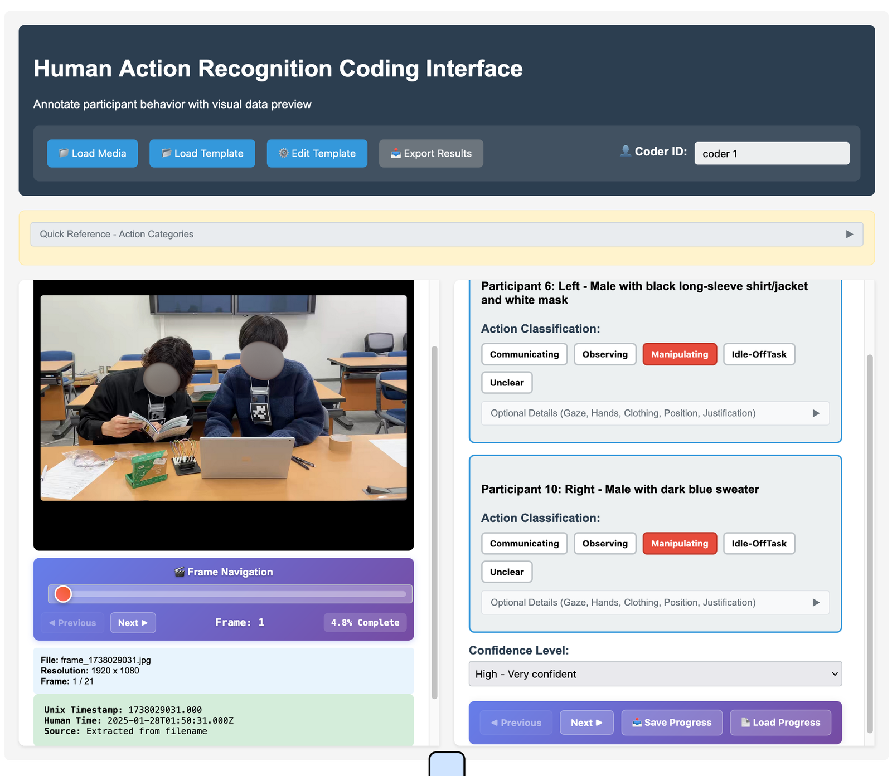

# Human Coding Interface

`pipelines/vfa-base/coding-interface/human_coding_interface.html` is a single self-contained web page for coding what each participant is doing in a series of video frames. It produces the human ground truth for the [VFA pipeline](index.md): coders see the same frames the pipeline analyzes and pick from the same action categories, and the export has the same shape as the pipeline's own output, so human and machine codings can be compared frame by frame.



## What you need

- **The page**: open the HTML file in any modern browser (double-click it). No server, no installation, no network access; everything stays on your machine.
- **Frames**: image files whose names contain a 10-digit unix timestamp, for example `1738029031.jpg` as written by a VFA base in `capture` mode (under `artifacts/runtime/pipelines/vfa-base/<host>/real-time/runtime/<camera>_<base-id>/`) or `frame_1738029031.jpg`. The timestamp becomes the window time of the coding. A single video file works too: the page steps through it at one frame per second and derives the timestamps from the timestamp in the file name plus the offset.
- **A template**: a JSON file with the action categories, their definitions and the participants. `human_coding_template.json` next to the page carries the five-action collaborative scheme used by VFA; fill in the participants:

```json
{
  "classification_schema": {
    "action_categories": ["Communicating", "Observing", "Manipulating", "Idle-OffTask", "Unclear"],
    "definitions": {
      "Communicating": "Person is actively communicating with others. ...",
      "Observing": "...",
      "Manipulating": "...",
      "Idle-OffTask": "...",
      "Unclear": "..."
    }
  },
  "participant_descriptions": {
    "6": "Left - Male with black long-sleeve shirt/jacket and white mask",
    "10": "Right - Male with dark blue sweater"
  }
}
```

Key the participants by the AprilTag id they wear, and use the same descriptions as in `config/experiments.yaml` so the VLM and the coders identify people the same way. The template can also be built or changed inside the page with **Edit Template** (add or remove categories, definitions and participants) and saved with **Export Template**.

## Coding a session

1. Enter your **Coder ID**; it becomes part of the export file name.
2. **Load Template** and pick the JSON file. The annotation panel now shows one block per participant, and the **Quick Reference** bar folds out the definitions.
3. **Load Media** and select every frame of the session at once (or one video). The frames are sorted and the first one is shown with its file name, resolution, unix timestamp and human time.
4. For each frame, click one action button per participant. The **Optional Details** fold of each block takes free text for gaze focus, hand status, clothing, position and justification, the same fields the VLM fills in. Set the **Confidence Level** (high, medium, low) for the frame, then **Next**. Leave a participant unclassified when they are not in the frame.
5. **Save Progress** at any time. It downloads `session_<start>_<coder>_progress.json`; **Load Progress** restores it after the template and the frames are loaded again.
6. **Export Results** when every frame is done. It downloads `session_<start>_<coder>_human_coded.json`.

Frames are kept in memory as you navigate, with an automatic save every 30 seconds while you type. Keyboard shortcuts: `Ctrl`/`Cmd`+`S` saves the current frame, `Ctrl`/`Cmd`+`←` and `→` move between frames.

## Output format

The export is a JSON array with one object per coded frame. Each object mirrors an `action_recognition` window as the VFA synchronizer stores it, with the frame timestamp as both window bounds, plus a few coding-specific fields:

```json
[
  {
    "result": "_result",
    "table": 0,
    "_time": "2025-09-20T10:27:41.772Z",
    "_measurement": "action_recognition",
    "action_recognition": {
      "classifications": { "10": "Manipulating", "6": "Manipulating" },
      "justifications": { "10": "Both hands on the laptop keyboard while looking at the screen", "6": "" },
      "observations": {
        "10": { "gaze_focus": "laptop screen", "hands_status": "contact - typing", "clothing": "dark blue sweater", "position": "right" },
        "6": { "gaze_focus": "", "hands_status": "", "clothing": "", "position": "" }
      }
    },
    "window_start_time": 1738029031.0,
    "window_end_time": 1738029031.0,
    "confidence_level": "high",
    "frame_index": 0,
    "media_file": "frame_1738029031.jpg",
    "extracted_timestamp": 1738029031.0
  }
]
```

Only participants that received a classification appear in a window. To compare with the pipeline, export the session's VFA actions from the TUI's Sessions tab (`Export Measurements` writes `<session>_action_recognition.json`) and join the two on `window_start_time` and the participant id. The pipeline's export labels its rows `_measurement: sensor_events` with `event_type: vfa_action` (the `action_recognition` value here is a legacy label), but the `action_recognition` block and the window times have the same layout in both files, which is all the comparison needs.

## Reliability

With several coders, each exports their own file. Agreement is measured per participant with Cohen's κ, and a majority vote across coders forms the gold standard; frames without a majority are excluded. This is the procedure used for the ICALT 2026 evaluation of the pipeline (κ between 0.73 and 0.84 across two sessions). The analysis scripts of that study are not part of the package.
