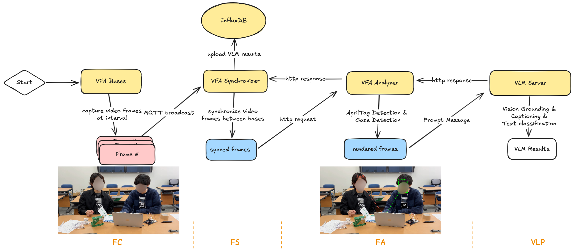
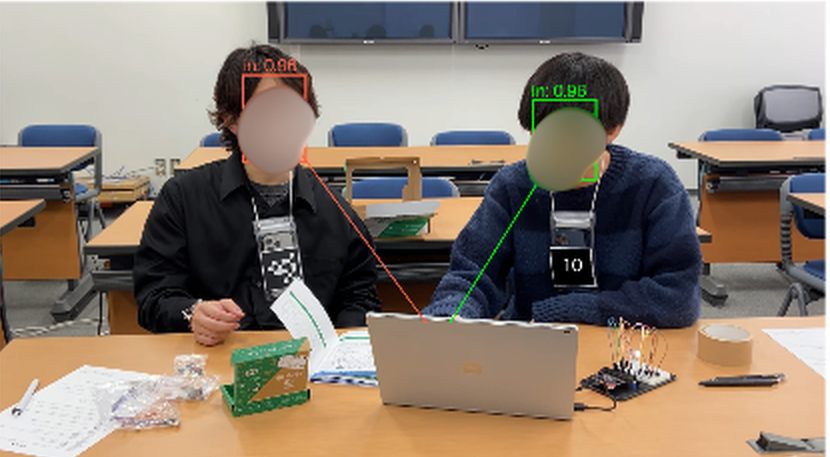
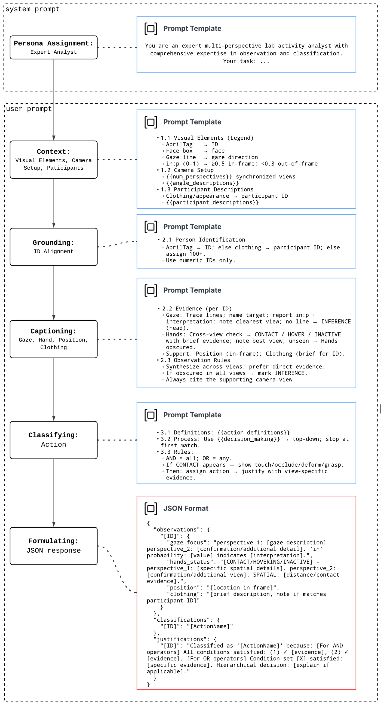

# Video Frame Analyzer (VFA)

Gaze-augmented collaborative action recognition with vision-language models. Bases capture a frame per camera angle at a fixed interval, the synchronizer bundles the angles of one moment into a single request, and the VFA server grounds each participant by their AprilTag, overlays gaze cues, and asks a VLM to describe what each person is doing and to classify it into one of five collaborative actions with a transparent, step-by-step justification.

The pipeline, its prompt design and its evaluation against human coders are described in the ICALT 2026 paper *Designing for Transparency: Gaze-Augmented Collaborative Action Recognition with Vision-Language Models*.

## Pipeline overview



The pipeline has four stages:

1. **Frame Capture (FC)**: each VFA base captures a frame from its video stream every `keyframe_interval` seconds (30 s by default) and broadcasts the frame metadata (camera angle description, frame path) over MQTT.
2. **Frame Synchronization (FS)**: the VFA synchronizer listens on the MQTT channel, aligns the messages of all bases in time, and sends the synchronized multi-angle frames together with the participant and angle descriptions to the analyzer in one HTTP request.
3. **Frame Analysis (FA)**: the VFA analyzer (the VFA server) runs AprilTag detection and gaze detection (RetinaFace for faces, [Gaze-LLE](https://github.com/fkryan/gazelle) for gaze targets), renders the frames with the overlays below, builds the structured prompt, and sends it to the VLM.
4. **Vision-Language Processing (VLP)**: the VLM, local or in the cloud behind an OpenAI-compatible API, performs grounding, captioning and classification and returns JSON. The result goes back to the synchronizer, which writes it to InfluxDB as `vfa_action` events (see the [Database Reference](../../database.md)).



A rendered frame carries the cues the prompt refers to: each detected AprilTag is repainted as a black square with its id in white, each detected face gets a coloured box, a gaze line points at the estimated gaze target, and `in: 0.98` is the probability that the gaze target lies inside the frame.

| Component | Runs on | Command | Environment |
|---|---|---|---|
| VFA Base, one per camera angle | base station | `mmla vfa-base` | conda env `vfa-base` |
| VFA Synchronizer, one per session | base station | `mmla vfa-sync` | conda env `vfa-base` |
| VFA Server: the multi-angle frame analyzer | GPU base server | docker compose | image in `docker/` |
| MLLM Server, optional local vision-language model | GPU server | `vllm serve` | conda env `vfa-vllm` |

Create the `vfa-base` environment from the TUI's Environment tab or by hand (`conda create -n vfa-base python=3.10 -y && pip install -e '.[vfa-base]'`). For an `lsl` source add `pip install pylsl==1.17.6` and `conda install -c conda-forge liblsl=1.16.2`.

## Action coding scheme

Every participant in every frame is assigned one of five mutually exclusive actions. Human coders work from the descriptive definitions below; the VLM receives a rule-based formalization of the same definitions, written as explicit conditions on gaze and hands plus a hierarchical decision process (`config/vfa/action_schemas.yml`, schema `collaboration_v1`, editable from the **Action Schema** tab of the VFA Server card).

| Action | Definition |
|---|---|
| Communicating | Actively communicating with others: looking at work items (screen, documents, hardware) while clearly pointing at them, or looking at another person while gesturing or pointing. |
| Observing | Watching or monitoring without communicating or manipulating: looking at work items or people while the hands are resting, hovering without touching, or touching something other than what is being looked at. |
| Manipulating | Directly working with something: looking at a work item while at least one hand clearly touches the same item. |
| Idle-OffTask | Not engaged in the task: looking at personal items (phone, snacks) or outside the camera frame, whatever the hands do. |
| Unclear | The gaze or the hands cannot be seen well enough to tell, because of occlusion, blur or poor visibility. |

The same scheme ships as the default template of the [human coding interface](coding_interface.md), so machine and human codings use identical labels.

## Prompt engineering



The prompt mirrors the human annotation process as a stepwise reasoning chain:

1. **Persona assignment** (system prompt): the VLM acts as an expert multi-perspective lab activity analyst.
2. **Context**: a legend of the visual overlays, the camera setup (`{{num_perspectives}}`, `{{angle_descriptions}}`) and the participant descriptions (`{{participant_descriptions}}`).
3. **Grounding**: identify each person by the AprilTag id, else by matching the appearance to the participant descriptions, else assign an id from 100 upwards.
4. **Captioning**: describe gaze focus, hand status (contact, hovering, inactive), position and clothing per person, citing the camera view that supports each observation.
5. **Classifying**: apply `{{action_definitions}}` and `{{decision_process}}` top down, stopping at the first match, with contact evidence when a rule requires contact.
6. **Formulating**: answer in a fixed JSON layout with `observations`, `classifications` and `justifications` per id.

The templates are plain text files under `pipelines/vfa-server/prompts/` (`prompt_templates_dir`), edited from the **Prompts** tab of the VFA Server card, which marks the templates in use. `prompt_profile` selects the end-to-end variant: `cot` (the chain-of-thought prompt above, the paper's main condition), `baseline` (direct classification without the reasoning steps) and `baseline_no_pre` (baseline without the pre-context block). `end_to_end: false` switches to the older two-step mode with the fixed `multi_angle_vlm_*` (vision) and `multi_angle_llm_*` (classification) templates.

Templates substitute `{{variable}}` placeholders, each using only its own subset: `{{num_perspectives}}`, `{{angle_descriptions}}`, `{{participant_descriptions}}`, `{{action_definitions}}`, `{{decision_process}}` (not in the baseline variants) and `{{image_description}}` (two-step LLM prompts only). The participant descriptions come from the experiment selected for the session (`config/experiments.yaml`, edited under **System Settings → Study → Experiments**). A missing templates directory is an error at startup; a missing single template is skipped silently and leaves that prompt empty, so check the path if the model starts receiving bare input.

## Model backend

The server talks to an OpenAI-compatible endpoint. Choose it with `VLLMFrameAnalyzer.backend` in `pipelines/vfa-server/config.yml` and fill in the matching block; the template lists every supported one. In the paper, GLM-4.5V, InternVL-3.5, Gemini-2.5-Pro and GPT-5 were evaluated with the `cot` profile.

Local:

- **vLLM**: the **MLLM Server** card runs `vllm serve` with the model, port and limits from `config/mllm_server.yml` (Qwen3-VL-8B-Instruct by default) in the `vfa-vllm` environment (`pip install -e '.[vfa-vllm-runtime]'`, Python 3.12). Point `vllm.vlm_base_url` at it. Alternatively the `mllm` profile of the VFA compose file runs the official vLLM image; see the [Docker guide](../../docker.md#local-vllm-vlm-backend).
- **Ollama**: install from https://ollama.com/download and pull a multimodal model (`ollama pull llava`); backend `ollama`.
- **llama.cpp**: backend `llamacpp` against a llama-server endpoint.

Cloud, each needing an API key in its block (stored encrypted on save):

- **OpenAI** (`openai`), **Google Gemini** (`gemini`), **xAI Grok** (`grok`), **Zhipu** (`zhipuai`), **InternLM** (`intern`): vision-capable models for both steps.
- **DeepSeek** (`deepseek`): text models only, so usable for the classification step of the two-step mode; the shipped block points `vlm_model` at `deepseek-reasoner`, which does not accept images.
- **Qwen** (`qwen`) through DashScope's OpenAI-compatible endpoint: the template default `qwen2.5-72b-instruct` is text-only, so set `vlm_model` to a `-vl` model.

Because the frame analyzer runs in a container, a backend on the same machine is reached as `http://host.docker.internal:<port>/v1`, not `localhost`.

## Configuration

`pipelines/vfa-base/config.yml` for the bases (created from the Config tab with **Save**, or copied from `config_template.yml`):

| Section | What it holds |
|---|---|
| `Base` | shared settings: `tag_size` and `families`, `resolution`, `rotate`, `fps`, `keyframe_interval` (seconds between analyzed frames), `angle_config` (a description per camera angle name), `file_dir` for replay, the file-replay pacing (`processing_rate`), `stream_kwargs` |
| `Bases` | one entry per camera angle: `id`, `camera` (a calibrated profile from `Cameras`, shared with IPS), `source`, `source_index`, `camera_angle` (a key of `angle_config`) |
| `Synchronizer` | `result_expiry_time`, `match_tolerance` |
| `Streams` | managed and external streams |
| `Server.vfa` | the frame analyzer endpoint, through the gateway (`http://<gateway>:8080/vllm`) or direct (`http://<server>:5007/vllm`) |
| `Cameras` | calibrated camera profiles; calibrate with the IPS camera calibration tool |
| `InfluxDB`, `MongoDB`, `MQTT`, `Redis`, `Gateway` | mirrored from System Settings |

`pipelines/vfa-server/config.yml` for the server: `backend` and its block, `end_to_end`, `prompt_profile`, `image_detail`, the AprilTag `families`, and optionally `action_schema`.

### Input sources

| Source | Description | Setup |
|---|---|---|
| `opencv` | USB camera on the base station or a Raspberry Pi | `source_index` is the device index; the base lists the devices it finds |
| `rtmp` | video pulled from the Nginx RTMP server | a `Streams` entry with `target: rtmp://...`; `source_index` is the position among the RTMP entries |
| `lsl` | Lab Streaming Layer | `source_index` is the stream name; needs `pylsl` |
| `file` | replay of a recorded video | `source_index` is the file name inside `Base.file_dir`; the start time comes from the file name |

### Streams

```yaml
Streams:
  # external RTMP stream (already running, the base only pulls from the URL)
  cam-external:
    target: rtmp://uber-server.local/vfa/side

  # managed stream: the TUI starts/stops ffmpeg on a remote Raspberry Pi over SSH
  cam-front:
    ssh_profile: rpi-front          # must match a TUI SSH profile name
    device: /dev/video0             # camera device on the remote machine
    target: rtmp://uber-server.local/vfa/front
    codec: libx264
    resolution: 1920x1080
    fps: 30
```

Managed streams are started and stopped from the **Streams** tab; see [RTMP Streaming](../../rtmp_streaming.md).

## Run from the TUI

1. **VFA Server**: `Launcher → Pipelines → VFA → VFA Server`, Host set to the GPU server. Set the backend, models, `end_to_end` and `prompt_profile` on the Config tab, review the Prompts and Action Schema tabs, then **Start**: the card runs `docker compose -f docker/docker-compose.vfa.yml up -d --build frame-analyzer`. Start the **MLLM Server** card first if you use a local vLLM model.
2. **System services** running, and `Server.vfa` pointing at the server or the gateway.
3. **VFA Base**: Host set to the base station. Choose the number of bases and synchronizers, the **Session**, the **Mode** and the toggles (`Graphics`, `Store Frames`, `Verbose`). **Start** opens one terminal window per instance; each base asks which `Bases` entry it is.
4. **Session Control**: send **START**, and **STOP** at the end.

Modes: `live` analyzes frames as they are captured (the TUI default); `capture` only stores frames, which is how frames for human coding are collected; `analyze` re-runs the analysis on the frames this session stored earlier.

## Manual CLI

```bash
conda activate vfa-base
mmla vfa-base -p pipelines/vfa-base -c pipelines/vfa-base/config.yml -m live -sid <session-id> -b <base-id>
mmla vfa-sync -p pipelines/vfa-base -c pipelines/vfa-base/config.yml -sid <session-id>
```

To run the server without Docker (`pip install -e '.[vfa-server]'`):

```bash
export PROJECT_DIR=pipelines/vfa-server CONFIG_PATH=pipelines/vfa-server/config.yml
gunicorn -k gevent -w 1 -b 0.0.0.0:5007 openmmla.services.vfa.apps.serve_multi_angle_vllm_frame_analyzer:app
```

## Smoke test

With the VFA Server running, send still frames straight to it without starting any base:

```bash
python pipelines/vfa-base/examples/analyze_video_frame.py front.jpg side.jpg \
  --angles front,side \
  --participant-descriptions '{"1": "person with red shirt"}'
```

## Human coding and evaluation

Ground truth for VFA is produced with the [human coding interface](coding_interface.md), a single HTML page in `pipelines/vfa-base/coding-interface/`. Run a base in `capture` mode (or `live` with `Store Frames` on) to collect frames; they land under `artifacts/runtime/pipelines/vfa-base/<host>/real-time/runtime/<camera>_<base-id>/` named `<unix-timestamp>.jpg`. Coders load the same frames and the action template, code every participant in every frame, and export a JSON file whose windows mirror the pipeline's `action_recognition` output, so human and machine codings can be joined on the frame timestamp and the participant id.

In the paper, three researchers coded two pilot sessions this way (Cohen's κ 0.73 to 0.84), a majority vote formed the gold standard, and each VLM was run five times over 214 person-frame codings. Manipulating and Observing were recognised most reliably; Communicating was the hardest class.

## Post-time processing

Record with **Collection → Collection Session**, then set each base's `source` to `file`, `Base.file_dir` to the `video/` directory from the collection manifest and `source_index` to the file name, and run in `live` mode; `keyframe_interval` and `processing_rate` control the replay pace.
