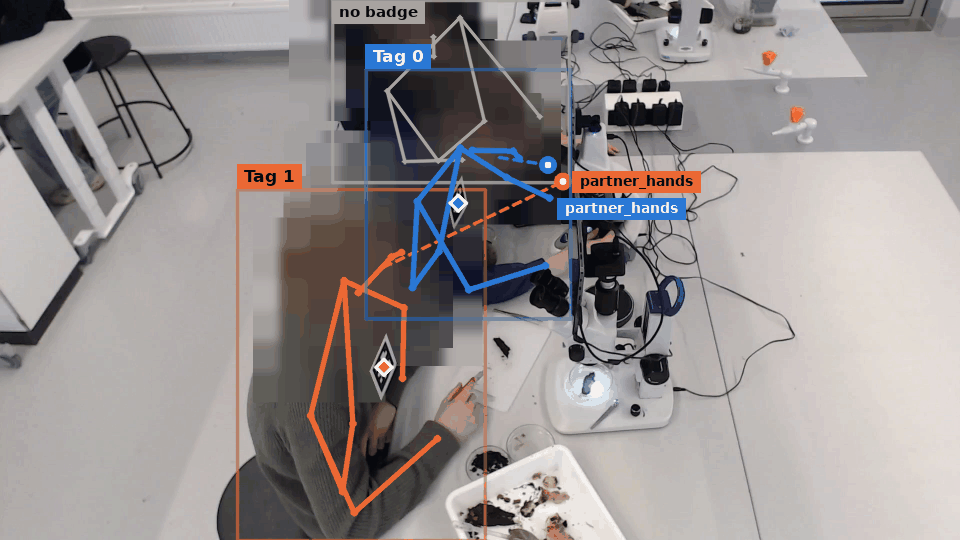

# Pose and gaze

The VFA server's features endpoint answers, for every frame of a frame set, the persons in it as geometry: their skeletons, the AprilTag each wears, how their head turns, and where their gaze lands. No VLM is involved. Use the pose and the gaze for body, hand and gaze measures; the synchronizer stores them as one `vfa_features` event per frame set.



## Features endpoint

`POST /vllm/features`, also through the Gateway, takes the frames of one frame set and answers one frame per image. The synchronizer sends every frame set to it when **Pose** or **Gaze** is on ([Choosing the outputs](run.md#choosing-the-outputs)).

### Request

The request is a form:

| Field | What it holds |
|---|---|
| `images` | one or more image files, one per camera |
| `angles` | a JSON list, the angle name of each image (`perspective_<n>` when missing) |
| `cameras` | a JSON list, the base id of each image: its persons are [tracked](#tracking) across that camera's frames, and its frame echoes it as `camera` |
| `session_id` | the session; tracks and appearance memories are kept per session |
| `zones` | named polygons a gaze may land in: `{"table": [[x, y], ...]}` for every image, or `{"front": {"table": [...]}}` per angle, in pixels or in `[0, 1]` |
| `inout_threshold` | below it a gaze is `out_of_frame`; the config's `features.inout_threshold` when left out |
| `keypoints` | `false` leaves the skeletons out of the answer |
| `gaze` | `false` skips the gaze model; the config's `features.gaze` when left out |

### Response

```json
{"frames": [{"angle": "front", "camera": "1", "width": 1920, "height": 1080,
             "tags": {"0": [1010.5, 560.0]},
             "persons": [{"person_id": "0", "tag_id": 0, "tag_match": "torso", "track_id": 3,
                          "bbox": [775, 70, 1359, 938], "score": 0.93,
                          "keypoints": [[x, y, confidence], "... 17 in COCO order"],
                          "head_yaw": -3.6,
                          "face_bbox": [1000, 230, 1210, 400],
                          "gaze": {"point": [1080, 760], "inout": 0.91,
                                   "target": {"category": "zone", "person_id": null, "zone": "table"}}}],
             "zones": {"table": [[0, 594], [1920, 594], [1920, 1080], [0, 1080]]},
             "pairs": {"0|1": {"gaze_distance": 412.0, "hand_distance": 254.4}},
             "scoring": {"hand_circle": 2, "keypoint_confidence": 0.3, "inout_threshold": 0.5}}],
 "pose_model": "yolo26n-pose.pt", "gaze": true}
```

All coordinates are pixels from the top-left corner of the frame.

| Field | What it is |
|---|---|
| `tags` | the centre of every AprilTag read in the frame |
| `persons` | one entry per person: see [Pose](#pose) and [Gaze](#gaze) |
| `zones` | the request's zones as resolved, in pixels, so a zone sent in the wrong units shows up at once |
| `pairs` | for every two persons, how far apart their gazes land (a joint-attention proxy; `null` when either gaze is out of the frame or missing) and how close their hands come |
| `scoring` | what the gaze targets and pairs were scored with: the [hand circle](#hands) version, `keypoint_confidence` and `inout_threshold` |
| `gaze_error` | only when the gaze failed on this frame: the reason |
| `gaze` (top level) | `true` when the gaze model ran |

The endpoint keeps no state but the tracks and their appearance memories: one request, one frame set.

!!! note "No pixels leave the endpoint"
    The answer holds boxes, keypoints and numbers, never pixels nor an appearance descriptor, and `/features` writes no frame to the server's `temp/` folder (where `/vllm` keeps its marked frames). `keypoints=false` leaves even the skeletons out.

### How the synchronizer uses it

- It writes each answer as one `vfa_features` event ([Databases](../../database.md#influxdb)).
- With **Gaze** off, it sends `gaze=false` and the server answers the pose alone.
- `Synchronizer.pose_keypoints: false` keeps the skeletons out of the events, and `Synchronizer.feature_zones_file` names a JSON file of zones ([Synchronizer](configuration.md#synchronizer)).
- It publishes each answer to the bases on MQTT (`<session>/vfa/features`). A base with **Graphics** on draws its own angle's boxes, tags, head yaws, skeletons and gaze lines on its live window, with a note of how old they are: the window runs at the camera's rate, the pose at the bases' `keyframe_interval`.

To call the endpoint from your own code, use `request_frame_features` in `openmmla/services/vfa/requests.py`; `pipelines/vfa-base/examples/frame_features.py` sends still frames to it.

## Pose

The pose is the persons of each frame as geometry: where each one is, who they are, which way the head turns and where the hands are.

### Skeletons

An Ultralytics YOLO pose model gives each person a box (`bbox`), a detection `score` and the 17 COCO `keypoints`, each with its confidence.

- The model is `features.pose_model`: `yolo26n-pose.pt`, the YOLO26 nano, by default. Other sizes and families, such as `yolo26s-pose.pt` or `yolo11n-pose.pt`, are a name away.
- The weights are fetched once, at the server's first start, into `pipelines/vfa-server/weights/` (the container's `/project/weights`). On a host without internet, put the file there yourself.
- A model that cannot be loaded, or one that does not answer 17 keypoints, makes the endpoint answer 503 with the reason.

!!! warning "Licence"
    `ultralytics` is AGPL-3.0, while openmmla is MIT. Serving the frame analyzer image over a network with it inside carries the AGPL source-offer obligation for the combined work ([Docker](../../docker.md)). A deployment that must stay free of AGPL code leaves `ultralytics` out and sets `features.enabled: false`.

### Identity

A person's identity is the AprilTag on their chest:

- A tag inside a person's torso beats one merely inside their box. The torso is the shoulders and hips or, seated with the hips hidden, a box hanging from the shoulder line.
- The nearest such tag wins, and tags and persons are matched one to one.
- `tag_match` says how: `torso`, `box`, or `track` for a tag the person's [track](#tracking) remembers while it is out of sight.
- `person_id` is the tag id. A person without a tag is `track_<id>` while tracked, else `unknown_1`, `unknown_2` ... from left to right. These are bystanders, which a client should drop.

### Head yaw

`head_yaw` is read from where the nose sits between the ears, or between the eyes when an ear is hidden, scaled for their narrower arc.

| Value | Meaning |
|---|---|
| 0 | facing the camera |
| positive | turned towards the right of the image |
| about ±70 | only one ear seen |
| past ±90 | seen from behind |
| `null` | the nose, or both ears and both eyes, are hidden |

### Hands

The hands are circles. For each wrist the pose model sees, the circle has a radius of 0.4 shoulder widths and is centred 0.33 shoulder widths past the wrist along the forearm, or on the wrist when the elbow is hidden. The centre sits past the wrist so that the circle covers the fingers rather than the wrist bone.

The gaze targets score these circles, and the pairs measure `hand_distance` between their centres. `/info` reports the circle under `features` (`hand_circle`, `hand_nudge`).

??? info "Details: hand circle versions"
    `scoring.hand_circle` names the circle a frame was scored with. Version 2 is the one above (`HAND_NUDGE` in `openmmla/services/vfa/features.py`); version 1 centres the circle 0.14 shoulder widths past the wrist. A frame without `scoring` was scored with version 1, and the fusion remakes its targets and hand distances ([The hand circle, remade](../../analytics/window_features.md#the-hand-circle-remade)).

## Tracking

With `cameras` in the request, the server keeps one tracker per camera of a session over the pose boxes. Every person then carries a `track_id`, which holds while they stay in view and for `buffer_frames` frames out of it (30, that is 30 s at the default `keyframe_interval` of 1 s). A newcomer's first frame has no `track_id`; the track is confirmed on the second.

A tag read on a track names that person for as long as the track lasts, hidden or not (`tag_match: track`). A tag read on another track moves to it.

!!! warning "One worker, frames in order"
    The tracks live in the server process. Run the server with one worker, the default, and send each camera's frames in order, as the synchronizer does.

The tracker is Ultralytics' ByteTrack: a Kalman filter predicts where each track's box will be, and a track takes the person whose box overlaps that prediction best. ByteTrack compares boxes only, so a lost track can drift onto someone else and hand them its tag. The server's tracker (`openmmla/services/vfa/tracking.py`, a small subclass of ByteTrack written for Ultralytics 8.3 and 8.4) adds:

- **Splits** (`split_gap_seconds`, `appearance.split_on`): a lost track found again at least 3 s after it last saw its person continues under a new track id, without its tag, when the appearance calls the person someone else (`split_on: different`). A track found again sooner, or one the appearance confirms or cannot judge, keeps its id and tag.
- **Refusals**: such a match is refused before it is made, so the person starts a track of their own, without the tag, and the lost track waits for its own person ([Appearance checks](#appearance-checks)).
- **Cascade** (`cascade`, off): the tracks in view take the frame's persons first, and a lost track is offered only a person none of them took.
- **Frozen lost tracks** (`freeze_lost`, off): a lost track stays where its person was last seen, without velocity, and a track found again starts its motion afresh.
- **Duplicates**: in ByteTrack's check for duplicate tracks (two boxes overlapping by an IoU above 0.85), a lost track gives way to the track in view when it is frozen, with the cascade, and whenever the appearance checks are on.
- **Track ids** are counted per camera from 1.

By default only a `different` verdict splits a track, because the face often has nothing to compare, and splitting every unconfirmed re-find cuts the tracks of people who never left. A tag carried on a kept track is still limited by the fusion's [tag memory](../../analytics/window_features.md#tags-along-the-tracks).

??? info "Details: splits and ByteTrack's matching"
    - `split_on: unconfirmed` splits every re-find after the gap that the appearance does not confirm (any verdict but `same`, none included). `split_gap_seconds: 0` never splits.
    - The tracker counts frames, and `frame_seconds` (1, the bases' `keyframe_interval`) turns `split_gap_seconds` into frames. A file replay run faster than real time therefore splits where a live run would.
    - The server judges a re-find on its first frame.
    - ByteTrack's cost is one minus the IoU times the detection score, and must stay below 0.8. It makes one assignment over the tracks in view and the lost ones together, and a lost track's box keeps moving at its last velocity for up to 30 frames.
    - ByteTrack's duplicate check drops the younger of the two tracks. Without the duplicate rule, a lost track the appearance refused a person at would stand where that person stands, and delete the track they start, frame after frame. A lost track drifting over a person whose track is younger than its own would likewise delete that track and take the person over, tag and all, in the next frame. The split rule plays no part in it.
    - ByteTrack shares one id counter among every tracker of a process and resets it whenever a tracker is made, which could hand a newcomer the id of a live track; hence the per-camera ids.
    - The tracker costs about 0.33 ms per camera frame on one CPU thread.

### Appearance checks

The appearance checks compare how a person looks with what the server remembers of a track or a tag. They run only when the face check or the colour check is switched on; both are off in the template.

A check gives a distance, 0 for the same look, and compares it with two thresholds: at or below `same` the verdict is `same`, above `different` it is `different`, and in between `unknown`.

| Check | What it compares | Distance | `same` | `different` |
|---|---|---|---|---|
| Face (`appearance.face`) | an ArcFace embedding (InsightFace's `w600k_r50.onnx`) of the face, aligned from the five landmarks RetinaFace gives | cosine | 0.55 | 0.65 |
| Colour (`appearance.colour`) | an HSV histogram of the upper-body clothing, only with looks from the same camera | Hellinger | 0.12 | 0.35 |

- A face is used when its box is at least `min_face_px` (56) wide and it is turned at most `max_face_yaw` (50) degrees by its landmarks.
- The face decides wherever both sides have one; the colour decides otherwise.
- The colour of a person whose box overlaps another's by an IoU of `max_overlap` (0.3) or more is not compared, since a neighbour leaning in front shows their own clothes; the face still is.
- The colour check is off by default because lighting, posture and occlusion change a histogram as much as a change of person.

??? info "Details: the colour histogram and the face crop"
    - The hue takes 16 bins, each pixel weighted by its saturation; a pixel darker than V 40 counts in a grey bin instead. Saturation and brightness take 8 bins each. Each part is normalised and given a third.
    - The region is the polygon of the shoulders and hips; seated with the hips hidden, a box from the shoulder line down 1.2 shoulder widths; with the shoulders hidden too, the band of the person's box from 20 % to 50 % of its height, 20 % in from each side. Each region is shrunk by 15 % towards its middle, and the crop to 48 px on its long side; a region under 30 pixels gives no histogram.
    - A face is turned too far when the nose sits more than 0.6 eye distances off the eyes' midpoint (50 degrees). The pose's head yaw is not used.
    - A colour costs about 0.1 ms. A face costs about 3 ms on the GPU and 48 ms on the CPU.

**What the server remembers.** A distance is the nearest of a memory's looks:

- A track's **looks**: its last `descriptor_frames` (10) frames, one every `sample_spacing_seconds` (2) of the camera. Colours come only from frames where the person's box overlaps no other person's by `max_overlap` or more.
- A tag's **gallery**: the frames in which the tag was read on the torso (not on the box), its last `gallery_size` (10) usable faces from any camera, and its last 10 colours of each camera, one every 2 s. The cameras of a session share one set of galleries.

**What the checks do:**

- **A lost track found again** checks the person against the tag it remembers, or against its own looks when it remembers none. A match called `different` is refused: the person is taken by another track or starts one of their own, without the tag. Any other match keeps the track's id and tag.
- **A remembered tag** is carried by a person whose tag is not read, and is checked by the same rule. By default the verdict is only recorded (`tag_check_acts: false`), because a `different` verdict against a tag's gallery is less reliable than a refusal between tracks.

??? info "Details: how a verdict is reached"
    - A tag is confirmed (`same`) only when the person is within `same` of it and nearer to it than to any other tag of the session. It is `different` beyond `different`, or when another tag is within `same` instead.
    - Another tag counts in this nearest-tag rule once its gallery holds `rival_looks` (3) looks, so a badge misread once does not stand against a person's own tag.
    - When the remembered tag's gallery holds nothing to compare (a tag read on the box only, or never on this camera), the track's own looks take its place under the same rule.
    - For the 3 frames after a refusal (`REFUSAL_HOLD_FRAMES` in `tracking.py`), the lost track takes only a person the appearance confirms, since a refused newcomer's own track is confirmed only on their second frame, where their face is often not seen. A person it holds off, its own included, starts a track of their own, without the tag.
    - With `split_on: unconfirmed`, a re-find not called `same` after `split_gap_seconds` is split even when it is not refused.

??? info "Details: `tag_check_acts: true`"
    - A `different` verdict withholds the tag in that frame and answers the person under a provisional track id of their own.
    - The `different_frames`-th (2) such verdict in a row gives the person no tag and continues their track under that id.
    - A verdict that is not `different`, or a read, puts the person back on their track.
    - A check that says `unknown`, or finds nothing to compare (no torso or face, an empty gallery), carries the tag as before.
    - The fusion's [tags along the tracks](../../analytics/window_features.md#tags-along-the-tracks) carry reads along a track id, so they carry the track's earlier reads neither onto a withheld frame nor past the split.

**In the answer**, a person a check ran on, or whom a lost track took after `split_gap_seconds`, carries `reid`. A re-find is recorded whether the track was split or kept; by default a `tag` record carries no flag, as the tag was given whatever its verdict.

```json
"reid": {"track": {"kind": "colour", "score": 0.084, "verdict": "same", "tag_id": 2, "gap": 9.0},
         "tag": {"kind": "face", "score": 0.412, "verdict": "same", "tag_id": 2}}
```

??? info "Details: the `reid` fields"
    | Field | Meaning |
    |---|---|
    | `track` | the check of a lost track found again, or refused |
    | `tag` | the check of a remembered tag |
    | `kind`, `score`, `verdict` | `face` or `colour`, the distance, and `same`, `different` or `unknown`; `null`, `null` and `unknown` when there was nothing to compare |
    | `tag_id` | the tag checked against |
    | `gap` | the seconds since the track last saw its person |
    | `split: true` | the track continued under a new id |
    | `blocked: true` | the match was refused: on a person no track took, or on one the refusal kept from the lost track that would have taken them; with a verdict other than `different`, by the hold of an earlier refusal |
    | `withheld: true` | with `tag_check_acts` only: the tag was not given in this frame, and `track_id` is the provisional one |

!!! note "Looks and face embeddings stay in the server's memory"
    The looks and galleries live in the server process only, per session, and are never compared across sessions. They are dropped with the session's trackers, at the first request after every camera of the session has been silent for `idle_seconds` (600), or when the server stops. They are never written to a file, a log, Redis, InfluxDB or MongoDB, nor answered: an answer, and the event stored from it, carries a kind, a distance and a verdict.

**The face check is a switch**, off in the template. Switch it on in a deployment's own config only for data whose consent covers local face recognition.

- The face model is fetched once, at start, from InsightFace's `buffalo_l` pack (`models_url`) into `pipelines/vfa-server/weights/face/` (the container's `/project/weights/face`, a bind mount, so a rebuild does not fetch it again).
- On a host without internet, put `w600k_r50.onnx` there yourself, and `det_10g.onnx` when `detection_model` names it. An empty `models_url` never fetches.
- The model runs on ONNX Runtime, on the GPU when it has CUDA.

!!! warning "Face model licence"
    InsightFace releases the `buffalo_l` models for non-commercial research only.

### Tracking settings

Under `features.tracking` in the server config. `/info` reports them under `features.tracking`.

| Key | Default | What it does |
|---|---|---|
| `enabled` | `true` | track the persons of each camera; `false` answers without track ids, every frame standing alone |
| `buffer_frames` | 30 | frames a lost track, and its tag, is kept |
| `idle_seconds` | 600 | a camera silent this long forgets its tracks; a session whose cameras all did forgets its galleries |
| `split_gap_seconds` | 3 | a lost track found again sooner keeps its id and tag; one found later is split as `appearance.split_on` says; 0 never splits |
| `frame_seconds` | 1.0 | the time between two frames of a camera |
| `cascade` | `false` | tracks in view first, lost tracks only for the persons left |
| `freeze_lost` | `false` | a lost track stays where its person was last seen |
| `appearance.descriptor_frames` | 10 | looks a track keeps |
| `appearance.gallery_size` | 10 | faces, and colours per camera, a tag's gallery keeps; a larger gallery lets more impostors in |
| `appearance.sample_spacing_seconds` | 2 | the least time between two looks a memory keeps of one camera |
| `appearance.max_overlap` | 0.3 | a person overlapping another by this IoU or more adds no colour to a memory, and their colour is not compared |
| `appearance.split_on` | `different` | the verdict that splits a lost track found again after `split_gap_seconds`: `different`, or `unconfirmed` (any but `same`, none included) |
| `appearance.tag_check_acts` | `false` | `true`: a `different` verdict on a remembered tag withholds the tag and, `different_frames` in a row, splits the track; `false` only records it |
| `appearance.different_frames` | 2 | with `tag_check_acts`: `different` tag verdicts in a row that split a track in view |
| `appearance.rival_looks` | 3 | looks another tag's gallery needs before it counts in the nearest-tag rule (not in the template) |
| `appearance.colour` | `enabled: false`, `same: 0.12`, `different: 0.35` | the colour check; `hue_bins`, `saturation_bins`, `value_bins`, `min_value`, `torso_inset`, `torso_drop`, `box_top`, `box_bottom`, `box_inset`, `min_shoulder_px`, `max_side` and `min_pixels` shape the histogram and its region |
| `appearance.face` | `enabled: false`, `same: 0.55`, `different: 0.65`, `min_face_px: 56`, `max_face_yaw: 50` | the face check; `recognition_model` and `models_url` name the model |
| `appearance.face.detection_model` | empty | SCRFD (`weights/face/det_10g.onnx`) to look for the face of a person RetinaFace missed, in the pose's head box; off by default because such faces compare poorly; with `detection_size` (192) and `detection_threshold` (0.5) |

`colour` and `face` also take a bare `true` or `false`.

## Gaze

The gaze is where each person looks and at what. It comes with the pose, from the same request and in the same `vfa_features` event, when **Gaze** is on. Each person gets:

- `face_bbox`: the face box (or the [head box](#head-boxes-from-the-pose)), `null` when the person has no face;
- `gaze.point`: the point the gaze lands on;
- `gaze.inout`: the probability that it lands inside the frame;
- `gaze.target`: what it lands on ([Gaze targets](#gaze-targets)).

The same gaze model draws the gaze lines the VLM sees for the [action labels](action-labels.md), but those return no gaze as data.

### Gaze models

RetinaFace finds the faces, and a gaze model finds where each face looks: [PaGE](https://github.com/OctopusWen/PaGE) by default, or [Gaze-LLE](https://github.com/fkryan/gazelle).

| `gaze_backend` | `gaze_model` | Notes |
|---|---|---|
| `page` (default) | `Octopus1/page-vitb` (default) | the distilled ViT-B |
| | `Octopus1/page-vits` | a third of the compute |
| | `Octopus1/page-vitsplus` | between `vits` and `vitb` |
| | `Octopus1/page-vithplus` | the 840M teacher |
| `gazelle` | `gazelle_dinov2_vitl14_inout` (default) | the torch.hub entry point with the in/out-of-frame head |
| | `gazelle_dinov2_vitb14_inout` | |

- A checkpoint loads with its own backend only: a `gazelle_*` checkpoint needs `gaze_backend: gazelle`. Left out, `gaze_backend` follows the checkpoint's name.
- `gaze_head_scale` (1.3, PaGE only) widens the face box into the head crop PaGE looks at.
- PaGE's code is MIT, and its checkpoints carry Meta's DINOv3 licence, which binds redistributing the weights, not serving them.

### Gaze targets

Every target within reach of the gaze point is scored, and the best is taken:

| `category` | The gaze lands on | Priority |
|---|---|---|
| `partner_face` | another person's face (their `person_id` comes with it) | 1 |
| `partner_hands`, `own_hands` | the nearest hand circles, someone else's or the person's own | 2 |
| `zone` | a named zone (its name in `zone`) | 3 |
| `elsewhere` | nothing of the above, inside the frame | 4 |
| `out_of_frame` | outside the frame: `inout` below `inout_threshold` | |
| `unknown` | nothing known: the person has no face, or the gaze model gave nothing | |

- Every target is widened by what the gaze model cannot resolve: one cell of its 64 by 64 heatmap, 30 px at 1920 wide.
- `inout_threshold` is the request's, else the config's `features.inout_threshold` (0.5).
- Zones come from the request's `zones`; the synchronizer sends those of `Synchronizer.feature_zones_file`.

### Head boxes from the pose

RetinaFace misses many faces, such as side views and small heads, and PaGE and Gaze-LLE find no face themselves. So a person RetinaFace missed, whose nose or both eyes the pose model sees, gets a square head box instead, and the gaze model runs once more on those boxes alone.

- Such a person carries `"face_source": "pose"`, and their `face_bbox` is the head box. A person without the key has a RetinaFace face, or none when `face_bbox` is `null`.
- A face RetinaFace found always wins, and the RetinaFace gazes stay as they are.
- A head box is looser than a RetinaFace box, and PaGE widens it again by `gaze_head_scale`, so it makes a slightly larger partner face.
- The second run happens only on a frame where someone was missed, and adds about a third to that frame's time on PaGE; the frame is decoded once for both runs. A replay needs that headroom ([Replay recordings](run.md#post-time-processing)).
- `gaze_head_box_fallback: false` turns head boxes off.

??? info "Details: how a head box is drawn"
    The box is centred on the nose, eyes and ears that are seen, as wide as the head (the ear span, 2.3 eye distances or a third of the shoulders, whichever is widest) plus a fifth on each side. A head seen side on shows one ear and overlapping shoulders, so there the head is also at least 1.5 times the nose-to-ear distance and three times the nose-to-eye distance. The box always holds every head keypoint seen. The keypoints count at `keypoint_confidence`.

### Face detector input

RetinaFace takes a frame as BGR and swaps the channels itself. `gaze_face_detector_bgr: true`, the default, hands it BGR, the order it expects.

- `false` hands it RGB, which finds fewer faces: use it only to reproduce an analysis made with that setting.
- The setting changes which persons get a gaze from a detector face rather than a head box, and which faces the tracker's face check gets.
- `/info` reports it (`gaze_face_detector_bgr`).

### Work area

The endpoint never labels a work area. The fusion relabels an `elsewhere` gaze that lands inside the camera's work area as `work_area`, and adds the area's box to each frame ([The work area](../../analytics/window_features.md#the-work-area)). A frame that already carries `work_area` is kept by the fusion as it is.

## Troubleshooting

**A frame carries `gaze_error`.** The face detector or the gaze model failed on that frame, and the field gives the reason. The synchronizer says so once on its console, and the base's window writes it under the features note. The skeletons and tags still come.

**The endpoint answers 503.** `features.enabled` is `false`, or the pose model could not be loaded; the answer gives the reason. The `vfa-server` extra installs `ultralytics`, and the weights are fetched into `weights_dir`.

**The endpoint answers 400.** The request has no images, a frame that is not an image, `zones` that is not a JSON object, or a zone that is not a polygon; the answer names it. Fix the request: the server does not ask for a retry.

**The answers have no track ids.** The request carries no `cameras`, `features.tracking.enabled` is `false`, or the tracker could not be made (the server log says why, once). An Ultralytics version whose ByteTrack lacks a method the tracker overrides is such a case, and the message names the method.

**No gazes, or gazes only from head boxes.** When RetinaFace cannot load, the server keeps the gaze model and makes gazes from head boxes alone; its log says so at start, and the `/vllm` marks then draw no gaze. With `gaze_head_box_fallback: false` as well, the gaze is off. With `gaze_detect: false`, or a gaze model that cannot load, there are no gazes at all.

**The face check is off although it is switched on.** The log says why at start: a model that cannot be fetched (a fetch waits at most 30 s for its next bytes and 30 min in all) or loaded leaves the face check off, and the colour check as configured. A face model that fails on a frame (a GPU out of memory, say) leaves that frame's faces out and keeps its colours; 10 such frames in a row switch the face check off until the server restarts.
