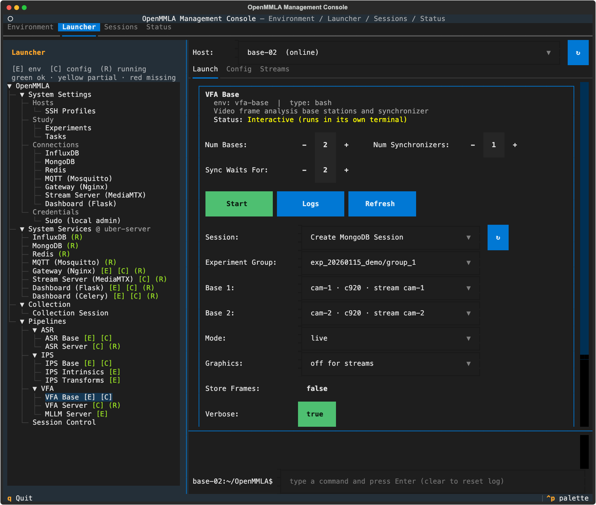

# Run VFA

This page runs VFA from the management console: what you set up once per deployment, and what you do for every session. It also covers running the components from the command line and replaying recorded video.

!!! note "Before you start"
    This page assumes the [one-time setup](../../quickstart.md#one-time-setup) of the Quickstart is done: the machines added and prepared, the system services running, every machine pointed at them, and the study described.

## Once per deployment

These steps are done once, and again only when something they set changes: a model, a prompt, a camera, a stream or a machine.

1. **VFA Server config.** Open `Launcher → Pipelines → VFA → VFA Server` with **Host** on the GPU server. On the **Config** tab, set what the outputs you will ask for need, then **Save**, which writes `pipelines/vfa-server/config.yml` on that host ([Server config](configuration.md#server-config)):
    - Action labels: `backend` and its block ([Model backends](action-labels.md#model-backends)), `end_to_end` and `prompt_profile` ([Prompts](action-labels.md#prompts)). The API key of a cloud block is stored encrypted.
    - Pose: the `features` block, with the pose model, its thresholds and the tracking ([Pose](pose-and-gaze.md#pose)).
    - Gaze: `gaze_backend` and `gaze_model` ([Gaze](pose-and-gaze.md#gaze)). The gaze lines of the action labels use the same model.

    !!! warning
        The server does not start without the block of its `backend` (`vllm` when left out) and, for a cloud backend, that block's `api_key`. This holds even when the server is only asked for the pose and the gaze.

2. **Prompts and action schema**, for the action labels. The **Prompts** tab of the same card edits the templates under `pipelines/vfa-server/prompts/` and marks the ones in use. The **Action Schema** tab edits `config/vfa/action_schemas.yml` ([Action coding scheme](action-labels.md#action-coding-scheme)). Both tabs edit the files of the card's host; **Sync to Host** copies them to another host and **Sync from Host** brings another host's in.
3. **MLLM Server**, only when `backend` is `vllm`. Open `Launcher → Pipelines → VFA → MLLM Server` with **Host** on the machine that serves the model, usually the GPU server. That machine needs the `vfa-vllm` environment (**Environment** tab, Python 3.12) and tmux.
    - The **Config** tab edits this console's `config/mllm_server.yml`, whatever the **Host** selector says ([MLLM Server settings](action-labels.md#mllm-server-settings)). Its `limit_mm_per_prompt` must allow as many images as a frame set has cameras.
    - **Start** runs `vllm serve` with these values on the card's host, in the `vfa-vllm` environment, inside a tmux session named `mllm-server`.
    - Start the MLLM Server before the VFA Server.
    - The server config's `vllm` block points at an MLLM Server on the same machine. When it runs on another machine or port, or serves another model, change the block: see [Local VLM with the MLLM Server](action-labels.md#local-vlm-with-the-mllm-server).
4. **VFA Server.** Press **Start** on the **Launch** tab, where the frame analyzer (`VLLMFrameAnalyzer`) has a `true`/`false` toggle. The card runs `docker compose -f docker/docker-compose.vfa.yml up -d --build frame-analyzer` on its host.
    - The first Start builds the image, which downloads several GB, and the server fetches the pose weights at its first start ([Skeletons](pose-and-gaze.md#skeletons)).
    - The server reads its config, the prompts and the action schema when its container starts. After a change to any of them, **Stop** the card and **Start** it again.
5. **VFA Base config.** Open `Launcher → Pipelines → VFA → VFA Base` with **Host** on the base station, which needs the `vfa-base` environment ([What you need](index.md#what-you-need)). On the **Config** tab ([Base config](configuration.md#base-config)):
    - `Base.angle_config`: the viewing angles, each a name and what a camera at that angle sees (**+ Add Entry**, **Remove**). What an angle sees travels with its frames to the VLM.
    - `Cameras`: the calibrated camera profiles the `Bases` entries name, in the form IPS uses. **IPS Intrinsics** writes them into the IPS Base config only; **+ Add Camera** adds one here (`fisheye`, `params`, `K`, `D`).
    - `Streams`: one entry per camera the console captures (**+ Add Stream**), or an external stream ([Streams](configuration.md#streams)). `target` takes the path alone, such as `vfa/front`, and **Save** completes it with the Stream Server of System Settings.
    - `Bases`: one entry per camera angle (**+ Add Entry**): `id`, `camera` from `Cameras`, `source` and `source_index` ([Input sources](configuration.md#input-sources)), and `camera_angle` from the names in `angle_config`. A new angle or stream shows up in these dropdowns once the config is saved.
    - `Server.vfa`: the frame analyzer, through the Gateway (the bare name `vllm`, shown as `through the Gateway: http://<gateway>:8080/vllm`) or straight to the server (`http://<gpu-server>:5007/vllm`).
    - `Base.keyframe_interval` and `Synchronizer.action_interval`: the pace of the frame sets and of the VLM ([Choosing the outputs](#choosing-the-outputs)).

    **Save** writes the config on the card's host.

6. **Streams tab** of the same card. For each stream the console captures, set its **SSH Profile** (the machine that runs its FFmpeg, such as `pi-01`), its **Device**, **Record** and **Rotate** (`180°` for a camera mounted upside down; see [Turning the picture](configuration.md#turning-the-picture)). These picks are written into the config of the card's host. **Start** a stream and **Probe** it: FFmpeg on this machine decodes two seconds of the URL the bases pull.
7. **Other base stations.** When the bases of one session run on more than one base station, **Sync to Host** on the **Config** tab copies this config, its `Bases` and `Streams` included, to the others. Each card's bases read the config of their own host.

## Every session

1. **Start the streams.** On the VFA Base card's **Streams** tab, **Start** the stream of each camera the session uses, or **Start All**, and wait until the **Stream Server** column reads `● live`. A stream that already runs for another session is left as it runs. A base with an `opencv`, `lsl` or `file` source, and every base in `analyze` mode, pulls no stream.
2. **Fill in the VFA Base card** on the **Launch** tab. The card opens on the host it was last pointed at.

    

    | Field | Default | What it does |
    |---|---|---|
    | **Num Bases** | 1 | bases started on this host, one per camera angle |
    | **Num Synchronizers** | 1 | a session has one synchronizer; set 0 on the cards of the session's other hosts |
    | **Sync Waits For** (`--num_bases`) | follows **Num Bases** | how many bases the synchronizer merges each frame set from, counted over every host of the session; set it by hand when bases run on other hosts |
    | **Session**, **Experiment Group** | | `Create MongoDB Session`, with the take's experiment group, starts a new take; the group's participant descriptions go into the action-label prompts |
    | **Base 1**, **Base 2**, ... | | which `Bases` entry each base is, one dropdown per base; `ask in its window` lets that base ask |
    | **Mode** (`-m`) | `live` | `live` analyzes frames as they are captured; `capture` only stores frames, for example for [human coding](action-labels.md#human-coding); `analyze` re-runs the analysis on the frames this session stored earlier |
    | **Graphics** (`-g`) | `off for streams` | a window on the base's frames, unless its source is a stream; `on` and `off` decide for every source |
    | **Store Frames** (`-s`) | off | keep every analyzed frame; a `capture` base stores its frames whatever this says |
    | **Verbose** (`-v`) | on | print debug output |
    | **Action Labels** (`-a`), **Pose** (`-pose`), **Gaze** (`-gaze`) | `as the config says` | what the synchronizer asks the frame analyzer for ([Choosing the outputs](#choosing-the-outputs)) |

    ??? info "Details: the card's fields"
        - **Sync Waits For** too high: a frame set waits for bases that never report until it expires (`Synchronizer.result_expiry_time`, 30 s), and is then sent with the frames it has, or dropped when it has only one. Too low: a set is merged before the other bases report. Start refuses a card that starts more bases than the synchronizer waits for.
        - **Session**: the first Start mints the session id. Every base card (ASR, IPS and VFA, on any host) then opens on it, so the other cards of the take join it with their own Start.
        - **Base** *n* starts on the *n*-th `Bases` entry. Start refuses two bases on one entry.
        - **Graphics**: a stream is pulled where nobody watches, often over SSH with no display, so `off for streams` opens no window for it. A window draws the features the synchronizer publishes (with **Pose** or **Gaze** on), with a note of how old they are. The dashboard's camera tiles show them either way.
        - **Store Frames** off: a `live` base writes each frame to `real-time/temp/`, and the synchronizer deletes it once it is done with it.

3. **Press Start.** It opens one terminal window per base and synchronizer, and nothing in them asks anything, unless a base is left on `ask in its window`. Each base runs as its `Bases` entry; the synchronizer starts on the session at once and waits for START.
    - On a remote host whose config lacks the current System Settings, the first Start only brings them there and says `Relaunch VFA Base once the sync above completes.` Press **Start** again.
    - Start asks the Stream Server whether the streams the bases pull are live, and holds back once, naming those that are not ([Stream check](../../tui/launcher/pipelines/index.md#stream-check)). Start them on the **Streams** tab, or press **Start** again to start the bases anyway.

    ??? info "Details: what else Start checks"
        - Start warns, and starts anyway, when a stream the **Streams** tab runs is captured on another machine, recorded or turned otherwise than the config of the card's host says. The bases read that config, and the session notes what it says.
        - A base whose stream is not up yet says so and waits for it, up to 30 s ([Bases: pulling a stream](../../streaming/index.md#bases-pulling-a-stream)), before it says that it waits for START. A START or STOP sent meanwhile is heard once the stream is up.

4. **Send START.** Open `Launcher → Pipelines → Session Control` and pick the session; the list opens on the one the base cards were last started into. Keep **VFA** ticked with the other pipelines of the take, and press **Send START** once every window reports that it waits. The dashboard's [Live](../../dashboard/index.md#live) page follows the session as it is written. A base whose stream drops during the session opens it again on its own (`stream_kwargs.reconnect_wait`), and that angle's frames are missing for the gap.
5. **Send STOP** at the end. STOP ends the run of every base and synchronizer of the session, and each of them exits, also when STOP comes before START; the card has no Stop of its own. STOP also marks the session as ended, and the cards go back to `Create MongoDB Session`, so the next session's bases are started from the card again.

    !!! warning
        A request the frame analyzer has not answered by STOP is given up, and the VLM can take minutes. The synchronizer exits at once, and the action labels or features of that frame set, and of any frame sets queued behind it, are dropped.

6. **Stop the streams** once no other session pulls them: **Stop** or **Stop All** on the VFA Base card's **Streams** tab, or **Stop All** on the Streams tab of `Launcher → System Services → Stream Server (MediaMTX)`, which lists the streams of every pipeline. Stop waits for FFmpeg to finish a recording and names the file.
7. **Export and archive** on the **Sessions** tab: **Export** gathers the session's measurements, recordings and base files onto the console, and **Archive** sends its raw files on to the System Settings host ([Export and archive](../../quickstart.md#export-and-archive)).

## Choosing the outputs

The synchronizer asks the frame analyzer for up to three outputs. Each is a three-way choice on the card: `as the config says` passes no flag and lets the config's [`Synchronizer`](configuration.md#synchronizer) keys decide, while `on` and `off` override them for this start.

| Output | Card | Flag | Config key | Endpoint | Event | What runs on the server |
|---|---|---|---|---|---|---|
| Action labels | **Action Labels** | `-a` | `Synchronizer.actions` | `/vllm` | `vfa_action` | AprilTag and gaze overlays, then the VLM; with `end_to_end: false` a VLM describes and an LLM classifies |
| Pose | **Pose** | `-pose` | `Synchronizer.pose` | `/vllm/features` | `vfa_features` | the pose model and the AprilTag detector |
| Gaze | **Gaze** | `-gaze` | `Synchronizer.gaze` | `/vllm/features` | `vfa_features`, the same event | the pose model and the gaze model |

With the shipped config, a card left on `as the config says` asks for the pose and the gaze, and no action labels. A gaze lands on someone's face or hands, so **Gaze** on also turns **Pose** on.

!!! note "Why the action labels are off by default"
    The VLM is the costliest request, and a cloud backend receives the frames.

The action labels and the features are two separate requests to the same server. The action labels run the VLM on frames the server first marks with AprilTags and gaze lines (as its `action_overlays` setting says), so they use the gaze model as a hint but return no gaze and run no pose model. The pose and the gaze return data and run no VLM. With **Action Labels** and **Gaze** both on, the gaze model runs twice per frame set.

!!! tip "Set the paces"
    The labels and the pose run at different paces. With the defaults, `Base.keyframe_interval` 1 and `Synchronizer.action_interval` 30, the frame sets come every second for the pose and the gaze, and the VLM is asked at most every 30 s. For a labels-only run, set `keyframe_interval` to 30 and `action_interval` to 0, so the bases capture a frame set every 30 s and each one is labelled, and turn **Pose** and **Gaze** off.

## Run from the command line

The card runs these commands; you can run them by hand on a base station:

```bash
conda activate vfa-base
mmla vfa-base -p pipelines/vfa-base -c pipelines/vfa-base/config.yml -m live -sid <session-id> -b <base-id>
mmla vfa-sync -p pipelines/vfa-base -c pipelines/vfa-base/config.yml -sid <session-id> -nb <number-of-bases>
# pose and gaze, no action labels; the bases' keyframe_interval sets the rate
mmla vfa-sync -p pipelines/vfa-base -c pipelines/vfa-base/config.yml -sid <session-id> -nb 2 -a False -pose True -gaze True
```

| Flag | Command | Default | What it does |
|---|---|---|---|
| `-p` | both | the working directory | the project directory |
| `-c` | both | required | the config file |
| `-sid` | both | asked | the session; given, the component starts at once and exits when the session is stopped |
| `-b` | `vfa-base` | with `-sid`, the only `Bases` entry; else asked | the `Bases` entry this base is; asked when there are several or the id is unknown |
| `-m` | `vfa-base` | `live` | `live`, `capture` or `analyze` |
| `-g` | `vfa-base` | no window for a stream source | show the frames in a window |
| `-s` | `vfa-base` | `False` | store the frames (`capture` always does) |
| `-v` | `vfa-base` | `False` | print debug output |
| `-nb` | `vfa-sync` | the number of `Bases` entries with `-sid`, else asked | how many bases to merge |
| `-a`, `-pose`, `-gaze` | `vfa-sync` | the config's `Synchronizer.actions`, `pose`, `gaze` | the outputs to ask for |

Without `-sid` the synchronizer opens its menu, where `1: start` asks for the session and, unless `-nb` is given, the number of bases. The base asks for the session and, without `-b`, for its `Bases` entry.

### Run the server without Docker

Install the server extra (`pip install -e '.[vfa-server]'`) and start one gunicorn worker:

```bash
export PROJECT_DIR=pipelines/vfa-server CONFIG_PATH=pipelines/vfa-server/config.yml
gunicorn -k gevent -w 1 -b 0.0.0.0:5007 openmmla.services.vfa.apps.serve_multi_angle_vllm_frame_analyzer:app
```

Keep it at one worker: the pose's tracks live in the server process ([Tracking](pose-and-gaze.md#tracking)). Without Docker, a VLM on the same machine is `http://localhost:<port>/v1` rather than `host.docker.internal`.

## Replay recordings { #post-time-processing }

A recorded session is analyzed by replaying its video files through the bases (post-time processing).

1. Record with **Collection → Collection Session**.
2. On the VFA Base card's **Config** tab, set each base's `source` to `file` and its `source_index` to its file in the `video/` directory of the collection manifest, by its full path (**Browse…** picks it).
3. Run the session in `live` mode as in [Every session](#every-session), without the streams. The Quickstart's [Analyze the recordings later](../../quickstart.md#analyze-the-recordings-later) gives the steps for all pipelines at once.

`Base.keyframe_interval` and `Base.processing_rate` set the replay's pace ([Base](configuration.md#base)). The files replayed together sit in one folder, and the replay starts at the latest start among them, read from the file names.

To analyze again the frames a session already stored (in `capture` mode, or with **Store Frames** on), start its bases in `analyze` mode in that session.

!!! warning "Leave the server headroom"
    The gaze's [head boxes](pose-and-gaze.md#head-boxes-from-the-pose) add about a third to a frame's time on PaGE. A replay paced faster than the server answers fills the synchronizer's features queue, and the frame sets still queued at STOP get no `vfa_features`. Lower `processing_rate` when the queue grows.

## Troubleshooting

**A window says why it cannot start.** A synchronizer with no number of bases (`-nb 0`, or no `-nb` and an empty `Bases` list), one that cannot reach Redis, or one whose run ends on an error rather than STOP prints the reason and falls back to its menu (`1: start`, `2: reinitialize` to reload the config, `0: exit`), which keeps the session it was started for.

**The synchronizer exits at once.** It connects to MQTT and MongoDB as it starts, before there is a menu. When either cannot be reached it says so, names what to check, and exits: start them from **System Services** and press **Start** on the card again.

**A base asks which entry it is.** A base launched without an id takes the only `Bases` entry there is. Given an id the `Bases` list does not have, or no id while there are several entries, it lists the ids there are and asks.

**A base exits naming a stream URL.** Its stream did not come up within its wait (`stream_kwargs.connect_wait`). Start the stream on the **Streams** tab, then start the bases again.

**`N frame sets wait for action labels`.** The VLM answers slower than the bases send frame sets. Raise `Synchronizer.action_interval` or `Base.keyframe_interval`.

**The features carry no gazes.** See [Pose and gaze → Troubleshooting](pose-and-gaze.md#troubleshooting).
