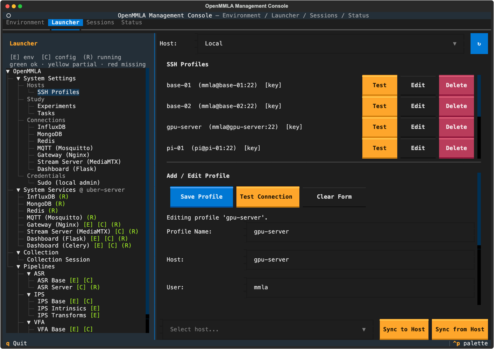

# Raspberry Pi

A Raspberry Pi serves OpenMMLA as a capture host, which streams or records a camera or a microphone, or as a base station, which runs a base itself. This page sets one up headless, for either role.

| Role | What runs on the Pi | What it needs |
|---|---|---|
| Capture host | FFmpeg, started and stopped over SSH by a card's **Streams** tab or the Collection card | SSH, `ffmpeg` and `tmux` |
| Base station | an IPS, VFA or ASR base | the [prerequisites](prerequisites.md), a clone of the repository and a conda environment |

As a capture host, the Pi pushes its stream to the Stream Server, or straight to an ASR base over UDP, and can record it to its SD card at the same time ([Streaming](streaming/index.md)).

## Set up the Pi

1. **Flash the card.** Write Raspberry Pi OS to the microSD card with Raspberry Pi Imager, and in its settings enable SSH and set the hostname, the user and the Wi-Fi.
2. **Forget an old host key.** When a previous Pi used the same hostname, drop its key:

    ```bash
    ssh-keygen -R pi-01.local
    ```

3. **Connect**, here to the hostname `pi-01`:

    ```bash
    ssh <user>@pi-01.local
    ```

4. **Install the base tools.** `v4l2-ctl --list-devices` and `arecord -l` then name the camera and the microphone:

    ```bash
    sudo apt update && sudo apt upgrade -y
    sudo apt install -y git tmux ffmpeg v4l-utils alsa-utils
    ```

5. **Add an SSH profile** for the Pi in the console: `Launcher → System Settings → Hosts → SSH Profiles`, with the **Host** selector on `Local`.

    

??? info "Details: a remote desktop over VNC"
    Enable the VNC server with `sudo raspi-config`, under `3 Interface Options → I2 VNC`.

## Use it as a capture host

Nothing else is needed on the Pi. In the console:

1. **Declare the stream.** On the pipeline card's **Config** tab, add a `Streams` entry with its `device` and `target` ([Declare a stream](streaming/index.md#devices-pushing-a-stream)).
2. **Pick the Pi.** On the **Streams** tab, choose the Pi in the stream's **SSH Profile** cell, which is written as the entry's `ssh_profile`.
3. **Start** the stream there. The Streams tab starts and stops FFmpeg on the Pi, and installs `ffmpeg` and `tmux` when they are missing.

The Pi's user needs to be in the `video` and `audio` groups to use the camera and the microphone. `groups` lists them, and `sudo usermod -aG video,audio "$USER"` adds them, from the next login.

## Use it as a base station

After [Set up the Pi](#set-up-the-pi):

1. **Give the Pi access to the repository**, with an SSH key added to your GitHub account or with a personal access token:

    ```bash
    # ssh key
    ssh-keygen -t ed25519 -C "your_email@example.com"
    eval "$(ssh-agent -s)"
    ssh-add ~/.ssh/id_ed25519
    cat ~/.ssh/id_ed25519.pub     # add at https://github.com/settings/keys

    # or a personal access token from https://github.com/settings/tokens
    echo "your_personal_access_token" > ~/.github_pat
    chmod 600 ~/.github_pat
    echo 'export GITHUB_PAT=$(cat ~/.github_pat)' >> ~/.bashrc
    source ~/.bashrc
    ```

2. **Clone the repository:**

    ```bash
    git clone git@github.com:ucph-ccs/OpenMMLA.git
    # or
    git clone https://$GITHUB_PAT@github.com/ucph-ccs/OpenMMLA.git
    ```

3. **Install Miniforge**, the conda-forge distribution with aarch64 builds:

    ```bash
    wget "https://github.com/conda-forge/miniforge/releases/latest/download/Miniforge3-$(uname)-$(uname -m).sh"
    bash Miniforge3-$(uname)-$(uname -m).sh
    ```

4. **Install the rest of the [prerequisites](prerequisites.md#ubuntu-debian-and-raspberry-pi-os)**, then create the pipeline's environment on the console's **Environment** tab, with the Pi as the target, or by hand:

    ```bash
    conda create -n ips-base python=3.10 -y
    conda activate ips-base
    pip install -e '.[ips-base]'
    ```

5. **Point the SSH profile at the clone.** Its `remote_project_path` defaults to `~/OpenMMLA`. The first launch on the Pi syncs the pipeline config there.

## Related

- [FAQ: Connect the smraza fisheye camera to a Raspberry Pi](faq.md#connect-smraza-fisheye-camera-to-raspberry-pi)
