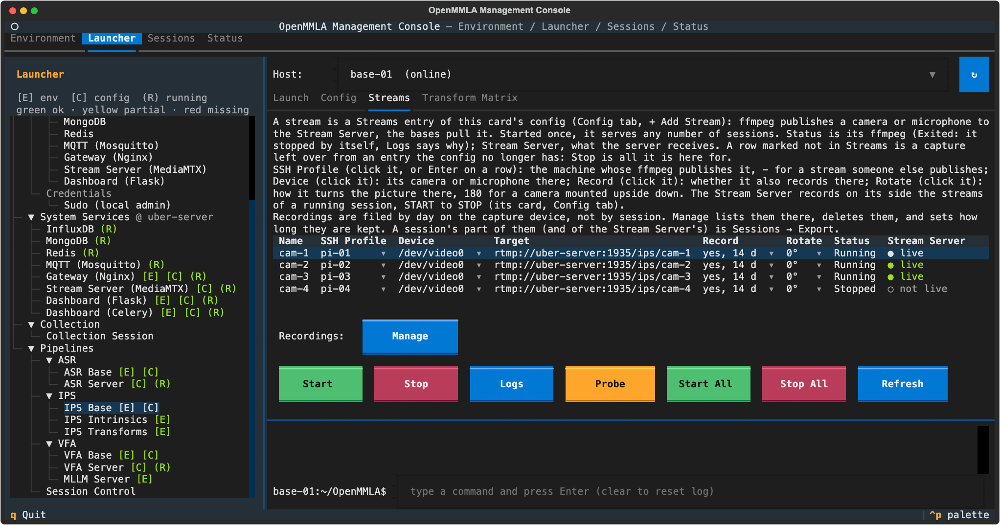

# Streaming

Streaming carries a camera or a microphone from the machine it is plugged into to the bases that analyze it. Use it when a base reads a camera or a microphone on another machine, such as a Raspberry Pi.

## How streaming works

1. **Capture.** FFmpeg on the capture host encodes the camera (H.264) or the microphone (AAC) and pushes it to the Stream Server, `rtmp://<stream-server>:1935/<app>/<name>`. The console starts and stops it over SSH from a pipeline card's **Streams** tab.
2. **Serving.** The Stream Server, MediaMTX, serves what is published on a path over every protocol it has on: the bases pull it as RTSP, and the [dashboard](../dashboard/live-video-and-sound.md#live-video) plays it over WebRTC.
3. **Pulling.** A base whose `source` is `stream` pulls its stream ([How the bases pull a stream](#bases-pulling-a-stream)).
4. **Recording.** The Stream Server records the streams of a running session, START to STOP, and a stream with `record: true` also records on its capture host ([Recording](recording.md)).

A microphone can also go straight to an ASR base as raw PCM over UDP or TCP, with no server in between. Nginx plays no part in streaming: it balances the AI services ([Nginx](../nginx.md)).

## What you need

- **A Stream Server**: MediaMTX on a machine that every capture host and base reaches, usually the uber server ([Run the Stream Server](#run-the-stream-server)).
- **Capture hosts**: a Linux machine, such as a Raspberry Pi, or a Mac, with the camera or the microphone, an SSH profile in the console, `tmux` and `ffmpeg`. **Start** on the Streams tab installs what a host lacks ([Raspberry Pi setup](../raspi_config.md)).
- **Open ports** from the capture hosts, the bases and the browsers to the Stream Server ([Ports](#ports)).
- **Synchronized clocks** on every machine that stamps frames ([Keep the clocks in sync](#keep-the-clocks-in-sync)).

## Run the Stream Server

Once per deployment:

1. **Name its host.** Set `System Settings → Connections → Stream Server (MediaMTX)` to the machine that runs it; `<stream-server>` stands for it below. It need not be the machine that runs Nginx.
2. **Start it.** Open `Launcher → System Services → Stream Server (MediaMTX)` and press **Start**. With **Run mode** `docker`, the default, the card runs the Docker service; with `native`, it runs `make mediamtx`, which needs the binary installed first ([System services → MediaMTX](../system_services.md#mediamtx-optional)).
3. **Check it.** `curl http://<stream-server>:9997/v3/paths/list` lists what is published, and `ffplay -rtsp_transport tcp rtsp://<stream-server>:8554/vfa/front` plays a path.

The same by hand, from the repository root:

```bash
# Docker
docker compose -f docker/docker-compose.infra.yml up -d mediamtx

# native: a tmux session named mediamtx
cd pipelines/uber-server
make mediamtx
make stop-mediamtx
```

Both read `pipelines/uber-server/mediamtx/mediamtx.yml` of the Stream Server's host, so pull the repository there too, and both record to `artifacts/streams/server/` of the repository.

??? info "Details: where the server's recordings land"
    The `recordPath` of `mediamtx.yml` is `./streams/server/...`. Docker mounts `MEDIAMTX_STREAMS_DIR` of `docker/.env` (default `artifacts/streams/server`) at `/streams/server` of the container, whose working directory is `/`. `make mediamtx` starts MediaMTX from `artifacts/` (`MEDIAMTX_RECORD_ROOT`). The console creates `artifacts/streams/server` before it starts the container, so the folder and `artifacts/streams/` belong to you and not to root.

### Ports

| Port | System Settings key | What uses it |
|---|---|---|
| 1935 | `rtmp_port` | RTMP publish from cameras and microphones |
| 8554 | `rtsp_port` | RTSP, what the bases pull |
| 8890/udp | | SRT publish or read |
| 9997 | `api_port` | the control API, `http://<stream-server>:9997/v3/paths/list` |
| 9996 | `playback_port` | the playback server for the server's recordings |
| 8889 | `webrtc_port` | WebRTC (WHEP): the dashboard's camera tiles and its **Sound** control |
| 8189/udp, 8189/tcp | | WebRTC media (ICE) from the server to the browser |
| 8000/udp, 8001/udp | | RTP and RTCP of RTSP readers that choose UDP; the bases use TCP |
| 9998 | | Prometheus metrics; not published by the Docker service |

The Docker service's host ports follow the `MEDIAMTX_*_PORT` variables of `docker/.env` ([Docker → Environment variables](../docker.md#environment-variables)). In Docker, MediaMTX cannot see the address browsers reach its host at: set `MEDIAMTX_WEBRTC_HOSTS` for the dashboard's live video ([Live video and sound in MediaMTX](../dashboard/deploy.md#live-video-and-sound-in-mediamtx)).

### Server settings { #configuration }

Edit `mediamtx.yml` on the Stream Server card's **Config** tab ([Stream Server Config tab](../tui/system-services.md#stream-server-config-tab)). A key not in the file keeps the MediaMTX default.

| Key | Shipped | What it does |
|---|---|---|
| `readTimeout`, `writeTimeout` | `30s` | how long a publisher (RTMP, RTSP over TCP, SRT) or a reader (a base, a playback download) may stall before the server closes it; MediaMTX's own default is `10s` |
| `pathDefaults.record` | `no` | `yes` records every published path; `no` leaves it to Session Control's START, per path ([Record on the server](recording.md#on-the-server)); the **Server-side recording** switch (`sessions only` or `every path`) |
| `recordFormat`, `recordSegmentDuration` | `fmp4`, `10m` | the server's recordings: fMP4 segments of at most ten minutes, named after their start |
| `recordDeleteAfter` | `72h` | MediaMTX deletes a segment this long after it began; `0s` keeps everything; the **Keep recordings for** choice |
| `useAbsoluteTimestamp` | off | keep an RTSP publisher's clock instead of the server's ([Timestamps](#timestamps)) |
| `api`, `playback`, `metrics` | on | the control API, the playback server and the metrics |
| `webrtc`, `hls` | on, off | WebRTC for the dashboard; no HLS |
| `paths: "~^listen/(.+)$"` | | a microphone's live sound for the dashboard, which an FFmpeg inside MediaMTX makes as Opus while someone listens ([Live sound](../dashboard/live-video-and-sound.md#live-sound)); it needs the `-ffmpeg` image, or natively an `ffmpeg` with libopus |
| `paths: all_others` | | any `<app>/<name>` of a publish URL is created on the fly, except under `listen/` |
| `authInternalUsers` | anyone | no authentication, for a trusted lab network; with credentials (see the MediaMTX reference), the base configs need them in their URLs |

A native MediaMTX reads the file again when it changes. A container keeps the file it started with, whatever changed it (a Save, a Sync, a `git pull`): recreate it, or press **Stop** and then **Start** on the card:

```bash
docker compose -f docker/docker-compose.infra.yml up -d --force-recreate mediamtx
```

!!! warning "Change the server between sessions"
    A recreate, and a changed `readTimeout` or `writeTimeout` even natively, closes every connection, publishers and readers alike. The capture hosts publish again and the bases open their streams again by themselves, but the server forgets which paths a running session records: send **START** for that session again ([Record on the server](recording.md#on-the-server)).

??? info "Details: why the timeouts are 30 s"
    Capture hosts that reach the server over Tailscale go through a DERP relay where no direct path exists, and a relay hiccup can stall a connection for longer than 10 s. MediaMTX then closes it (`closed: read tcp ...: i/o timeout` in its log). With 30 s the server keeps a stalled publisher or reader that long; a capture host gives up on a push that blocks for 15 s and publishes again, and a video base opens its pull again after 10 s without a frame.

    The price: a publisher that disappears without closing its connection, such as a Pi that loses power or its network, keeps its path listed as published for up to 30 s with nothing arriving. For that long the Streams tab's **Stream Server** column reads `● live`, and a base card's **Start** counts the stream as live.

## Declare a stream { #devices-pushing-a-stream }

A pipeline's streams are entries under `Streams` in `pipelines/<pipeline>-base/config.yml`. You add one on the pipeline card's **Config** tab with **+ Add Stream** ([IPS](../pipelines/ips/configuration.md#streams), [VFA](../pipelines/vfa/configuration.md#streams), [ASR](../pipelines/asr/configuration.md#streams)).

- **Managed**: an entry with an `ssh_profile`. The **Streams** tab runs its FFmpeg in a tmux session named `mmla-stream-<name>` on that host.
- **External**: an entry without one. It is taken as already running somewhere, and only pulled from.

In `target`, type the path alone, such as `ips/cam-1`. **Save** completes it to `rtmp://<stream-server>:<rtmp_port>/ips/cam-1` and fills an empty `read_target` with `rtsp://<stream-server>:<rtsp_port>/ips/cam-1`. The config file always holds the full URLs, which the bases and FFmpeg read, and a full URL you type is kept as written.

??? info "Details: how the stream URLs follow the Stream Server"
    - While the Stream Server is `localhost`, a path is not completed for a stream captured on another machine, which would publish to itself: name the server under System Settings first.
    - While the form still reads `<uber-server>`, no path is completed, and **Save** says why.
    - When the Stream Server is saved with another host or port, the stream URLs that named the old address follow it in the pipeline configs of the host it is saved on; URLs that point elsewhere are left alone.
    - **Sync to Host** on the pipeline's **Config** tab takes the changed config to another host, and **Sync from Host** on that host's card fetches it. The two buttons of the Stream Server form carry the address and merge the `Streams` entries by name ([Stream Server form](../tui/system-settings.md#stream-server-form)).

### Stream keys

| Key | Default | What it does |
|---|---|---|
| `target` | | the publish URL: `rtmp://<stream-server>:1935/<app>/<name>`, `rtsp://` or `srt://`; or `udp://<base>:<port>` or `tcp://` for raw audio straight to an ASR base |
| `read_target` | `target` | what the bases pull, such as `rtsp://<stream-server>:8554/<app>/<name>` |
| `ssh_profile` | none: external | the capture host, an SSH profile of the console or `local`; the **SSH Profile** cell of the Streams tab |
| `device` | the host's first | `/dev/video0` (a V4L2 camera) or `hw:1,0` (an ALSA microphone); on a Mac, `0` (a camera's index or name) or `:0` (a microphone); the **Device** cell of the Streams tab lists what the host has |
| `kind` | from the card | `audio` or `video`. Left empty, a `udp://` or `tcp://` target or a sound device (`hw:1,0`, a Mac's `:0`) makes it audio, and anything else is what the card is for: audio on ASR, video on IPS and VFA. A Mac microphone without a `device` names no sound device, so only the card can tell; **+ Add Stream** on the ASR card writes `kind: audio` |
| `codec` | `libx264` | the video encoder; `copy` sends the camera's own stream, which cannot be turned |
| `resolution`, `fps` | `1920x1080`, `30` | the capture size and frame rate |
| `bitrate` | `1M` | the video bitrate, shared by the push and the recording; the peak is twice it |
| `format`, `rate`, `channels` | `s16le`, `16000`, `1` | the audio sample format, rate and channels |
| `rotate` | `0` | how the capture host turns the picture, clockwise: `0`, `90`, `180` (a camera mounted upside down) or `270`; the **Rotate** cell |
| `steady_fps` | `true` | hold a Linux camera at its `fps` in dim light; see below |
| `record` | `false` | also record on the capture host; the **Record** cell ([Record on the capture host](recording.md#on-the-capture-device)) |
| `record_root` | `~/artifacts` on a remote host, `artifacts/` of the project for `local` | where the capture host records |
| `record_keep_days` | `0` | days the capture host keeps the recordings; `0` keeps them until you delete them |

A running stream keeps its machine until it is stopped, and takes a new device, `record` or `rotate` at its next **Start**. A stream's name is one capture across every pipeline: entries of several cards that share a camera share its name, and two captures under one name are a clash ([Stream names](../tui/streams.md#stream-names)).

??? info "Details: turning the picture and holding the frame rate"
    - **`rotate`**: FFmpeg turns the picture once, on the capture host, so the bases, both recordings and the dashboard get it upright. The session notes the turn as `sources[].capture.rotate`, and the bases turn their camera's intrinsics with it. A running stream started with another turn shows both in its **Rotate** cell ([Turning the picture](../tui/streams.md#turning-the-picture)).
    - **`steady_fps`**: with aperture-priority auto exposure, the default of webcams such as the Logitech C920, a camera may lengthen the exposure past a frame in a dim room and deliver 15 fps for the 30 asked. **Start** runs `v4l2-ctl -c exposure_dynamic_framerate=0` on the camera before FFmpeg (`exposure_auto_priority=0` on older kernels), so it keeps its frame rate with a darker picture. The camera keeps the setting until it is unplugged ([Steady frame rate](../tui/streams.md#steady-frame-rate)).

## Start and stop streams

Before the bases start, on the **Streams** tab of a pipeline card ([Streams tab](../tui/streams.md)):



1. **Pick the machine and the device** in the row's **SSH Profile** and **Device** cells, and set **Record** and **Rotate**.
2. **Start** the row, or **Start All**. Start installs `tmux` and `ffmpeg` when the host lacks them, and waits until FFmpeg has run for three seconds.
3. **Wait for `● live`** in the **Stream Server** column (`-` for a stream that goes elsewhere, `no answer` when the server does not answer), then start the bases. **Probe** decodes two seconds of the URL the bases pull.
4. **Stop** the row, or **Stop All**, once no session pulls the stream. **Stop** waits for FFmpeg to finish a recording and names the file.

A managed stream publishes until it is stopped, whichever card started it; the Stream Server card's **Streams** tab lists and stops the streams of every pipeline ([Stream Server Streams tab](../tui/system-services.md#stream-server-streams-tab)).

A push the Stream Server drops does not end FFmpeg: it opens the push again every five seconds until the server takes it, so a stream comes back within seconds of the server being reachable, with nobody at the console.

??? info "Details: how a dropped push recovers"
    - The push sits in a queue of its own, FFmpeg's fifo muxer, while the capture and its recording go on. Meanwhile the row stays `Running`, its **Stream Server** column reads `○ not live`, and **Logs** shows FFmpeg's attempts.
    - A push opened again starts at a keyframe with what is captured then. What was captured while it was down is not sent later, so a stream never lags behind the others after a drop.
    - A read or write of the push that blocks for 15 s (a stalled connection, or a server that accepts it and never answers) counts as failed, so the push is opened again rather than hanging. **Stop** finishes the recording first, whatever the push does.
    - Raw PCM sent straight to an ASR base over `udp://` or `tcp://` has no fifo: a `tcp://` push whose base goes away ends FFmpeg and its recording.
    - A running stream keeps the FFmpeg command it was started with. After you update OpenMMLA, **Stop** and **Start** every running stream once.

### Capture on a Mac

A Mac captures through AVFoundation: `device` is a camera's index or name (`0`, the default, or `FaceTime HD Camera`), and a microphone is `:0`. As macOS lets nothing started over SSH use the camera or the microphone, the Streams tab starts FFmpeg from a Terminal window on the Mac's screen, which closes by itself once FFmpeg runs. That needs someone logged in on the Mac, with Terminal allowed under **System Settings → Privacy & Security → Camera** and **Microphone** ([Recording on a Mac](../tui/collection.md#recording-on-a-mac)).

??? info "Details: the Mac's FFmpeg"
    FFmpeg goes on in a session of its own, so no window closed by hand can stop a stream; the tmux session follows its output and passes **Stop** on to it. A stream `local` to a Mac runs directly, as the console already runs in the Mac's desktop session, unless the console itself was reached over SSH.

### FFmpeg commands

The Streams tab runs these commands. Run them by hand on a device without SSH access:

```bash
# camera on a Raspberry Pi -> MediaMTX (RTMP). The camera's MJPEG is 4:2:2, which H.264 would
# keep: format=yuv420p makes it the 4:2:0 that browsers and hardware decoders play. With rotate,
# the turn comes first in the same -vf: hflip,vflip for 180, transpose=1 for 90, transpose=2 for 270.
# With steady_fps (the default) the camera is held at its frame rate first; neither line fails the start
{ v4l2-ctl -d /dev/video0 -c exposure_dynamic_framerate=0 || \
  v4l2-ctl -d /dev/video0 -c exposure_auto_priority=0; } >/dev/null 2>&1 || true
ffmpeg -fflags +genpts -use_wallclock_as_timestamps 1 \
  -f v4l2 -input_format mjpeg -framerate 30 -video_size 1920x1080 -i /dev/video0 \
  -c:v libx264 -vf hflip,vflip,format=yuv420p -preset ultrafast -tune zerolatency \
  -g 30 -keyint_min 30 -sc_threshold 0 \
  -x264-params "keyint=30:min-keyint=30:no-scenecut=1:repeat-headers=1" \
  -b:v 1M -maxrate 2M -bufsize 2M \
  -flags +global_header -map 0:v -f tee \
  "[f=fifo:fifo_format=flv:format_opts=rw_timeout=15000000:attempt_recovery=1:recover_any_error=1:max_recovery_attempts=0:recovery_wait_time=5:drop_pkts_on_overflow=1:restart_with_keyframe=1]rtmp://<stream-server>:1935/vfa/front"
# the push goes out through a fifo that opens it again when the server drops it, each read or write
# bounded to 15 s; with record: true the file comes first in the same tee, [f=matroska]<file>.mkv|,
# and the push gets onfail=ignore
```

```bash
# microphone -> MediaMTX (AAC); the ASR base pulls it as rtsp://<stream-server>:8554/asr/mic1
ffmpeg -f alsa -ac 1 -ar 16000 -i hw:1,0 -map 0:a -c:a aac -b:a 128k -flags +global_header \
  -f fifo -fifo_format flv -format_opts rw_timeout=15000000 -attempt_recovery 1 -recover_any_error 1 \
  -max_recovery_attempts 0 -recovery_wait_time 5 -drop_pkts_on_overflow 1 -restart_with_keyframe 1 \
  "rtmp://<stream-server>:1935/asr/mic1"
# the fifo names no codec of its own, so -map 0:a is needed; with record: true, one tee output:
# -filter_complex "[0:a]asplit=2[push][rec]", a PCM stream for the .wav first (select=1) and the AAC
# one for the push (select=0, in the fifo)
```

```bash
# microphone -> ASR base directly (raw PCM over UDP, no server in between)
ffmpeg -f alsa -ac 1 -ar 16000 -i hw:1,0 -c:a pcm_s16le -f s16le udp://<base>:5001
```

```bash
# SRT instead of RTMP: loss-tolerant on Wi-Fi with a fixed latency budget
ffmpeg ... -flags +global_header -map 0:v -f tee \
  "[f=fifo:fifo_format=mpegts:format_opts=rw_timeout=15000000:attempt_recovery=1:recover_any_error=1:max_recovery_attempts=0:recovery_wait_time=5:drop_pkts_on_overflow=1:restart_with_keyframe=1]srt://<stream-server>:8890?streamid=publish:vfa/front"
```

```bash
# camera on a Mac (AVFoundation) -> MediaMTX. AVFoundation states no frame rate:
# without -r, ffmpeg takes the wallclock timestamps for 1000k fps and duplicates frames without end
ffmpeg -fflags +genpts -use_wallclock_as_timestamps 1 \
  -f avfoundation -pixel_format nv12 -framerate 30 -video_size 1920x1080 -i 0:none \
  -c:v libx264 -pix_fmt yuv420p -r 30 -preset ultrafast -tune zerolatency \
  -g 30 -keyint_min 30 -sc_threshold 0 \
  -x264-params "keyint=30:min-keyint=30:no-scenecut=1:repeat-headers=1" \
  -b:v 1M -maxrate 2M -bufsize 2M \
  -flags +global_header -map 0:v -f tee \
  "[f=fifo:fifo_format=flv:format_opts=rw_timeout=15000000:attempt_recovery=1:recover_any_error=1:max_recovery_attempts=0:recovery_wait_time=5:drop_pkts_on_overflow=1:restart_with_keyframe=1]rtmp://<stream-server>:1935/vfa/front"
```

| To list | On | Command |
|---|---|---|
| cameras and their formats | Linux | `v4l2-ctl --list-devices`, `ffmpeg -f v4l2 -list_formats all -i /dev/video0` |
| microphones | Linux | `arecord -l` |
| cameras and microphones | Mac | `ffmpeg -f avfoundation -list_devices true -i ""`; a size the camera cannot deliver, such as `-video_size 1x1`, makes FFmpeg list the ones it can |
| SRT support | any | `ffmpeg -protocols`, which lists `srt` when FFmpeg was built with libsrt, as the Debian and Raspberry Pi OS packages are |

## How the bases pull a stream { #bases-pulling-a-stream }

A base whose `source` is `stream` pulls the `Streams` entry its `source_index` names, by its `read_target`, else its `target`. Only `rtmp://`, `rtsp://` and `srt://` entries count, and the Bases form offers them in a dropdown. Start the streams first, then the bases.

- **Names**: the Bases form stores the entry's name. A number is read as the position among the pullable entries, and a name or number that matches none stops the base with the list of streams there are. `rtmp` is accepted as another name of the `stream` source.
- **RTSP**: the device publishes over RTMP and the bases pull the same path over RTSP, because an RTSP pull opens within a couple of seconds, while FFmpeg's FLV reader waits for an audio track that never comes. The steady delay is the same either way; expect well under a second end to end on a wired base station.
- **Low latency**: the video bases open network streams with `OPENCV_FFMPEG_CAPTURE_OPTIONS=rtsp_transport;tcp|fflags;nobuffer|flags;low_delay`, unless the variable is already exported, and the ASR base runs its FFmpeg decoder with the same flags.

The base waits for a stream that is not up yet, and opens one that drops again, by these `stream_kwargs` of its config:

| Key | Default | What it does |
|---|---|---|
| `connect_wait` | `30` | seconds a base waits at its start for a stream nobody publishes yet (`404 Not Found`) or a Stream Server it cannot reach, trying every 2 s, every 5 s after the first 30 s; then it stops with the URL and the reason; `0` tries once |
| `reconnect_wait` | `3600` | seconds a base keeps opening a stream again that dropped while it runs, about a session; `0` tries once |
| `capture_options` | the low-latency options above | the FFmpeg options a video base opens its stream with |
| `timestamp_offset` | `0` | seconds added to every stamp ([Measure a stream's delay](#measure-a-streams-delay)) |

??? info "Details: waiting and dropping"
    - A waiting base says so in its window and its session log, with the URL. A stream that comes up meanwhile is taken as if it had been there.
    - A stream drops when its publisher went away and MediaMTX ended the readers of its path, or when nothing came for 10 s. The base keeps its session and goes on with what comes after the gap; the gap has no frames or audio, and none is made up. The log says when the stream dropped and when it came back, and, when the base stops, how many drops there were.
    - A stream that does not come back within `reconnect_wait` ends the run as an error: an IPS or VFA base exits, and an ASR base says its run did not end with STOP and shows its menu.
    - A camera index, a file or a microphone on the base's own machine is not waited for: the base fails at once when it is not there. An LSL stream is waited for like a network stream.
    - A base card's **Start** asks the Stream Server which of its bases' streams are live, and holds back once, naming those that are not ([Stream check](../tui/pipelines.md#stream-check)).

## Timestamps

Every measurement is filed under a time, and the machine that reads a frame puts it on, not the camera and not the Stream Server. What the stamp means depends on the path the frame took:

| Path | Stamped by | What the stamp carries |
|---|---|---|
| a base pulling a `stream` source | the media clock, anchored once per connection | a base that opened the stream within 30 s of the publisher's start anchors on the capture-side start time the Streams tab noted in its stream registry (`real-time/runtime/stream_registry.yml`); any other base, and a base that opened the stream again after a drop, on its own clock at the first frame. From then on the stamps follow the media clock, so a slow base does not smear them, but the first frame's delay (encode, network, server, decoder: a few tenths of a second on a wired network) stays in every stamp as a constant |
| the ASR base on a raw `udp` or `tcp` stream | the base, counting samples | the delay of the first packet, as a constant |
| a local camera or microphone (`opencv`, `pyaudio`); the ASR base on a `stream` source, whose FFmpeg decodes to raw PCM without timestamps | the base's clock on arrival | the device's and the decoder's delay, in every stamp; a busy base stamps late |
| a badge's `timestamped` packets; an LSL stream | the sender's clock | the capture side's time |

MediaMTX stamps every frame with its own clock as it arrives, and names its recordings by it. Its `useAbsoluteTimestamp` keeps an RTSP publisher's clock instead: switch it on per path, and only for a publisher that is NTP-synchronized.

??? info "Details: the publisher's clock"
    - The device stamps what it encodes with its own clock (`-use_wallclock_as_timestamps 1`), but RTMP and SRT carry only the differences between frames. Published over RTSP (`-f rtsp -rtsp_transport tcp rtsp://<stream-server>:8554/vfa/front`, or a `target` that starts with `rtsp://`), the clock travels too, in RTCP sender reports.
    - `useAbsoluteTimestamp` is off because with it on, an RTSP path publishes nothing until the first sender report arrives, and its recordings are filed by the publisher's clock. **Sessions → Export** matches that clock against the session's window, so a publisher whose clock is off by minutes exports nothing.
    - A WebRTC or HLS publisher carries a clock too, but nothing here publishes that way.

### Keep the clocks in sync

Every machine that stamps must agree on the time: each base host, the Stream Server, and a device that publishes over RTSP.

| On | Check | Fix |
|---|---|---|
| Linux | `timedatectl` reads `System clock synchronized: yes` | `sudo timedatectl set-ntp true` |
| Mac | `sntp time.apple.com` says by how much the clock is off | |
| a Raspberry Pi without internet | | an NTP server on the network: `chrony` on the Stream Server's host with an `allow` line for the subnet, and `NTP=<stream-server>` in the Pi's `/etc/systemd/timesyncd.conf` |

### Measure a stream's delay

Every stream carries a constant delay of its own, well under a second, which the pipelines absorb as they are: the VFA synchronizer matches angles within `match_tolerance`, ASR buckets are three seconds, and the [window features](../analytics/window_features.md) ten. For a claim that needs less, measure each stream once and write the result into `stream_kwargs.timestamp_offset` of its base's config, which the base adds to every stamp: a delay of 0.35 s is `timestamp_offset: -0.35`.

1. Open `pipelines/ips-base/docs/clock.html` on a screen whose machine is synchronized. It shows the local time with milliseconds and, under it, the unix time the pipelines stamp with.
2. Film that screen through the stream for a minute, with the base's **Store Frames** on (`-s`): the VFA base saves a keyframe every `keyframe_interval` seconds into its `real-time/` folder, the IPS base one frame a second.
3. For five saved frames, subtract the unix time visible in the picture from the time in the file's name. The difference is the stream's delay, and its negative the offset.
4. For audio against video, clap in front of the camera and the microphone. The frame where the hands meet, against the onset in the audio segment (`<speaker>_<segment start>.wav` in the base's `segments/` folder, the onset's position added to the start), gives the offset between the two streams.

The offset is in every stamp from then on, including the `vfa_features` events, the window features and the replay of saved frames in `analyze` mode.

!!! note "One offset per config"
    The base logs where its stamps come from at the first frame (`Stream stamps come from ...`), and does not shift stamps that already carry the capture side's clock: the noted stream start, a badge's packet header, LSL. Measure on the source you will run with. The offset is shared by every base of the config (for ASR, every base of the base type), so bases on streams with different delays belong in different configs.

## Pages in this guide

- [Recording](recording.md): the recordings on the capture hosts and on the server, and a session's part of them.
- [Troubleshooting](troubleshooting.md): streams that do not start, do not arrive or drop.
