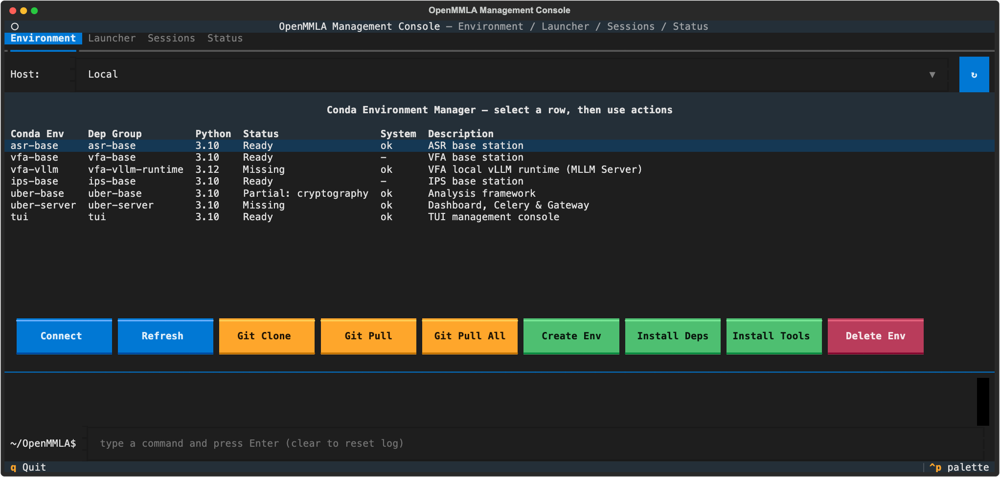

# Environment tab

The Environment tab shows the conda environments OpenMMLA uses on the host the **Host** selector picks, and what each needs of that host. Use it to create the environments, install their packages and system tools, and clone or pull the repository on remote hosts.

## Environments

| Conda env | Extra in `pyproject.toml` | Python | Used by |
|---|---|---|---|
| `asr-base` | `asr-base` | 3.10 | ASR base station |
| `vfa-base` | `vfa-base` | 3.10 | VFA base station |
| `vfa-vllm` | `vfa-vllm-runtime` | 3.12 | local vLLM runtime of the MLLM Server card |
| `ips-base` | `ips-base` | 3.10 | IPS base station |
| `uber-base` | `uber-base` | 3.10 | analytics: the `mmla ses-*` analysis commands |
| `uber-server` | `uber-server` | 3.10 | dashboard, Celery worker, Nginx render step |
| `tui` | `tui` | 3.10 | this console |

The ASR and VFA server services have no conda environment: they run as Docker images ([Docker](../docker.md)).

## Table columns

| Column | What it shows |
|---|---|
| `Conda Env` | the environment's name |
| `Dep Group` | its extra in `pyproject.toml` |
| `Python` | its Python version |
| `Status` | `Missing` (no such env), `Partial: pkg, pkg +N` (packages missing), `Ready`; computed live from `[project.optional-dependencies]` in `pyproject.toml` |
| `System` | what the environment's programs need of the host and the host lacks: `lacks ffmpeg, portaudio`, `ok`, `-` for an env that needs nothing of its host, `?` when the host did not answer |
| `Description` | what uses it |

### What each environment needs of its host

| Conda env | Needs | Why |
|---|---|---|
| `asr-base` | FFmpeg, PortAudio; on Linux also a C compiler (`build-essential`) | an ASR base pulls its stream through FFmpeg; PyAudio is built against PortAudio |
| `uber-base` | FFmpeg | the session commands |
| `uber-server`, `vfa-vllm` | tmux | the dashboard, its worker and the MLLM Server run in it |
| `tui` | git; sshpass while an SSH profile signs in with a password | |
| `vfa-base`, `ips-base` | nothing | they read video through OpenCV, which brings its own FFmpeg |

??? info "Details: how the System column is read"
    The host is asked at **Connect** and **Refresh**, with the `PATH` of what the console runs there over SSH, Homebrew's folders included. A tool that is installed but off that `PATH` reads as lacking, as it would to a launch.

## Buttons

| Button | What it runs |
|---|---|
| **Connect**, **Refresh** | test the host and read `conda env list` and `conda list` again |
| **Create Env** | `conda create -n <env> python=<version> -y` |
| **Install Deps** | `conda run -n <env> pip install -e '.[<group>]'` in the repository; first names what the host lacks of the env's `System` needs |
| **Install Tools** | installs what the selected env lacks (`System`): `apt-get install` through `sudo` on Debian, Ubuntu and Raspberry Pi OS, `brew install` on a Mac |
| **Delete Env** | `conda env remove -n <env> -y`, after a second press |
| **Git Clone** | remote hosts only: `git clone <origin url> <remote_project_path>` |
| **Git Pull** | remote hosts only: `cd <remote_project_path> && git pull` |
| **Git Pull All** | the same pull on every SSH profile at once, whatever the Host selector says; this machine is left alone |

??? info "Details: Install Tools and Git Pull All"
    - **Install Tools** hands `sudo` the SSH profile's password, or on this machine the Sudo password of System Settings, on its input and never on a command line.
    - One install runs on a host at a time, the [Streams tab](streams.md#tools-start-installs)'s included; a second press while one runs there is refused. The `System` column is read again afterwards.
    - **Git Pull All** skips offline and Windows hosts. It shows each host's output in one piece as it finishes, and a last line sums up which hosts pulled, were already up to date or failed.
    - A pull stops on a file that a **Sync to Host** changed there when the pull changes the same file ([Sync safety](launcher.md#sync-safety)).

## Command console

The console at the bottom shows the output of every button and runs shell commands you type on the selected host. On a remote host each runs as `cd <remote_project_path> && <command>`.

??? info "Details: a host without a clone"
    On a host without a clone at `remote_project_path`, no command runs until **Connect** finds the folder missing and moves the console to `~`. Anything that sets the host again (**Refresh**, another host, coming back to the tab) goes back to the project path.
