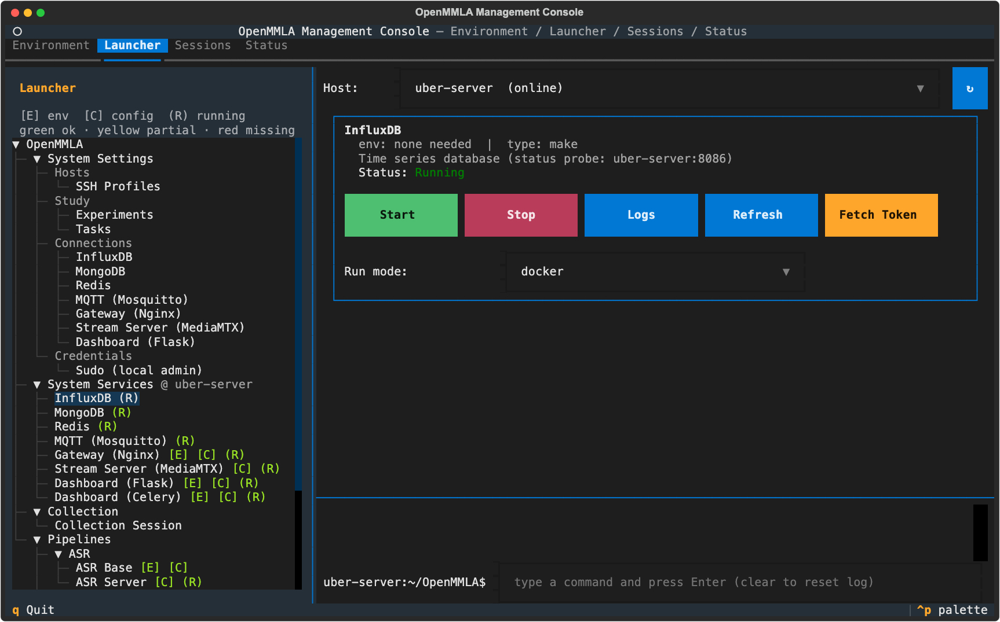

# Launcher tab

The Launcher tab configures and starts every OpenMMLA component. Its sidebar is a tree of System Settings, system services, Collection and pipelines; selecting a leaf shows its form or card on the right.



## The tree

```
OpenMMLA
├── System Settings
│   ├── Hosts:        SSH Profiles
│   ├── Study:        Experiments, Tasks
│   ├── Connections:  InfluxDB, MongoDB, Redis, MQTT (Mosquitto),
│   │                 Gateway (Nginx), Stream Server (MediaMTX), Dashboard (Flask)
│   └── Credentials:  Sudo (local admin)
├── System Services
│   ├── InfluxDB, MongoDB, Redis, MQTT (Mosquitto)
│   ├── Gateway (Nginx), Stream Server (MediaMTX)
│   └── Dashboard (Flask), Dashboard (Celery)
├── Collection
│   └── Collection Session
└── Pipelines
    ├── ASR:  ASR Base, ASR Server
    ├── IPS:  IPS Base, IPS Intrinsics, IPS Transforms
    ├── VFA:  VFA Base, VFA Server, MLLM Server
    └── Session Control
```

Each branch has its page: [System Settings](system-settings.md), [System Services](system-services.md), [Collection](collection/index.md) with [Bringing recordings in](collection/session-tools.md), and [Pipelines](pipelines/index.md) with the [Streams tab](pipelines/streams.md).

A system service has one name everywhere the console shows it: `Role (Product)`, where the role is the **Connections** form that holds its address. `Gateway (Nginx)` and `Stream Server (MediaMTX)` each have a form, since the load balancer and the Stream Server need not share a machine. `Dashboard (Flask)` and its worker `Dashboard (Celery)` take their host from `Dashboard (Flask)`, and the broker behind the `MQTT` section is `MQTT (Mosquitto)`.

## Markers

A leaf that launches something carries markers, explained by the legend above the tree, `[E] env  [C] config  (R) running`. Each leaf is checked on its own host, and a system service at the address the pipelines use, so the sidebar agrees with every card that sits where it opened.

| Marker | What it means |
|---|---|
| `[E]` | the conda environment on the leaf's host: green `Ready`, yellow `Partial`, red `Missing`; not shown for services that run in Docker or as native system services |
| `[C]` | whether the config file the leaf needs exists on its host: green present, red missing |
| `(R)` | the service is running, by the last status probe |
| `@ host` | where the system services run: the **System Services** heading names the host most of them share (`System Services @ <host>`), and a service elsewhere names its own (`Redis (R) @ <other-host>`); an offline host reads `@ <host> (offline)` in red |

??? info "Details: when the markers change"
    - `[E]`: a host's environments are read once and kept. The markers catch up when the Environment tab creates, removes or fills an env on that host, and when the Launcher comes back into view a minute or more later.
    - `[C]` checks the pipeline's `config.yml`, and for the Gateway, Dashboard and Stream Server cards `nginx/config.yml`, `dashboard/flask-backend/config.yml` and `mediamtx/mediamtx.yml` under `pipelines/uber-server/`.
    - A remote host's files are looked up over SSH with the status probe: when the Launcher opens, when a host is picked or comes back online, and after a Start or Stop. A Save, or a sync that copies the file there, turns its marker green at once. Until a host has answered, its leaves show no `[C]`.
    - `@ host` appears once the first status probe has placed the services.

## Service cards

Every launchable leaf opens a card with the service name, its conda env and launch type, a status line, its parameters, and **Start**, **Stop**, **Logs** and **Refresh**. A pipeline card also has a **Config** tab that edits `pipelines/<pipeline>/config.yml` on the selected host; **Save** writes it there.

Bases and camera tools open in terminal windows: their cards read `Interactive (runs in its own terminal)` and have no Stop. A base exits by itself at its session's STOP ([Start](pipelines/index.md#start)), and a camera tool is closed from its own window.

The command log at the bottom of the tab is one transcript for every card, since a build or a remote stop keeps printing after you move on. A divider such as `── Stream Server (MediaMTX) · Local ──` comes before the first line of another card or host.

??? info "Details: terminal windows on a Mac"
    - Each window is named as soon as it opens (`IPS Base · base 1 @ base-01`) and starts with a banner in its pipeline's colour: ASR blue, IPS green, VFA magenta. It keeps its Terminal profile's own colours. A program names its window only once its imports and set-up are done, which can take a minute, and the tabs of a window group show the running process rather than a name.
    - The window's shell is handed a short line that runs the component's command from a file only you can read. macOS cuts a longer line typed into a shell that is still starting at 1024 bytes, Enter included, and it never runs.
    - The file is kept a day, so Up and Enter in that window start the component again.

### Checks before Start

Start checks the target host first and stops with a note when something is missing.

| Check | When it fails |
|---|---|
| `config.yml` exists on the target host | Start stops; write it with **Save** on the card's Config tab, or copy this machine's with a sync |
| the System Settings sections of the config are up to date | on a remote host, the first Start only brings the current System Settings there and prints `Relaunch <service> once the sync above completes.`; press **Start** again |
| every section the config carries has an address | Start is refused on any host: `IPS Base not started: System Settings → Connections → MQTT has no host yet. ...` |
| the conda environment exists | Start stops |
| the streams the bases pull are live (base cards) | Start holds back once ([Stream check](pipelines/index.md#stream-check)) |

??? info "Details: the Gateway and Dashboard configs"
    The Gateway (Nginx), Dashboard (Flask) and Dashboard (Celery) cards need a `config.yml` too, in `pipelines/uber-server/nginx/` and `pipelines/uber-server/dashboard/flask-backend/`. Like every config it is gitignored, so a freshly pulled host has none, and Start stops with a note. Write it with **Save** on that card's Config tab, or copy this machine's: **Sync from Host** with `Local` picked on that host's Config tab, or **Sync to Host** with Host on `Local`.

## Sync to Host and Sync from Host

**Sync to Host** and **Sync from Host** copy a file between the host a tab shows and another machine. They sit side by side after one host picker on these tabs:

- a pipeline card's **Config** tab, and the **Prompts**, **Action Schema** and **Transform Matrix** tabs;
- the Stream Server card's MediaMTX **Config** tab;
- **Calibration Cameras** under IPS Intrinsics;
- the **MLLM Server** form;
- every System Settings form but Sudo.

The tab shows the files of the host the Host selector names; the picker names the other machine. It lists every other SSH profile, and `Local` as soon as the tab shows another host's files, and opens on `Select host...`.

| Button | What it does |
|---|---|
| **Sync to Host** | copies what the host on screen has saved to the host picked |
| **Sync from Host** | copies the picked host's file over the one on screen, then reads the tab again, with the status line below it |

Between two remote hosts the file travels through this machine, the one place both are reachable. It lands at the same place in the other host's project, and the rest of what is there is left alone.

!!! warning "A synced config brings that host's values"
    A config that comes back from another host brings its values with it, System Settings sections included. Read them over before a **Save** sends them out again.

### What each sync moves

| Place | What moves |
|---|---|
| pipeline **Config** tab | the whole `config.yml` as last saved, its `Bases`, `Streams` and devices included; a Sync from Host replaces the file on screen, and edits not saved there are gone |
| **MLLM Server** form | the whole `config/mllm_server.yml` |
| **Prompts**, **Action Schema**, **Transform Matrix**, MediaMTX **Config** | files added or overwritten by name, none deleted; on Prompts and Transform Matrix a Sync from Host first lists the picked host's files, and says when that host could not be asked or has none |
| **Calibration Cameras** | camera parameters, not files ([IPS calibration](pipelines/index.md#ips-calibration)) |
| **Experiments** | the whole file |
| **Tasks** | the task files, by name |
| **SSH Profiles** | the profiles, merged by name |
| a **Connections** form | its one section ([Connections](system-settings.md#connections)) |
| **Stream Server (MediaMTX)** form | the address, and the `Streams` entries merged by name ([Stream Server form](system-settings.md#stream-server-form)) |

### Sync safety

A sync never leaves half a file, and encrypts the file's secrets again with the destination's master key.

??? info "Details: how a sync writes"
    - Syncs to one host wait for each other, and for a Save of a config or System Settings form there, instead of cancelling each other.
    - A remote file is written next to itself as `<file>.tmp` and then moved over the old one. A `.tmp` file left on a host comes from such a copy and can be deleted.
    - Only the encrypted values change on the way. A file holding a value none of the machines involved can open is not copied.

!!! note "Synced files that git tracks"
    The prompt templates, `config/vfa/action_schemas.yml`, `config/mllm_server.yml`, `config/tasks/*.yaml` and `pipelines/uber-server/mediamtx/mediamtx.yml` are tracked in git. A synced copy is a local change in that host's checkout, and a **Git Pull** there stops on it when the pull changes the same file, until the change is committed or undone.

## Pages in this section

- [System Settings](system-settings.md): SSH profiles, experiments, tasks, connections, sudo.
- [System Services](system-services.md): the service cards, and the Stream Server's Streams and Recordings tabs.
- [Collection](collection/index.md): record raw audio and video, and download it.
    - [Bringing recordings in](collection/session-tools.md): `mmla ses-import`, `ses-tidy` and `ses-align`.
- [Pipelines](pipelines/index.md): base cards, server cards, the MLLM Server, IPS calibration, Session Control.
    - [Streams tab](pipelines/streams.md): start, stop and record the streams of a pipeline.
