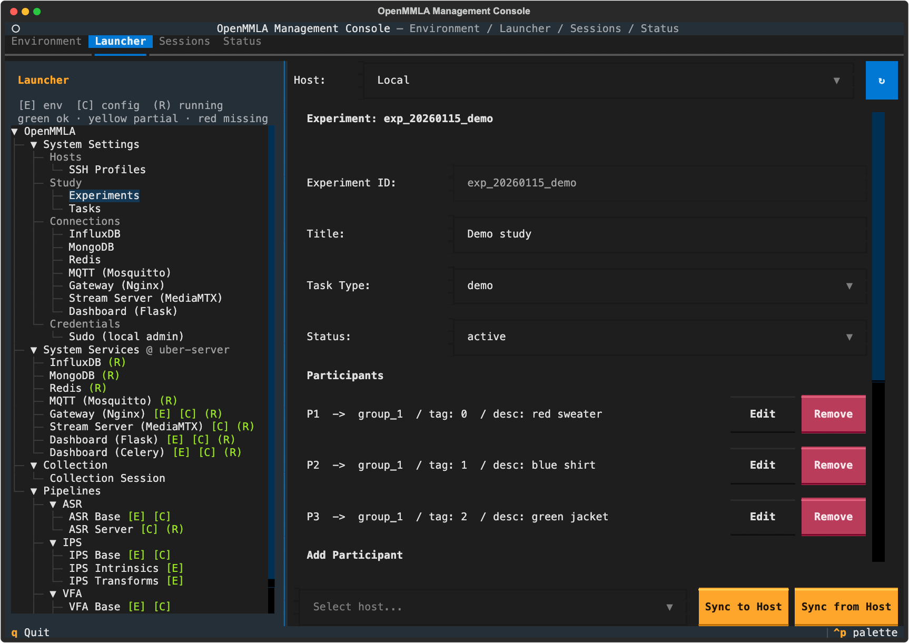
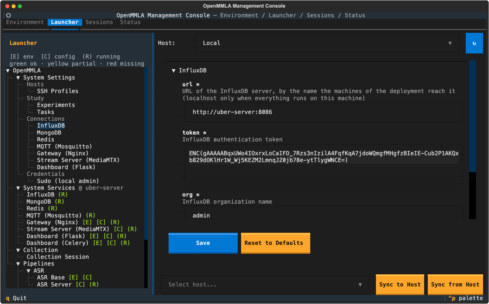

# System Settings

System Settings holds what the whole deployment shares: the SSH profiles of the machines, the study's experiments and tasks, the addresses of the system services, and this machine's sudo password. You fill it in once per deployment, and again when a machine or an address changes.

## Whose settings a form shows

Every machine's services read that machine's settings: its pipeline `config.yml` files and, on top of them, its `config/system_services.yml` ([Pointing the pipelines at the services](../../system_services.md#pointing-the-pipelines-at-the-services)). A console started there reads that machine's SSH profiles, experiments and tasks. So every form but Sudo has a **Host** selector, one shared by the forms, starting on `Local`.

| Selector | What the forms do |
|---|---|
| `Local` | edit this machine's project |
| another host | read that machine's files over SSH (`Reading ... of '<host>' ...` meanwhile) and say above the form whose they are; **Save** writes there, into its settings file (created when it has none) and its pipeline configs that carry the section |

Experiments, Tasks and SSH Profiles write every change at once (`Saved to <host>:~/OpenMMLA/config/experiments.yaml`). A Connections form also says where its values come from: the host's own `config/system_services.yml`, else its pipeline configs, else the defaults.

!!! tip
    Flip the selector to a host before a session to check what it will connect to.

??? info "Details: when a host or file is not there"
    - A form acts on the host it was read from. When that host goes offline, or its profile is removed, before a Save or a sync, nothing is written and the status line says so; the next form opened falls back to `Local`.
    - A write that fails says why, and the form is read from that host again.
    - A file that cannot be read (unreadable, not YAML, not what the form edits, or a broken task file) is never shown as empty, since the next change would write over it: a red line says why, with no form and no sync row. Opening the form again reads it again.
    - A Connections form whose `config/system_services.yml` cannot be read shows that host's pipeline configs read-only, with Save, Reset to Defaults and the sync row disabled.
    - Experiments, Tasks and SSH Profiles refuse a sync while their changes are still being written (`Changes made here are still being written to <host>; sync once they are`).

### Settings on a remote Start

A Start on a remote host first brings its pipeline configs in step: with that host's own settings where it has them, section by section, and with this machine's elsewhere, leaving out a section this machine has not filled in. The first Start there says which sections differ from this machine's.

!!! warning
    When more than one machine is involved, write addresses that are true from every machine: a host name, not `localhost`.

## SSH Profiles

One entry per remote machine, in `config/ssh_profiles.yml` (gitignored; `config/ssh_profiles_template.yml` is the tracked example). Passwords are stored encrypted.

| Field | Default | What it does |
|---|---|---|
| `Profile Name` | | the name the Host selectors and cards use |
| `Host` | | the host name or address |
| `User` | | the login |
| `Port` | `22` | the SSH port |
| `Password` | empty | the login password, which needs `sshpass` on this machine; empty for key authentication |
| `Key Path` | empty | the private key, for example `~/.ssh/id_ed25519` |
| `Remote Project Path` | `~/OpenMMLA` | the repository root on that machine |

| Button | What it does |
|---|---|
| **Save Profile**, **Edit**, **Clear Form** | save the profile being edited, load one into the form, empty the form |
| **Test Connection**, **Test** | test the login from this machine and, when a password is stored, the password on its own; the result says which failed |
| **Delete** | asks first, in the status line below the form; a second press of the same row deletes |
| **Sync to Host**, **Sync from Host** | merge the profiles by name into the other machine's file, after a second press ([Profile sync](#profile-sync)) |

??? info "Details: why the password is tested on its own"
    A key in the host's `authorized_keys` logs in whatever the password says, while `sudo` on that host asks for the account's real password. A placeholder password passes the login and fails the first Start that needs `sudo`.

??? info "Details: another host's profiles"
    - With the Host selector on another machine, the form shows that machine's `config/ssh_profiles.yml`: the machines a console started there can reach. Every host's list can be edited, whatever its key. Every change is written there as the whole file, its passwords encrypted with that machine's key, mode `600`.
    - It changes nothing in this console: the Host selectors keep listing this console's profiles, and a rename there does not move the cards pointed at that name.
    - A password that machine's key cannot open shows empty, with `encrypted on <host>` in the field, and is kept unless a new one is typed. An entry the form cannot show (no name or host, or a port that is not a number) is written back as it was.

### Profile sync

A sync asks for a second press first (`Press again to write 3 profile(s) (1 with passwords) into <host>'s config/ssh_profiles.yml.`). Each profile of the source replaces the destination's profile of that name or is added; the destination's other profiles stay. A sync into `Local` refreshes the Host selector and tests the profiles.

!!! warning "A profile sync hands passwords over"
    The passwords are encrypted again with the destination's key, and whoever holds that key can decrypt them.

??? info "Details: what a merged profile keeps"
    - A profile the destination already has keeps its own `Key Path`, and its own password when the incoming one is empty or none of the machines involved can open it.
    - A new profile whose password none of them can open arrives without one. One whose `Key Path` names a file on the source is named in the status line.

## Experiments

The study registry, in `config/experiments.yaml` (gitignored, template `config/experiments_template.yaml`). The active experiments and their groups fill the **Experiment Group** dropdowns of the base and Collection cards, and the participants' descriptions go into the VFA prompts.

| Field | What it does |
|---|---|
| **Experiment ID** | starts every session id of the experiment, `<experiment>_<group>_<YYMMDDTHHMMZ>`, and so its folder names; up to 64 ASCII letters, digits, `_`, `-` and `.`, starting with a letter or digit; the dashboard reads a session's date and task from the form `exp_<YYYYMMDD>_<task type>`; locked once a session carries it |
| **Title** | shown here and in the experiment menus of `mmla ses-man` and of a base's Create New Session; can change at any time |
| **Task Type** | a task from [Tasks](#tasks) |
| **Status** | an active experiment is offered on the cards |
| participant `group_id` | the group the participant belongs to |
| participant `tag_id` | the AprilTag the participant wears |
| participant `description` | a short appearance description, for the VFA prompts |

| Button | What it does |
|---|---|
| **Save & Back** | saves the experiment; refuses an id another experiment has |
| **Delete** | asks first, in the status line below the form, with how many sessions carry the id; a second press of the same row deletes |
| **Sync to Host**, **Sync from Host** | copy the whole file, like a pipeline config |

The dropdowns, the rosters and the participants a session writes into its MongoDB document (which takes them to every host) always come from this console's own file, whatever the Host selector says.

!!! warning "Personal data"
    The file holds the participants' names and appearance descriptions. Sync it only to machines that should hold them.

??? info "Details: when the Experiment ID is locked"
    - The id cannot change once a session carries it, since the session's id, folders and MongoDB document would not follow. It is greyed out when a session in the shared MongoDB names the experiment, or a folder in `artifacts/` or `collection/` of this machine or of the host on screen starts with `<id>_`.
    - It stays greyed out while those are asked and, for every experiment, when one of them cannot be asked; the status line names it. **Save & Back** asks again before it changes an id.
    - A deleted experiment's sessions keep its id, but `mmla ses-tidy` and the ASR card's Speakers no longer find their participants. Delete says "not known yet" while the count is being asked.
    - With the selector on another machine, the form shows that machine's file and its **Task Type** lists that machine's tasks. A host without the file gets one from the first change made there.

## Tasks

The task definitions in `config/tasks/*.yaml`, tracked in git and edited as raw YAML. Only consoles read them, for an experiment's Task Type.

| Button | What it does |
|---|---|
| **Create** | adds a task; refuses a name that is taken |
| **Delete** | asks first, in the status line below the form; a second press of the same row removes both `<name>.yaml` and `<name>.yml` |
| **Sync to Host**, **Sync from Host** | carry every task by name, as `<name>.yaml`, added or overwritten; nothing is deleted |

??? info "Details: tasks on another host"
    - With the selector on another machine, the form reads all its task files in one go and writes each change there, one file at a time. A task file there that is not valid YAML leaves the whole folder unread.
    - A sync carries the file the source reads for each task. A `<name>.yml` the destination also has is named in the status line, since the `.yaml` now comes first.

## Connections

One form per system service address. The fields and defaults are in [Pointing the pipelines at the services](../../system_services.md#pointing-the-pipelines-at-the-services).

| Form | Section | Host key |
|---|---|---|
| InfluxDB | `InfluxDB` | `InfluxDB.url` |
| MongoDB | `MongoDB` | `MongoDB.url` |
| Redis | `Redis` | `Redis.host` |
| MQTT (Mosquitto) | `MQTT` | `MQTT.host` |
| Gateway (Nginx) | `Gateway` | `Gateway.host` |
| Stream Server (MediaMTX) | `StreamServer` | `StreamServer.host` ([Stream Server form](#stream-server-form)) |
| Dashboard (Flask) | `Dashboard` | `Dashboard.host`; places and probes the Dashboard cards and gives `make flask` its port |

| Button | What it does |
|---|---|
| **Save** | writes the section into `config/system_services.yml` and every pipeline `config.yml` that carries it |
| **Reset to Defaults** | fills the form with the defaults; **Save** writes them |
| **Sync to Host** | sends the section as the host on screen has saved it, and writes it into the picked host as a Save there would |
| **Sync from Host** | reads the picked host's section afresh (its `config/system_services.yml`, else its pipeline configs), writes it into the host on screen, and reads the form again |

- The pipeline Config tabs show these sections read-only, with a `managed in System Settings` note. A pipeline that must keep its own value lists the section under `SystemServicesOverride:` in its `config.yml`, or you press **Override here** at the bottom of that section on its Config tab.
- A stored secret, such as the InfluxDB token, shows as `ENC(...)`, encrypted with the master key of the machine the form shows. Type the new value in plain text over it, and Save encrypts it.
- An address nobody has filled in reads `<uber-server>` ([A new machine](../../system_services.md#a-new-machine)). A section with any such value counts as not set as a whole, and the status line names the fields to fill.

??? info "Details: what Save writes"
    - In `config/system_services.yml`, the sections already there stay as they are, and no section is added that nobody saved. A section no pipeline config carries (Dashboard) goes into that file alone.
    - A missing pipeline config is not created, and one that cannot be read is named and left as it is.
    - A section still holding `<uber-server>`: on this machine Save keeps it in `config/system_services.yml` as typed, but the pipeline configs keep their own section and the services started here use theirs. On another host Save refuses it, as every sync does, so no host takes the placeholder for a host name.

??? info "Details: what a Connections sync refuses or changes"
    - A form with unsaved edits says `Save first: Sync to Host sends what <host> has saved` and sends nothing.
    - Sync to Host creates the picked host's `config/system_services.yml` when it has none, without a trip through that host's form.
    - Sync from Host is refused when the picked host's settings cannot be read, and when nothing but defaults or `<uber-server>` would come back.
    - A secret is encrypted again with the destination's key. One that none of the machines involved can open is not carried: the destination keeps its own, and the status line names it.
    - A `localhost` value is copied as it is and then means the other machine itself; the status line says so whenever a section crosses machines with one.

## Stream Server form

The Stream Server (MediaMTX) form is read by consoles and the dashboard, and no pipeline config carries it. The console places and probes the MediaMTX card with it, and completes a stream written as a path (`ips/cam-1`) into the URLs of its `Streams` entry ([Server settings](../../streaming/index.md#configuration)). The [dashboard](../../dashboard/live-video-and-sound.md#camera-tiles) reads it on its own machine to ask MediaMTX which streams are live and to tell browsers the WebRTC port; **Sync to Host** gives it the address there.

??? info "Details: the Stream Server form"
    - The form follows the Host selector like the others, but this console places, probes and completes with `Local`'s address whatever the form shows. A console on another machine reads that machine's own file.
    - Saving it with another address moves the stream URLs that named the old one in the pipeline configs of the host it is saved on (on a remote host, in the same transfer as its settings file).
    - A sync carries the address into the destination's `config/system_services.yml`, and the source's `Streams` entries into the destination's pipeline configs, merged by name: a source entry replaces the one of that name or is added, and entries only the destination has stay, with their URLs moved to the new address. A host without that pipeline config is skipped and named. The rest of those configs is left alone.
    - **Sync from Host** takes the address only from the host's own `config/system_services.yml`, where an address kept under `Gateway` also counts; its pipeline configs could only yield the Gateway's.

## Sudo (local admin)

The sudo password of this machine, stored encrypted and never copied to another host; the form has no Host selector and no sync. Native Start and Stop of the system services run `make` with `sudo`, and the console types this password when the prompt appears, at most three times per command. A `sudo` prompt on a remote host is answered with its SSH profile's password instead.
