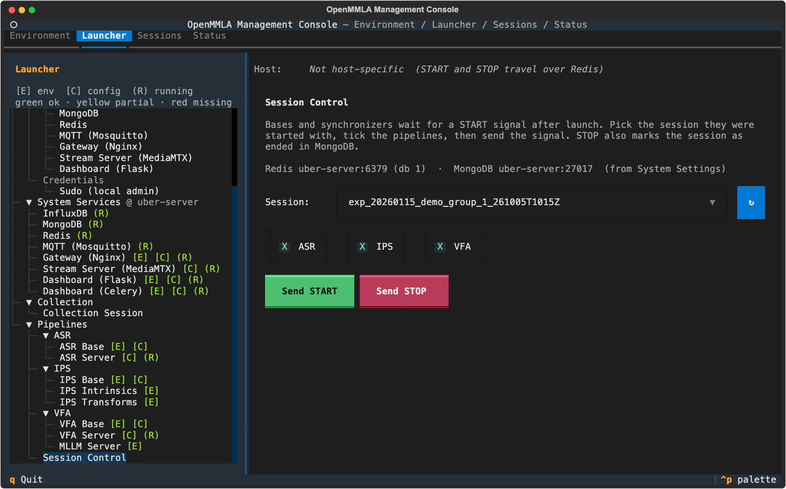

# Pipelines

`Launcher → Pipelines` holds a card for every pipeline component: base cards that start bases and synchronizers, server cards that run the AI services, the MLLM Server, the IPS calibration tools, and Session Control, which starts and stops a session. The pipeline guides walk through each one end to end: [ASR](../pipelines/asr/index.md), [IPS](../pipelines/ips/index.md), [VFA](../pipelines/vfa/index.md).

## Base cards

The ASR Base, IPS Base and VFA Base cards have a **Launch** tab, a **Config** tab with the pipeline's `config.yml`, and a [Streams tab](streams.md). The IPS Base card also has a **Transform Matrix** tab.

### Launch tab


| Field | Cards | Flag | Default | What it does |
|---|---|---|---|---|
| **Num Bases** | all | | `1` | bases started on this host; `-` hides the last Base row and keeps what it had |
| **Num Synchronizers** | all | | `1` | a session has one synchronizer; set `0` on the cards of its other hosts |
| **Sync Waits For** | ASR, VFA | `--num_bases` | follows Num Bases | how many bases the synchronizer merges each time slice from, over every host of the session; `0` leaves the flag out, and the synchronizer counts its config's `Bases` |
| **Session** | all | `-sid` | `Create MongoDB Session` | the session the bases join ([One session per take](#one-session-per-take)) |
| **Experiment Group** | all | | | the `<experiment>/<group>` a new session is made in |
| **Room** | IPS | | | with rooms in `Bases`: puts a room's bases, their number and its main camera on the card |
| **Base 1**, **Base 2**, ... | all | `-b` | the *n*-th `Bases` entry | which `Bases` entry each base is, shown as `0 · c920-01 · stream ips-cam-1` (id, camera or `base_type`, source and index); `ask in its window` passes no `-b` |
| **Main Camera** | IPS | `-mc` | the entry with `main: true`, following Base 1 to its room's main | one option per `camera_sync/transformation_matrices_<id>.json` on the card's host, then each base no file holds (`· alone, no matrices`: that camera alone, in its own coordinates; Base 1 takes it along) |
| **Mode** | ASR, VFA | `-m` | `live` | `live`, `capture` or `analyze` |
| **Language** | ASR | `-lang` | left to the service | the language sent with every transcription request ([Language](../pipelines/asr/speakers-and-diarization.md#language)) |
| **Diarize** | ASR | `-dia` | `on for group microphones` | which bases also ask for anonymous speaker turns; the default passes no flag, so a base diarizes when its speech goes to the group; `on` and `off` decide for every base ([Diarization](../pipelines/asr/speakers-and-diarization.md#diarize)) |
| **Participant 1**, ... | ASR | `--participant` | by the base type's `asr_scope` | whom a base's speech is attributed to: a participant of the session's group, **Group**, or **Speakers (speaker verification)** ([Personal microphones](../pipelines/asr/speakers-and-diarization.md#personal-microphones-and-energy-attribution)) |
| **Speakers 1**, ... | ASR | `-spk` | the group's profiles on the host | under a base on Speakers, the profiles it recognizes; **Manage** ticks them, registers and deletes speakers ([Speakers](../pipelines/asr/speakers-and-diarization.md#speakers)) |
| **Store Audio** | ASR | `-s` | off | see [Run ASR](../pipelines/asr/run.md#every-session) |
| **VAD**, **Noise Reduce**, **Transcribe** | ASR | `-vad`, `-nr`, `-tr` | on | see [Run ASR](../pipelines/asr/run.md#every-session) |
| **Speech Separate**, **Dominant Speaker** | ASR | `-sp`, `-d` | off | see [Run ASR](../pipelines/asr/run.md#every-session) |
| **Half-Scaled Recognition** | ASR | `-hsr` | on | see [Run ASR](../pipelines/asr/run.md#every-session) |
| **Graphics** | IPS, VFA | `-g` | `off for streams` | a window on the base's frames ([IPS](../pipelines/ips/run.md#every-session), [VFA](../pipelines/vfa/run.md#every-session)) |
| **Store Frames** | IPS, VFA | `-s` | off | keep the frames |
| **Verbose** | IPS, VFA | `-v` | on | print debug output |
| **Action Labels**, **Pose**, **Gaze** | VFA | `-a`, `-pose`, `-gaze` | `as the config says` | the outputs to ask for ([Choosing the outputs](../pipelines/vfa/run.md#choosing-the-outputs)) |

The dropdowns follow a **Save** on the Config tab and a change of host. **Refresh** reads the config and the matrix files again.

??? info "Details: what Start refuses on the Launch tab"
    - Two bases on one `Bases` entry. With one entry listed, a base given no `-b` takes it, so a base on `ask in its window` next to a base on the only entry counts as two.
    - A card that starts more bases than **Sync Waits For**. It warns when the config lists more entries, or the synchronizer waits for more bases, than the card starts: those have to run on other hosts, in the same session.
    - IPS: no Main Camera picked (the log names the folder: make the files with **IPS Transforms**, bring them with **Sync to Host** on the Transform Matrix tab, each base needs its file too, then **Refresh**); bases of two rooms or another room's main camera ([Several rooms](../pipelines/ips/calibration.md#several-rooms)); `· alone, no matrices` beside other bases ([One camera](../pipelines/ips/calibration.md#one-camera)).
    - ASR: one tag on two bases; a base on Speakers in `live` or `analyze` mode with no profiles.

??? info "Details: Base rows"
    - A base the list has no entry for starts on `ask in its window`, and takes its entry once the config has one (its first Save, or a **Refresh** that could read it). A row put there by hand stays there.
    - A base that pulls a stream the config's `Streams` no longer name reads `(not in Streams)`: that base would stop on it, and its `Bases` entry is where it is repointed.
    - A Refresh that cannot list a remote host's matrix folder keeps the Main Camera list and pick it had, and says the list may be out of date.

??? info "Details: Sync Waits For"
    - It goes along with Num Bases until set by hand, which it has to be when bases of the session run on other hosts.
    - Too high: a slice waits for bases that never report and goes on only when it expires. The ASR synchronizer then merges what reached it; the VFA synchronizer sends a frame set of two frames or more and drops one of a single frame, so a camera alone whose synchronizer waits for two gets nothing analysed.
    - Too low: a slice is merged before the other bases report.

??? info "Details: Participant and Speakers"
    - A Participant row opens on the pick kept for that experiment group and `Bases` entry; else on the wearer the session's Collection Start noted for the base's stream; else on the base type's `asr_scope`: `wearer` gives the group's participants in row order, `individual` Speakers, `group` Group.
    - Speakers lists the group's participants that have a profile on the card's host, unless you tick them under **Manage**. Manage records a new speaker from a base or from audio files on this machine.
    - **Language** reaches the transcriber with each request, whatever the transcriber's own config says.

### One session per take

The first Start with `Create MongoDB Session` makes the session id. From then on every base card (ASR, IPS and VFA, on any host) and Session Control open on that session, so the other cards of the take join it by pressing **Start**. When the session ends, the cards go back to `Create MongoDB Session`, so the next Start is a new take.

??? info "Details: which session the cards follow"
    - A Start into an existing session, a Collection Start, and a session picked by hand on a base card (`Create MongoDB Session` included) are followed the same way: a new card or host keeps the pick.
    - A session ends with STOP in Session Control, Stop All Hosts on the Collection card, or End Session or a delete in the Sessions tab.
    - The followed session is kept while the console runs. After a restart the cards open on `Create MongoDB Session`; pick the running session from the list.
    - A Start into a session that has ended (stopped from another console) is held back once. Pick `Create MongoDB Session` for a new take, or press **Start** again to go on in it, which makes it active again.

### Start

**Start** runs the [checks before Start](launcher.md#checks-before-start), the stream checks below, and opens one terminal window per base and synchronizer, with the card's choices as flags:

```bash
mmla ips-base -sid <id> -b 0
mmla ips-sync -sid <id> -mc 0
mmla asr-sync -sid <id> --num_bases 2
```

A process started this way asks nothing: it waits for its session's START ([Session Control](#session-control)) and exits at the session's STOP or when its run ends. What it writes for its session (its log, the config it ran with, what it recorded) stays on its machine under `artifacts/<session>/pipelines/`; [Sessions → Export](sessions.md#export) brings it here.

??? info "Details: a process that cannot start"
    A process that cannot start (a matrix file or a `Bases` entry that is not there) says why in its window and falls back to its menu, where it can be put right by hand. Run by hand without `-sid`, the commands ask in their menus.

### Stream check { #stream-check }

Before the windows open, Start asks the Stream Server (its control API, `api_port`) whether it receives the streams these bases pull. With every stream live, the log lists them and the bases start. A stream that is not live holds the Start back once, and the log names it, the bases that pull it (`Base 1 · entry 4`) and the machine that captures it.

- Start the stream on the [Streams tab](streams.md) and press **Start** again once it reads `● live`, or
- press **Start** again at once: each base waits for its stream up to `connect_wait` seconds, 30 by default ([How the bases pull a stream](../streaming/index.md#bases-pulling-a-stream)).

??? info "Details: the stream check"
    - Asked about: the stream of each row's `Bases` entry whose `source` is `stream`, from the config on the card's host (for a remote host, the copy the card last read; Refresh reads it again).
    - Not asked about: a base on `ask in its window` while the config has several entries, a device, file or LSL source, audio pushed to an ASR base over `udp://` or `tcp://`, every base of an `analyze` run, and a stream whose URL names another server.
    - The log says when it asks (`Asking the Stream Server (uber-server) whether c920-01 is live...`); every line names the card and host it was pressed for.
    - For a stream published from outside the console, the log says to ask whoever publishes it. For one started from this console's Streams tab and not stopped since, it says when; its FFmpeg publishes again within seconds of a drop, so one that stays `○ not live` has stopped on its capture host or cannot reach the server.
    - The second press goes ahead for the same card, host and missing streams only, and comes before the question about an ended session. **Stop** while Start waits for the answer calls the Start off.
    - A Stream Server that does not answer within three seconds, or a Stream Server form with no host, holds nothing up: the log says it is not known whether the streams are live.

### Stream settings check

Each base notes in the session the machine, `record` and `rotate` of its stream as its own config's `Streams` entry says, and what reads the session goes by that note. The configs are kept per host, so the Streams tab may have started a stream from another host's config. Start therefore warns, in one yellow line, when a stream this console's Streams tab started runs on another machine, records or is turned otherwise than the config of the card's host says. The Start goes on.

```
IPS Base on this machine: c920-01, started from this console's Streams tab at 21:16, records on pi-01, but the config these bases read says record: false, so the session notes it as not recorded.
```

To make them agree, copy one host's config over the other's with **Sync from Host** or **Sync to Host** on the Config tab, or change the entry and **Stop** and **Start** the stream. Then stop the bases if they run and press **Start** again.

??? info "Details: the stream settings check"
    - What reads the note: **Sessions → Export** asks the machine it names for the stream's recording, `mmla ses-calibrate` and the analysis report take the turn it gives, and the dashboard offers **Turn 180°** only on a camera noted as not turned.
    - It covers streams the bases pull and streams pushed to an ASR base over `udp` or `tcp`. The stream registry notes the machine, recording and turn of every Start. A Start leaves a running stream as it runs.
    - On an IPS Base card, a camera turned otherwise adds that the bases turn its intrinsics and poses for a picture that is not turned so: a half turn apart, its tags come out mirrored through the camera's axis.
    - It runs whether or not the Stream Server form has a host. A stream published from outside the console, one stopped since, and an unreadable stream registry say nothing.

### Config tab

The **Config** tab edits the pipeline's `config.yml` on the card's host; **Save** writes it. These fields behave differently from plain YAML values:

| Field or button | What it does |
|---|---|
| System Settings sections | named as in System Settings (`Gateway (Nginx)`, `MQTT (Mosquitto)`), read-only with a `managed in System Settings` note and an **Override here** button ([Connections](system-settings.md#connections)) |
| `Server` entries | a bare name (`infer`) goes through the Gateway, shown as `through the Gateway: http://<host>:8080/infer`; a full URL connects directly |
| **+ Add Stream** | adds a `Streams` entry, on the ASR card with `kind: audio` |
| stream `kind` | `audio` or `video`, by which the Streams tab captures, records and files the stream; left empty, a sound device (`hw:1,0`, `:0`) or a `udp://` or `tcp://` target is audio, anything else is the card's own kind (audio on ASR, where a Mac's first microphone pushed over RTMP names no device; video on IPS and VFA) |
| stream `target` | the path alone (`ips/cam-1`); **Save** completes it with the Stream Server of System Settings ([Stream Server form](system-settings.md#stream-server-form)) |
| **+ Add Base** | ASR: adds a device type under `Base` |
| `Bases` entries | dropdowns from the config: cameras, base types, sources, the files of a file entry's folder, and for `source: stream` the `Streams` entries by name; only the fields the `source` uses are shown and saved |
| `source_index` | a dropdown of the devices the host has, once it answers; **Browse…** writes a file's full path |
| model and backend keys | dropdowns: VFA Server `backend`, `prompt_profile`, `image_detail`, `gaze_backend`, `gaze_model`, `features.pose_model`; ASR Server `SpeechTranscriber.local.diarize_model`. A value not listed is shown, marked and kept; blank keeps the template's default |
| `Cameras` (IPS, VFA) | one group per camera; **+ Add Camera** adds one by hand (`fisheye`, `params`, `K`, `D`, the matrices as bracketed rows) |
| **Remove** | takes a group (camera, stream, base device) out of the form and the file |

A stream's machine and device are picked on the Streams tab, not here, and a Save keeps them. Each time the tab comes into view, the stream entries are marked `●` live or `○ … not publishing now`, with the paths the server has live under the same apps that no entry names listed below.

??? info "Details: Bases entries and device lists"
    - Fields by `source`: `source_index` for a device index, a stream, an LSL stream or a file; `channel_select` for `pyaudio`; `port`, `host` and `packet_format` for `udp` and `tcp`; `capture_rotate` (the turn a file was recorded with) for `file` on IPS and VFA.
    - An entry with `channel` is shown and saved as `channel_select`, one with `source: rtmp` as `source: stream`.
    - A stream added on the tab is listed once the config is saved. One deleted is marked on the entries still pointed at it, which keep it until repointed.
    - Devices are found, not typed: the console asks the card's host (over SSH for another machine) for PyAudio's input devices or its cameras, and says under the field what it found. A value the host does not list now stays, marked. A host that does not answer, or runs Windows, leaves a text box with the reason. **Refresh** on the Launch tab asks again.
    - The IPS form's Cameras are written by the calibrator and moved by **Calibration Cameras**, which acts on the IPS config only; the VFA form gets its cameras by hand or copied from the IPS config. The template holds no camera, and a placeholder camera named `camera_name` is dropped at the next Save.
    - A stream on another server gets no live mark. When the Stream Server does not answer, the tab says so.

### Transform Matrix tab

The IPS Base card's **Transform Matrix** tab lists the `transformation_matrices*.json` files camera sync writes, each with whose coordinates it holds (`transformation_matrices_<id>.json · main of room <room>`; the plain `transformation_matrices.json` holds the pairs of every room). The files are edited as JSON. The steps that copy them to the base stations are in [Distribute the matrices](../pipelines/ips/calibration.md#distribute-the-matrices).

| Button | What it does |
|---|---|
| **Sync to Host** | copies the files of the host on screen into `pipelines/ips-base/camera_sync/` of another machine ([What each sync moves](launcher.md#what-each-sync-moves)) |
| **Sync from Host** | brings another machine's files onto the host on screen; the tab and that host's Main Camera choices follow |
| **Delete** | removes the file on screen from the host the tab edits, after a second press; other hosts keep their copy |

!!! warning "Deleting a main's file"
    A main's file is loaded by every base of its room and the synchronizer with that Main Camera; the first press names them. They have no matrices until camera sync writes them again. A base never takes another room's file in its place, and a synchronizer of a config with a main per room needs its Main Camera.

## Server cards

**ASR Server** and **VFA Server** run the AI services with Docker Compose on the selected host, from `docker/docker-compose.asr.yml` and `docker/docker-compose.vfa.yml`.


| Control | What it does |
|---|---|
| service toggles | one `true`/`false` per sub-service of the server config |
| **Start** | `docker compose up -d --build` for the selected services |
| **Stop** | `docker compose down` |
| **Logs** | tails the containers |
| **Config** tab | the server's `config.yml`; on the VFA Server with the `features` block of the [features endpoint](../pipelines/vfa/pose-and-gaze.md#features-endpoint) |
| **Prompts** tab (VFA) | the templates under `pipelines/vfa-server/prompts/` of the selected host, with Sync to Host and Sync from Host |
| **Action Schema** tab (VFA) | `config/vfa/action_schemas.yml` of the selected host, with Sync to Host and Sync from Host |

!!! note "Restart the server after a config change"
    The config, prompts and action schema are mounted into the container and read when the server starts. **Start** leaves a running container as it is when only they changed, so press **Stop**, then **Start**.

## MLLM Server

The **MLLM Server** card starts `vllm serve` from `config/mllm_server.yml` in the `vfa-vllm` environment, inside a tmux session named `mllm-server`, for VFA setups with a local vision-language model ([Local VLM with the MLLM Server](../pipelines/vfa/action-labels.md#local-vlm-with-the-mllm-server)). Its Config tab edits this machine's `config/mllm_server.yml` whatever the Host selector says; **Sync to Host** and **Sync from Host** carry it.

## IPS calibration { #ips-calibration }

The steps that use these cards are in [Calibrate the cameras](../pipelines/ips/calibration.md).

| Card | Fields | Default | Runs |
|---|---|---|---|
| **IPS Intrinsics** | **Num Calibrators** | `1` | `mmla ips-ccal`: captures a camera's checkerboard images into `pipelines/ips-base/camera_calib/cameras/<name>/` (a later capture adds to them) and writes its parameters to `Cameras.<name>` of `pipelines/ips-base/config.yml` |
| **IPS Transforms** | **Num Tag Detectors**, **Num Sync Managers** | `2`, `1` | `mmla ips-ctag` and `mmla ips-csync`: put a second camera in the main one's coordinates |

**IPS Transforms** listens for the tag detections both bases publish, so the config's `Bases` needs the main base (`main: true`, one, or one per room) and at least one other, both running. Start refuses otherwise, and so does `mmla ips-csync`.

Below IPS Intrinsics, **Calibration Cameras** lists the cameras of this machine that have images under `pipelines/ips-base/camera_calib/cameras/<camera>/` or parameters in `Cameras`, with the image count and the bases that use each (`7 image(s) · calibrated (fisheye: no) · used by base 0`). It works with the card's **Host** on `Local`; the parameters travel between machines, the images never do.

| Button | What it does |
|---|---|
| **Open Folder** | shows a camera's images in the file browser, to look at and remove a bad one |
| **Delete Camera** | removes its images and parameters after a second press; refused while a base in the config uses it; other hosts keep their copy |
| **Refresh** | reads the images and the parameters again |
| **Sync to Host** | writes this camera's parameters into `Cameras.<name>` of the picked host's IPS config, leaving its `Bases` and `Streams` (the Config tab's own Sync to Host copies the whole file); the picked host needs an IPS base config first |
| **Sync from Host** | brings every calibrated camera of the picked host's IPS config into this machine's, parameters only (the images stay there); needs no camera picked, and needs an IPS base config on this machine; the status line says which cameras were added, updated and unchanged |

When **Sync from Host** would replace parameters this machine already has for a camera, the first press names those cameras and writes nothing, and a second press takes the host's.

## Session Control

Bases and synchronizers wait after start-up for a START for their session. **Session Control** sends START and STOP over Redis.



| Control | What it does |
|---|---|
| session list | opens on the session the base cards were last started into |
| **ASR**, **IPS**, **VFA** | the pipelines the signal is for |
| **Send START** | starts the session's runs |
| **Send STOP** | ends them, and marks the session ended in MongoDB; every base and synchronizer the Launcher started for it exits, and the bases note when they left |

The Redis and MongoDB addresses come from System Settings and are shown on the panel. The signal goes from this machine to that Redis, and every base subscribed to it hears it, whichever machine it runs on. The [Quickstart](../quickstart.md#run-a-session) walks through a session.

!!! warning "All machines of a session need one Redis"
    With `Redis.host` at `localhost`, only bases on this machine hear the signal; the panel warns about it. For a session across machines, put the Redis machine's host name under `System Settings → Connections → Redis`.

??? info "Details: Session Control without an address"
    - While Redis has no host on this machine (no `config/system_services.yml`, no Redis section, or `<uber-server>` still there), the panel says so and sends neither START nor STOP.
    - While MongoDB has none, STOP still goes out but cannot mark the session ended, and says so.
    - A session that was never ended is taken to end when its last base left ([End Session](sessions.md#end-session)).
