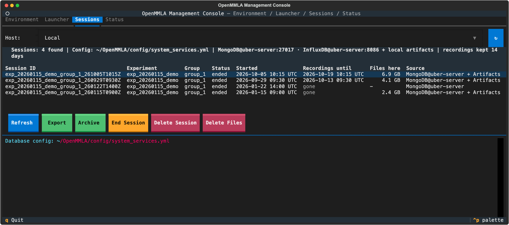

# Sessions tab

The Sessions tab lists every session, from MongoDB and from the session folders of a host. Use it after a session to gather its data onto the console (**Export**), send its raw files to the archive host (**Archive**), end a session left open, or delete one.

## After a session

1. **Export** the session: it gathers the measurements, recordings, stream cuts and base files onto this console ([Export](#export)).
2. **Archive** it: it sends the raw files on to the archive host, where the dashboard and replays read them ([Archive](#archive)).

A session is often exported the day after it ran. Export before the Stream Server deletes its footage: the `Recordings until` column says when.

## Session table

| Column | What it shows |
|---|---|
| `Session ID`, `Experiment`, `Group` | the session |
| `Status` | `active` or `ended`; a row known only from folders shows its manifest's status, else `artifact` or `collection` |
| `Started` | when it started |
| `Recordings until` | when the Stream Server begins to delete the session's footage: its start plus the retention on the [Stream Server Config tab](launcher/system-services.md#stream-server-config-tab); `kept` when nothing is deleted, `gone` once it has passed. The capture hosts keep theirs as long as each stream's `record_keep_days` says ([Recordings and Manage](launcher/pipelines/streams.md#recordings-and-manage)) |
| `Files here` | what the session's folders take on the disk of the host picked, `-` for none |
| `Source` | where the row comes from, joined by `+`: `MongoDB@<host>`, `Artifacts` and `Collection Files` (this checkout's folders), `Files@<host>` (another host's folders) |

The table is read again whenever the tab comes into view. The **Host** selector picks whose session folders are listed; it opens on `Local` and stays where it is put. A folder MongoDB does not know gets a row of its own, so a session whose MongoDB document was deleted is still listed.

| Host | Folders listed |
|---|---|
| `Local` | `artifacts/<id>/` and `collection/<id>/` of this checkout |
| another host | `artifacts/<id>/` and `collection/<id>/` of its checkout, `~/artifacts/<id>/` (where the Collection recorders write), and `~/artifacts/streams/.session-cuts/<id>/` |

??? info "Details: the table"
    - The database addresses come from this machine's `config/system_services.yml`, whichever host is picked. With a remote host picked and no database sections there, its pipeline config is read over SSH instead.
    - `Files here` is measured with `du` on that host, in one SSH call per listing, after the table is up (`...` until the host answers). A host that does not answer gets a yellow line, `?` in the column, and the MongoDB rows only.
    - The summary line names the Stream Server's retention in force.

## Buttons

| Button | What it does | From a shell |
|---|---|---|
| **Refresh** | reads the table again and reconnects to the databases | |
| **Export** | gathers everything of the session onto this console | `mmla ses-export <session>` |
| **Archive** | sends the session's raw files from this console to the archive host | `mmla ses-archive <session>` |
| **End Session** | marks a session left `active` as `ended` | |
| **Delete Session** | deletes the session's archive, cached report, InfluxDB events and MongoDB document | `mmla ses-delete <session> --yes` |
| **Delete Files** | deletes the session's folders on the host picked | `mmla ses-delete <session> --files-on <host> --yes` |

A row without a session id is refused. The deletes ask first: the first press says what would go, any other button lets the question go (also while the first press is still reading), and only a second press of the same button on the same row deletes.

## Export

**Export** gathers everything of the selected session onto this console, into `artifacts/<session>/`, in four parts, in this order. A progress row under the buttons names what is fetched from where; its **Cancel** stops the export, what arrived stays, and a transfer cut short resumes at the next press.

| Part | What it fetches | Into |
|---|---|---|
| Measurements | one JSON file per event type from InfluxDB, a text transcript, and `<session>_parameters.json`, what the session ran with, from its MongoDB document | `measurements/` |
| Collection recordings | each recording host's session folder, by the Collection card's [Download](launcher/collection/index.md#downloading-a-session) transfer | `collection/<host>/` |
| Streams | the session's part of each stream it used: the Stream Server's copy and the capture host's | `streams/server/`, `streams/capture/` |
| Base files | what its bases and synchronizers wrote on their machines: logs, the config they ran with, what they recorded | `pipelines/<pipeline>/<host>/` |

| `mmla ses-export` option | What it does |
|---|---|
| `--only measurements,collection,streams,base` | runs some of the parts |
| `--dry-run` | says what would be fetched and from where, and changes nothing |
| `--all-profiles` | asks every SSH profile for Collection recordings, not only the hosts the session names |

The log ends with a summary per part: files fetched, files here already, and what is missing and why. A host that does not answer, or no longer holds what it recorded, is named in a yellow line, and what it held is looked for on the archive host. Pressing **Export** again fetches only what is missing.

??? info "Details: Measurements"
    - The event types are speaker recognition and transcription, IPS translation, rotation and relation, and VFA actions and features ([Databases](../database.md#mongodb)).
    - `<session>_parameters.json` holds the experiment, group and participants, the streams the bases took, and one entry per base and synchronizer: its flags, the values it ran with (thresholds, durations, the camera and its intrinsics, the IPS matrices, the speaker profiles, the stream), its config with secrets masked, the software version, and what its servers answered about themselves (the transcriber's model, language and diarization; the frame analyzer's models, prompt profile and pose model). The log lists the entries; a session whose components noted nothing has the file without them.
    - A file that comes out of InfluxDB as it was exported before counts as here already. With InfluxDB not connected, files exported before stay as they are.

??? info "Details: Collection recordings"
    - The hosts are those Collection Start noted in the MongoDB document (`collection_hosts`, with each recorder's folder and device under `collection_recorders`); else the hosts of the recordings the local `manifest.yml` names; else every SSH profile is asked whether it holds `artifacts/<session>/collection/`, under `~/artifacts` and under its checkout.
    - This machine's own recordings are in place already.

??? info "Details: Streams"
    - The session's streams are the ones its bases noted taking when they joined and left.
    - The part is each stretch from a START to its STOP (`recording_windows` in MongoDB), the same for both copies; what was recorded before the first START is no part of it. A session never STARTed takes its start to its end, and one never ended runs until its last base left, else up to now.
    - A stream is shared by the sessions that pull it: the Stream Server records its path while one of them runs, START to STOP, and the capture host records it whether or not one runs. Two overlapping sessions each get their own part, and another group's microphones stay out.
    - The Stream Server's copy comes from MediaMTX's playback server over HTTP (no SSH; its address and ports are under `System Settings → Connections → Stream Server (MediaMTX)`), one file per unbroken stretch: `streams/server/<app>/<name>_<start>.mp4`.
    - The capture-side copy is looked for on the capture host of every stream this console captures, whatever Record the bases noted. It is cut there without re-encoding (a video cut moves back onto a keyframe, at most a second, and is named after that frame), staged under `<record_root>/streams/.session-cuts/<session>/`, fetched with the resumable transfer and removed there: `streams/capture/<host label>/<video|audio>/<name>_<start>.<mkv|wav>`. A stream captured on this machine is cut straight into place. The session's `manifest.yml` names these folders as file sources.
    - An external stream, or one noted with Record off whose host holds nothing of that time or does not answer, has the server's copy only; the log says so. A session whose record names no stream (no base joined) has nothing to export.
    - Every file name carries the time of its first frame, so a base with `source: file` and the file's full path as `source_index` replays it.
    - A copy here in full is not fetched or cut again. One exported while the session ran is shorter under the same name, so its length is checked with `ffprobe` and it is replaced.

??? info "Details: Base files"
    - `logger/`: the logs. `config/`: the `config.yml`, a `<role>[_<id>].json` per component (the entry it wrote into the session's document), and for IPS the `transformation_matrices_<main>.json` it loaded. `real-time/runtime/`: an ASR base's speech segments with **Store Audio** on and the speaker profiles it recognized, the frames VFA and IPS keep. `real-time/temp/` stays on the host.
    - A process run on this machine writes there in the first place. A remote process keeps them under `artifacts/<session>/pipelines/` of the checkout its profile names. Every SSH profile is asked at once; a host the bases noted that no profile reached is named in the log.
    - A file here at the same size is not fetched again; one of another size (a log fetched while still written) is replaced.
    - The session's `manifest.yml` names each host's folders, and the ASR base's `real-time/runtime/` as a file source.

??? info "Details: what comes from the archive host"
    - What a host held, when it does not answer over SSH or no longer holds it (deleted with **Delete Remote**, or past a stream's `record_keep_days`), is looked for under the archive host's `artifacts/<session>/` and fetched from there: the Collection recordings, the stream cuts and the base files' `config/` and `logger/`. Only what did not arrive from where it was made is taken from there, never this machine's own base files.
    - A file from the archive host never replaces a different one here, since the archive may hold the older copy: it goes beside it as `<name>_<archive host><ext>`.
    - A session that names no recording host also gets each `collection/<host>/` of the archive host that no SSH profile brought.
    - A file from the archive host counts as here only with the sha256 its ledger states. A clip or cut exported before counts as here once its host no longer holds it.

??? info "Details: what Export needs, and its exit code"
    - The measurements need only the console's own `tui` environment, whose InfluxDB and MongoDB clients read them. The streams need nothing beyond the console here, and are cut on each capture host with the FFmpeg its streams run with. The Collection recordings and base files need only the SSH profiles.
    - `mmla ses-export` exits with 1 only when something that should exist (a host the session names, a folder a host was found holding, a stream it took or recorded, a host its bases noted) is not here and could not be fetched from anywhere.

## Archive

**Archive** sends this console's copy of the session's raw files to the archive host, the System Settings host of the Dashboard, else of the Stream Server, into `artifacts/<session>/` of its checkout. Export first: a session with no folder here is refused. It needs an SSH profile of the archive host and `python3` there.

| What | Sent |
|---|---|
| `collection/`, `streams/`, `raw/`, each `pipelines/<pipeline>/<host>/config/` and `logger/`, `measurements/<session>_parameters.json` | always |
| what the bases stored: `real-time/`, `post-time/` and `visualizations/` of each `pipelines/<pipeline>/<host>/` | with `--with-runtime-media` |
| `profiles/` (speaker profiles) | never |

| `mmla ses-archive` option | What it does |
|---|---|
| `--host <SSH profile>` | archives to another host, or to this machine with `local` |
| `--dry-run` | says what would be sent and cut, and changes nothing |
| `--with-runtime-media` | also sends what the bases stored |

Nothing is deleted on either side. The log ends with what was sent, was there already, was verified, any mismatch, and the stream cuts; pressing **Archive** again completes a partial archive.

??? info "Details: how the archive is written"
    - Files go with rsync (resumable) or scp into `<session>/.archive/incoming/` and are moved into place once their sha256 there matches. A file there with the same sum is not sent again; a different file of the same name is kept, and this one goes beside it as `<name>_<console host><ext>`, a `manifest.json` or `config.yml` included.
    - On that host it cuts the session's part of the Stream Server's recordings into `streams/server/`, over the stretches the server recorded the session, else from its start to its end.
    - It rewrites `manifest.json` and `manifest.yml` there with the paths there: each recording gains `relpath`, `bytes`, `sha256` and `origin`, and the stream cuts are listed under `stream_cuts`, apart from the recordings that `ses-code`, `ses-align` and `ses-calibrate` read.
    - It sets `archive` in the session's MongoDB document: location, status (`complete`, or `partial` while a file or cut is missing), files, bytes and `verified_at`.

## End Session

**End Session** marks a session that was left `active` as `ended`, for one whose console closed or whose bases went down before a STOP. The first press says the end it would write and names any base that never noted leaving; the second writes it, and switches off the Stream Server's recording of the session's paths, as STOP does. A running base is better stopped with STOP in [Session Control](launcher/pipelines/index.md#session-control).

??? info "Details: the end it writes"
    - When its last base left, once every base that joined has. Otherwise the latest moment the session is known to have been alive: its last InfluxDB measurement, a base joining or leaving, or a log its components wrote on this machine (`artifacts/<session>/pipelines/<pipeline>/<this host>/logger/`). A time before the session began (a replay stamps the original recording time) does not count; only when nothing says is it now.
    - The Collection card's Stop also switches the recording off when it ends a session. A Collection card that starts recording into an ended session asks first, and makes it active again.

## Delete Session

**Delete Session** deletes the session everywhere central, in this order, stopping at the first step that fails:

1. its archive on the archive host, with the archive's ledger and, when the dashboard runs there, the dashboard's cached report;
2. the dashboard's cached report on the dashboard's own host, when that is another one;
3. its events in InfluxDB;
4. its MongoDB document.

The first press says in red what goes (the archive's path, files and size, the InfluxDB events by type, the MongoDB document) and what stays: this console's `artifacts/<session>/`, the files on capture hosts and other machines (**Delete Files**), and the Stream Server's recordings, which the sessions using a stream share.

!!! warning "Deleting the archive cannot be undone"
    For an imported session, the archive folder holds its raw videos.

??? info "Details: what Delete Session refuses and skips"
    - When the archive host cannot be reached or named, or a database that System Settings name is not connected, it says so and deletes nothing.
    - A failed step is named in red and the steps after it do not run, so the session stays listed and a new press goes on from there.
    - An unreachable dashboard host other than the archive host blocks nothing, since the cache can be rebuilt. The dashboard host is the one `System Settings → Connections → Dashboard (Flask)` names, else the archive host.
    - When this console is itself the archive host, its own folder is the archive and goes with it.
    - The cached report is `<session>/` in `cache/` beside `pipelines/uber-server/dashboard/flask-backend/cache.location`, and in each folder that file lists (every process that loads the dashboard adds its `DASHBOARD_CACHE_DIR` there). A listed folder where session data lies (the home folder, the checkout or above, `artifacts/`, `collection/`, `~/artifacts`, or below one of those) is never looked in. A `<session>/` holding anything the dashboard does not write (a folder, a link, a file not named `*.json`, `window_features.csv` or `.tmp-*`) is left alone. The first press names the folders it looked in and what it passed over.

## Delete Files

**Delete Files** deletes the selected session's folders on the host the Host selector picks, and nowhere else. The first press names the host and each folder with its size, and says when a folder is also the archive copy; the second deletes exactly those folders.

| Host | Folders deleted |
|---|---|
| `Local` | `artifacts/<session>/` and `collection/<session>/` of this checkout |
| another host | those of its checkout, `~/artifacts/<session>/`, `~/artifacts/streams/.session-cuts/<session>/`, and the folders the MongoDB document names there (a Collection recorder's own Output Root, a stream's `record_root`) |

A capture host's recordings filed by day ([Recordings and Manage](launcher/pipelines/streams.md#recordings-and-manage)) are not a session's folder and stay.

??? info "Details: the checks of Delete Files"
    - Each folder is checked again on the host just before it goes. It is deleted only when it is a directory named exactly the session id, letter case included, directly inside one of those folders as the host resolves them. On a Mac, a folder whose name differs in case only is another session's and stays. A symbolic link or file of that name is refused, and the parent folders are never deleted.
    - The archive copy is recognised under whichever SSH profile or address reaches the archive host, since both hosts are asked what machine they are and where the archive lies.
    - When a host stops answering partway (a Pi's Wi-Fi drops, or the delete times out), the log names the folders it said were deleted and says the rest may be partly deleted. A new first press shows what is left.

## Deletes from a shell

| Command | What it does |
|---|---|
| `mmla ses-delete <session>` | prints what the first press of Delete Session says, and deletes nothing |
| `mmla ses-delete <session> --yes` | deletes |
| `mmla ses-delete <session> --files-on <host>` | Delete Files on that host (`local` or an SSH profile): says what would go, and deletes with `--yes`; an empty host is refused |
| `mmla ses-man` → **Delete Session** | prints the same, then asks y/N, naming the archive's path and what stays |
| `mmla ses-man` → **Delete Local Files** | Delete Files on `Local`, plus `logs/<session>/`, `visualizations/<session>/` and `real-time/runtime/<session>/` below its config's folder (where `mmla ses-ana` writes), with the same checks |

A session id that names no single folder is refused.
