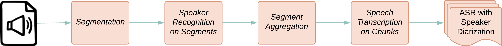

# ASR with Diarization

This pipeline provides automatic speech recognition with speaker diarization capabilities. It processes audio streams in real-time to transcribe speech and identify different speakers.

## Pipeline Overview


The real-time pipeline processes audio through several stages:
- Audio capture/input from microphones
- Voice activity detection (VAD) to identify speech segments
- Speech enhancement to clean audio signals
- Speaker diarization to separate and identify speakers
- Speech recognition to transcribe the audio to text
- Synchronization of results from multiple asr bases

The post-time analyzer is as follows:

## Usage Instructions

### Install Dependencies
```bash
# Install the required dependencies for the ASR pipeline on specific machines 
# (e.g., base station: asr-base, base server: asr-server, uber server: uber-server)
conda create -n asr-base -c conda-forge -y python=3.10.12
conda activate asr-base
pip install -e .[asr-base] # or pip install openmmla[asr-base]
# Optional: if you would like to use lab streaming layer as an input source
pip install pylsl==1.17.6 
conda install -c conda-forge liblsl=1.16.2
```

### Data Input Setup

ASR Base supports the following audio input sources (configured via `Base.<device>.source` in `config.yml`):

| Source | Description | Device Setup |
|--------|-------------|-------------|
| `pyaudio` | USB microphone directly connected to the base station (e.g., Jabra Speak2 75, built-in mic) | Plug in the microphone; the base will prompt you to select the audio device and channel at startup |
| `udp` / `tcp` | Nicla Vision or Portenta H7 wearable badge streaming audio over Wi-Fi | Flash the firmware (`.ino`) onto the badge with the correct Wi-Fi credentials and ASR Base host/port in `arduino_secrets.h`. See `pipelines/wearables/nicla-vision/asr/` or `pipelines/wearables/portenta-h7/asr/` |
| `rtmp` | Audio stream pulled from an NGINX RTMP server | Add RTMP entries in the `Streams` section of `config.yml` with `target: rtmp://...`. The streaming device pushes audio to NGINX via ffmpeg |
| `lsl` | Lab Streaming Layer input | Configure `lsl_name` in `stream_kwargs`. Requires `pylsl` installed |
| `file` | Replay from previously recorded audio files | Set `file_dir` and `initial_sync_time` in config |

For wearable badges, the key configuration is in the firmware:
- **Wi-Fi**: SSID and password in `arduino_secrets.h`
- **Target**: ASR Base's IP address and port (base listens on `port_offset + base_id`)
- **Format**: Must match `stream_kwargs` in config (default: 16 kHz, mono, 16-bit PCM)

#### Stream Configuration

All stream sources (RTMP and remote devices) are configured in the unified `Streams` section of `config.yml`:

```yaml
Streams:
  # external RTMP stream (already running, Base only pulls from the URL)
  rtmp-mic-1:
    target: rtmp://uber-server.local/stream_01

  # managed stream (TUI starts/stops ffmpeg on remote Raspberry Pi via SSH)
  rpi-mic-1:
    ssh_profile: rpi-table-1        # must match a TUI SSH profile name
    device: hw:1,0                  # ALSA audio device on the remote machine
    target: udp://asr-base.local:5001
    format: s16le
    rate: 16000
    channels: 1
```

Streams with `ssh_profile` can be started/stopped from the TUI Launcher's **Streams** tab. Streams without `ssh_profile` are treated as external (already running).

### On Servers

> **Tip**: You can use `mmla tui` to configure and launch all services from the TUI Launcher, instead of running commands manually.

```bash
# 1. Run uber services on uber server with conda env `uber-server` 
# Go to /pipelines/uber-server/ to run with scripts or run manually with brew or systemctl
make all # if start all services 
make all -without=nginx,celery,flask,next # if start without nginx(load balancer, RTMP) and dashboard

# 2. Run asr services on base server with conda env `asr-server` 
# Edit your own config.yml file, see pipelines/asr-server/config_template.yml for more details
# You can either run it via bash or python

# ==================BASH========================
# Start asr services at once
# Go to /pipelines/asr-server/bash
./run.sh

# =================PYTHON========================
# Start asr services one-by-one (asr-infer, asr-enhance, asr-vad, asr-transcribe, asr-separate, etc.)
# Flask app entrypoints live under openmmla/services/asr/apps/ (serve_*.py); use mmla or gunicorn against :app.
# Activate conda env `asr-server`
conda activate asr-server

## Option 1: run with single worker via mmla command
## e.g., 
## mmla asr-infer -c config.yml
mmla <asr-server-commands> -c <config_file_path> 

## Option 2: run with multiple workers via gunicorn
## e.g., 
## export CONFIG_FILE=config.yml
## gunicorn -k gevent -w 3 -b 0.0.0.0:5001 openmmla.services.asr.apps.serve_audio_inferer:app
export CONFIG_FILE=<config_file_path>
gunicorn -k gevent -w <number-workers> -b 0.0.0.0:<port> openmmla.services.asr.apps.<serve_module>:app
```

### On Base Stations
```bash
# Run asr pipelines on base station with conda env `asr-base`
# Edit your own config.yml file, see pipelines/asr-base/config_template.yml for more details
# Prefer the mmla commands below; examples/run_*.py launchers were removed.
# You can either run it via bash or python

# ===================BASH========================
# Go to /pipelines/asr-base/bash
# Run real-time audio analyzer
usage: ./run.sh [-nb NUM_BASE] [-ns NUM_SYNCHRONIZER] [-s STORE] [-vad VOICE_ACTIVITY_DETECT] [-nr NOISE_REDUCE] [-tr TRANSCRIBE] [-sp SPEECH_SEPARATE] [-d DOMINANT] [-h]

options:
  -nb  NUM_BASE               : Number of ASR bases to run (default: 3)
  -ns  NUM_SYNCHRONIZER       : Number of synchronizers to run (default: 1)
  -s   STORE                  : Whether to store audio data (true/false, default: true)
  -vad VOICE_ACTIVITY_DETECT  : Whether to use Voice Activity Detection (true/false, default: true)
  -nr  NOISE_REDUCE           : Whether to use Noise Reduction (true/false, default: true)
  -tr  TRANSCRIBE             : Whether to transcribe audio (true/false, default: true)
  -sp  SPEECH_SEPARATE        : Whether to use Speech Separation (true/false, default: false)
  -d   DOMINANT               : Whether to apply dominant speaker (true/false, default: false)
  -h                          : Display this help message

# Run post-time audio analyzer
usage: ./run_post.sh [-vad VOICE_ACTIVITY_DETECT] [-nr NOISE_REDUCE] [-sp SPEECH_SEPARATE] [-tr TRANSCRIBE] [-h]

options:
  -vad VOICE_ACTIVITY_DETECT   : Whether to use Voice Activity Detection (true/false, default: true)
  -nr NOISE_REDUCE             : Whether to use Noise Reduction (true/false, default: true)
  -sp SPEECH_SEPARATE          : Whether to use Speech Separation (true/false, default: false)
  -tr TRANSCRIBE               : Whether to transcribe audio (true/false, default: true)
  -h                           : Display this help message
   
# ==================PYTHON========================
# Activate conda env `asr-base`
conda activate asr-base

# Run real-time audio analyzer
mmla asr-base -b <base_type> -c <config_file_path> # start an asr base
mmla asr-sync -c <config_file_path> # start an asr base synchronizer

# Run post-time audio analyzer
mmla asr-post -f -c <config_file_path>
``` 