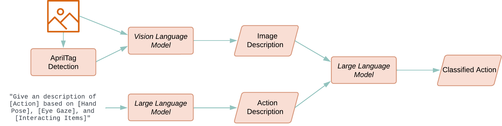

# Video Frame Analyzer (VFA)

This pipeline provides video frame analysis capabilities, including vision grounding (mapping AprilTag ID to person 
in image), vision captioning (give description about the image), and text classification to categorize each person's
actions into predefined categories.

## Pipeline Overview


The system performs nonverbal behavior analysis using large language models (LLMs) and vision-language models (VLMs), processing image frames every 30 seconds:
- Image frame capture from base station (vfa-base)
- AprilTag detection and in-image coordinate calculation
- Prompt construction for VLM to describe gestures, postures, and interactions
- VLM output links AprilTag IDs to natural language descriptions
- Prompt construction for LLM using VLM-generated descriptions
- LLM classification of actions into predefined behavior categories
- Output generation in structured <ID, Action> dictionary format

## Usage Instructions

### Install Dependencies
```bash
# Install the required dependencies for the VFA pipeline on specific machines 
# (e.g., base station: vfa-base, base server: vfa-server, uber server: uber-server)
conda create -n vfa-base -c conda-forge python=3.10.12 -y
conda activate vfa-base
pip install -e .[vfa-base] # or pip install openmmla[vfa-base]
# Optional: if you would like to use lab streaming layer as an input source
pip install pylsl==1.17.6 
conda install -c conda-forge liblsl=1.16.2
```

### LLM and VLM Backend Options

VFA requires backend services to run large language models (LLMs) and vision-language models (VLMs). You can choose either to run these models locally on your own hardware or connect to cloud services:

#### Local Backend Options
- **vLLM**: Efficient inference for LLMs with optimized attention algorithms
  - Installation and setup guide: [vLLM Quickstart](https://docs.vllm.ai/en/latest/getting_started/quickstart.html)
  - For local VFA inference, install the OpenMMLA wrapper and local vLLM runtime extras: `pip install -e ".[vfa-server,vfa-vllm-runtime]"`
  - Example: `vllm serve Qwen/Qwen3-VL-8B-Instruct --limit-mm-per-prompt '{"image":4}'`
  - From the TUI Launcher, use **VFA → MLLM Server** to run the local vLLM model service and **VFA → VFA Server** to run the OpenMMLA wrapper.
  
- **Ollama**: Simplified local deployment of open-source models
  - Installation: [Ollama Download](https://ollama.com/download)
  - Example: `ollama pull llava` to download a multimodal model

#### Cloud API Options
For these options, you'll need to obtain API keys from the respective providers and configure them in your `config.yml`:

- **OpenAI API**: Access to GPT-4 Vision and other OpenAI models
  - Requires an [OpenAI API key](https://platform.openai.com)
  
- **Google Gemini**: Google's multimodal LLM 
  - Requires a [Gemini API key](https://ai.google.dev/)
  
- **DeepSeek**: DeepSeek's vision-language models
  - Requires a [DeepSeek API key](https://platform.deepseek.com)
  
- **Qwen**: Alibaba's multimodal models via ModelScope
  - Requires a [Qwen API key](https://help.aliyun.com/document_detail/611472.html)

Configure your chosen backend in the `config.yml` file under the appropriate VLM/LLM section.

### Customizing Prompt Templates

Prompt templates live in external files (default: `pipelines/vfa-server/prompts/`), so you can
modify prompts without touching code. The easiest way is the TUI: **Launcher → VFA Server →
Prompts** tab lists all templates, marks which are active, and lets you edit and save them.

1. Configure the templates directory and profile in `config.yml`:
   ```yaml
   VLLMFrameAnalyzer:
     prompt_templates_dir: "prompts"  # path to your prompt templates directory
     prompt_profile: cot              # end-to-end variant: cot | baseline | baseline_no_pre
     end_to_end: true                 # end-to-end VLM vs two-step VLM+LLM
     # Other configuration options...
   ```

2. The `prompt_profile` selects which end-to-end templates are loaded (these correspond to the
   ICALT26 paper conditions):
   - `cot`: `multi_angle_end_{system,user}_prompt.txt` — zero-shot Chain-of-Thought (main pipeline)
   - `baseline`: `multi_angle_end_{system,user}_prompt_baseline.txt` — direct classification
   - `baseline_no_pre`: `..._baseline_no_pre.txt` — baseline without the pre-context block

3. The two-step (`end_to_end: false`) templates are fixed:
   - `multi_angle_vlm_system_prompt.txt` / `multi_angle_vlm_user_prompt.txt`: vision-only observations
   - `multi_angle_llm_system_prompt.txt` / `multi_angle_llm_user_prompt.txt`: classification from observations

   All templates can use variable substitution with the syntax `{{variable_name}}`. Supported variables:
   - `{{num_perspectives}}`: Number of camera angles being analyzed
   - `{{angle_descriptions}}`: Descriptions of each camera perspective
   - `{{participant_descriptions}}`: Descriptions of known participants
   - `{{action_definitions}}`: Definitions of actions to classify
   - `{{image_description}}`: VLM observations (only for LLM prompts)

   Use the variable directly in the template file, e.g. `Here below is the angle descriptions for the images: {{angle_descriptions}}`

### Data Input Setup

VFA Base supports the following video input sources (configured via `Base.source` in `config.yml`):

| Source | Description | Device Setup |
|--------|-------------|-------------|
| `opencv` | USB camera directly connected to the base station or Raspberry Pi | Plug in the camera; the base will detect available video devices and prompt you to select at startup |
| `rtmp` | Video stream pulled from an NGINX RTMP server | Add RTMP entries in the `Streams` section of `config.yml` with `target: rtmp://...`. The streaming device pushes video to NGINX via ffmpeg |
| `file` | Replay from previously recorded video files | Set `file_dir` and `initial_sync_time` in config |
| `frames` | Replay previously extracted VFA frames for post-time analysis | Set `frame_dir` and start `vfa-base` with `-m analyze`; frame filenames may be `timestamp.jpg` or `prefix_timestamp.jpg` |

VFA captures frames at a configurable interval (`keyframe_interval`, default 30s) for VLM/LLM analysis, rather than processing every frame. Configure `angle_config` in `config.yml` to describe camera perspectives for multi-angle analysis.

#### Stream Configuration

All stream sources (RTMP and remote devices) are configured in the unified `Streams` section of `config.yml`:

```yaml
Streams:
  # external RTMP stream (already running, Base only pulls from the URL)
  cam-external:
    target: rtmp://uber-server.local/vfa/side

  # managed stream (TUI starts/stops ffmpeg on remote Raspberry Pi via SSH)
  cam-front:
    ssh_profile: rpi-front          # must match a TUI SSH profile name
    device: /dev/video0             # camera device on the remote machine
    target: rtmp://uber-server.local/vfa/front
    codec: libx264
    resolution: 1920x1080
    fps: 30
```

Streams with `ssh_profile` can be started/stopped from the TUI Launcher's **Streams** tab. Streams without `ssh_profile` are treated as external (already running).

### Run with the TUI (recommended)

Start the management console and use the Launcher:

```bash
mmla tui
```

1. **VFA Server** (on the AI server): edit the Config tab (`pipelines/vfa-server/config.yml` — backend, models, `prompt_profile`), then Start — the TUI launches one gunicorn tmux session per service, locally or over SSH
2. **Prompts tab** (on the VFA Server card): browse and edit the prompt templates; active ones are marked according to `prompt_profile` and `end_to_end`
3. **MLLM Server**: run a local vLLM model if you don't use a cloud backend
4. **Pipelines → VFA → VFA Base** (on base stations): set session, mode, and options on the card, then Start
5. **Streams tab**: start/stop remote ffmpeg streams defined in the `Streams` config section

### Manual CLI (alternative)

```bash
# Base station (conda env: vfa-base)
mmla vfa-base -c <config_path>  # start a vfa base
mmla vfa-sync -c <config_path>  # start a vfa synchronizer

# AI server (conda env: vfa-server)
# one gunicorn process per service from openmmla/services/vfa/apps/
export CONFIG_FILE=<config_path>
gunicorn -k gevent -w <workers> -b 0.0.0.0:<port> openmmla.services.vfa.apps.<serve_module>:app
```

### Smoke Test

With the VFA Server running, you can verify the analyzer end-to-end without starting any base:

```bash
python pipelines/vfa-base/examples/analyze_video_frame.py front.jpg side.jpg \
  --angles front,side \
  --participant-descriptions '{"1": "person with red shirt"}'
```
