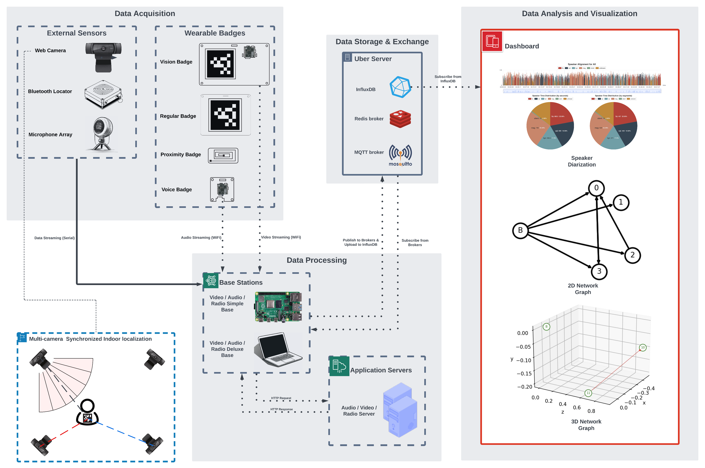

# mBox System Design

## System Diagram

Below is a diagram that represents the different components of the system and their interactions:

The mBox system is designed to analyze the learning activity within a group using different modalities of data - video, audio, and radio. The system
is composed of several modules: Clients(dashboard, MobileTag), Servers, Bases and Badges.

## Clients

### Dashboard

**Description**:  
The dashboard is the user interface of the system, accessed through a web browser. Users interact with the dashboard by navigating to `http://uber-server.local:3000`. The dashboard, built with React and Flask, and hosted on the uber server, provides real-time and post-session visualizations of session activities by subscribing to InfluDB.

**Tech Stack**:

| Tech                | Role in System   |
|---------------------|------------------|
| Web Browser         | GUI              |

### MobileTag

**Description**:  
The MobileTag application is used to tag some of the events that occur during a learning activity into InfluxDB.

## Servers

### Uber Servers

**Description**:  
The uber servers are clusters of servers that host the following services:

- **React Application**: Forms the dashboard interface accessed by user's web browser clients 
- **Flask Application**: Implements API endpoints for processing requests from user clients and returning responses
- **Data Messaging**: Manages real-time data exchange via MQTT (data synchronizations among bases and badges) and Redis (signaling, task queuing)
- **Data Storage**: Saves time-series data (speaker & speech recognition, locations, orientations, relations results) in InfluxDB
- **Data Streaming**: Receives and distributes real-time media streams with Nginx with RTMP server
- **Load Balancing**: Distributes incoming requests to the application servers with Nginx

**Tech Stack**:

| Tech         | Role in System              |
|--------------|-----------------------------|
| InfluxDB     | Data Storage                |
| MQTT Broker  | Data Exchange               |
| Redis Broker | Data Exchange               |
| Flask        | Web Application Backend     |
| React        | Web Application Frontend    |
| Nginx        | Load Balancing, RTMP Server |

### Application Servers

**Description**:  
Application servers are clusters of servers that host the following services:
+ Audio Server:  
  speaker embedding generation, speech enhancement, speech separation, voice activity detection, speech transcription

  **Tech Stack**:

  | Tech            | Role in System                   |
  |-----------------|----------------------------------|
  | Titanet         | Speaker Embeddings Service       |
  | Denosier        | Speech Enhancement Service       |
  | Modelscope      | Speech Separation Service        |
  | Silero          | Voice Activity Detection Service |
  | Whisper         | Speech Transcription Service     |
  | Flask           | Audio Server API Endpoint        |

+ Video Server:  
  AprilTag detecion, action recognition

  **Tech Stack**:

  | Tech           | Role in System             |
  |----------------|----------------------------|
  | pupil_apriltag | AprilTag Detection Service |
  | VLM + LLM      | Action Recognition Service |
  | Flask          | Video Server API Endpoint  |

## Base Stations

Base stations are hubs responsible for data relay between badges and servers. They include:

### Video-Base

**Description**:  
The video-base reads video frames either from sensors or RTMP server, processes them either locally or through application
server's services for specific recognition tasks, and uploads the recognition result to database.  
**Tech Stack**:

| Tech                 | Role in System  |
|----------------------|-----------------|
| Raspberry-Pi         | Simple Base     |
| Laptop               | Deluxe Base     |
| Logitech c920        | Data Collection |
| InfluxDB Client      | Data Messaging  |
| Redis Client         | Data Messaging  |
| MQTT Client          | Data Messaging  |

### Audio-Base

**Description**:  
The audio-base reads audio frames either from sensors or RTMP server, processes them either locally or through application
server's services for specific recognition tasks, and uploads the recognition result to database. 

**Tech Stack**:

| Tech                  | Role in System  |
|-----------------------|-----------------|
| Raspberry-Pi          | Simple Base     |
| Laptop                | Deluxe Base     |
| Jabra                 | Data Collection |
| InfluxDB Client       | Data Messaging  |
| Redis Client          | Data Messaging  |

### Radio-Base

**Description**:  
The radio base receives Bluetooth signals from the proximity badge, calculates the location of badges either locally or through the radio server's service, and uploads the recognition result to InfluxDB.

**Tech Stack**:

| Tech               | Role in System                |
|--------------------|-------------------------------|
| Raspberry-Pi       | Simple Base                   |
| Laptop             | Deluxe Base                   |
| Bluetooth Locator  | Bluetooth Signal Receiver     |
| Gateway            | Data Hub                      |

## Badges

The Badges are responsible for data collection and providing unique IDs for participants.

### Vision-Badge

**Description**:  
The vision badge uses an Arduino nicla vision board to stream video frames to the video base and employs a unique AprilTag.
On-board AprilTag detection is provided for local runtime selection.

**Tech Stack**:

| Tech                 | Role in System                            |
|----------------------|-------------------------------------------|
| Arduino Nicla Vision | Data Collection & On-board Detection      |
| MQTT Client          | Data Messaging                            |
| AprilTag             | Unique Identity, Translation and Rotation |

### Voice-Badge

**Description**:  
The voice badge uses the Arduino nicla vision board to stream audio frames to the audio base.

**Tech Stack**:

| Tech                 | Role in System  |
|----------------------|-----------------|
| Arduino Nicla Vision | Data Collection |

### Proximity-Badge

**Description**:  
The proximity badge is a Bluetooth beacon that can transmit Bluetooth signals.

**Tech Stack**:

| Tech                | Role in System                                 |
|---------------------|------------------------------------------------|
| Bluetooth Beacon    | Bluetooth Signal Transmitter                   |

### Regular-Badge

**Description**:  
The regular badge is a basic badge equipped with a unique AprilTag.

**Tech Stack**:

| Tech                | Role in System                                 |
|---------------------|------------------------------------------------|
| AprilTag            | Unique Identity, Translation and Rotation      |

### Unified-Badge

**Description**:
The unified badge is a badge that combines the functionalities of the regular badge, voice badge and proximity badge.
